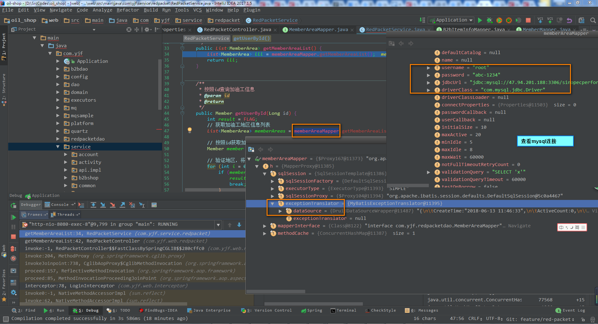
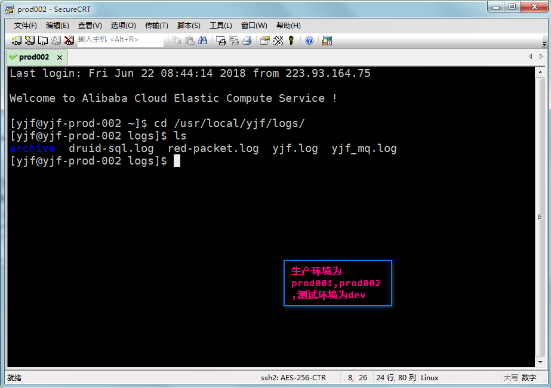
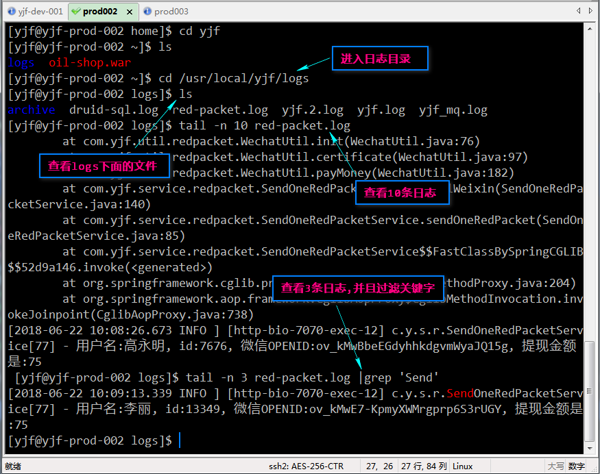
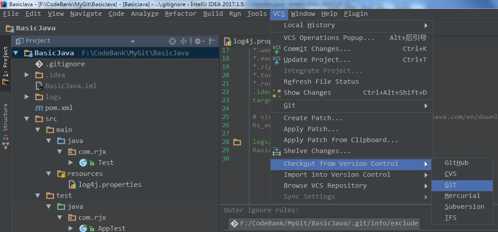
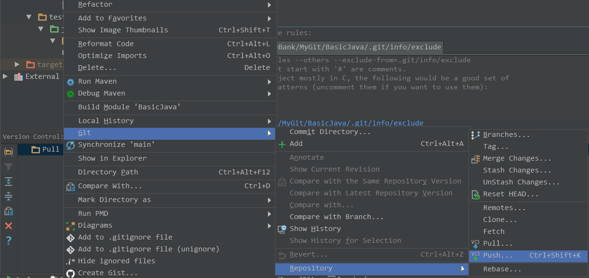
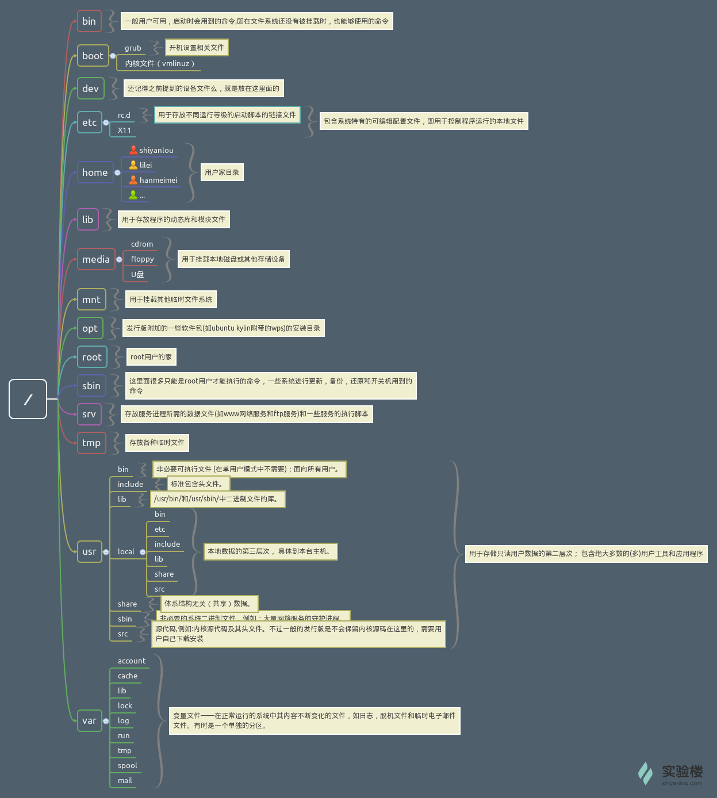
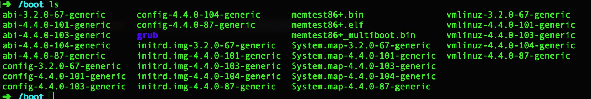

### 后端框架学习笔记2
***

[TOC]


##### 35 : 注解，providersql，mapper.xml等方式的异同?
A : 注解，providersql，mapper.xml三种方式都是要产生对应的查询结果，**注解方式更加集中**，把DAO方法，SQL语句，集中在了一个Java接口之中，方便，但是每次有改动，必须要完整的改动这个接口文件。
providersql和mapper.xml方式比较相似，**providersql方式，将sql语句与DAO方法的接口文件分离**，使用反射，提供了sql语句的调用，DAO方法和SQL语句是分离的。
mapper.xml方式同样是分离的，但是**在mapper.xml之中，我们可以定义各种resultMap，可以重复利用**，利用效率比较高，但是写起来比较麻烦。


##### 36 : 动态sql标签
A : **MyBatis的动态SQL是基于OGNL表达式的**，它可以帮助我们方便的在**SQL语句中实现某些逻辑**。MyBatis中用于实现动态SQL的元素主要有 : if, where, set, choose(when，otherwise), trim, foreach. 我们在一般是在**可能产生不确定条件的地方使用动态SQL的标签**，如在where, update的set之中使用动态标签。

if是一个基本的标签，
```xml
<if test="条件"> id=#{id} </if>
```
也可以if+where组合, 
```xml
<where>
    <if test="条件1"> id=#{id} </if> 
    <if test="条件2"> name=#{name}</if>
</where>
```
update的\<set> 标签,
```xml
<set>
    <if test="条件1">  id=#{id} </if> 
    <if test="条件2">  name=#{name}</if>
</set>
```
有时候，我们不想用到所有的查询条件，只想选择其中的一个，查询条件有一个满足即可，使用 \<choose> 标签可以解决此类问题，类似于Java的switch语句
```xml
<where> 
    <choose> 
        <when test="条件1">  id=#{id}  </when> 
        <when test="条件2">  name=#{name}  </when> 
        <otherwise> and age=#{sex}  </otherwise>
    </choose> 
</where>
```
trim标记是一个格式化的标记，可以完成set或者是where标记的功能，在sql其中，添加了一些如分隔符，前缀后缀等的信息。可以对应更多的情况，而foreach更多的是sql之中的in情况，例如id in(id的一个查询得到的结果集合)
```xml
<select id="selectUserByListId" parameterType="com.ys.vo.UserVo" resultType="com.ys.po.User">
    select * from user
    <where>
        <!--
            collection:指定输入对象中的集合属性
            item:每次遍历生成的对象
            open:开始遍历时的拼接字符串
            close:结束时拼接的字符串
            separator:遍历对象之间需要拼接的字符串
            select * from user where 1=1 and (id=1 or id=2 or id=3)
          -->
        <foreach collection="ids" item="id" open="and (" close=")" separator="or">
            id=#{id}
        </foreach>
    </where>
</select>
```


##### 37 : Mybatis的Insert Update和Select Delete语句的注意点
A : 当我们使用SQL进行**insert和update**的时候，在Mybatis之中，使用的是对象，而非一个一个的单独的参数，在Mapper之中，**对应的参数为id和对应的对象**，而delete和select的时候大多数使用的是id或者其他合适的条件。[Mybatis纯注解方式](http://solverpeng.com/2016/06/14/Mybatis%E7%BA%AF%E6%B3%A8%E8%A7%A3%E6%96%B9%E5%BC%8F/)
```xml
@Update("<script>"
        + "UPDATE "
        + "sp_red_pack_record "
        + "<set> "
        + "<if test = \" create_date !=null \"> create_date =#{createDate} ,</if>"
        + "<if test = \" modify_date !=null \"> modify_date =#{modifyDate} ,</if>"
        + "<if test = \" act_name !=null \"> act_name =#{actName} ,</if>"
        + "<if test = \" amount !=null \"> amount =#{amount} ,</if>"
        + "<if test = \" client_ip !=null \"> client_ip =#{clientIp} ,</if>"
        + "<if test = \" daily_hb_date !=null \"> daily_hb_date =#{dailyHbDate} ,</if>"
        + "<if test = \" remark !=null \"> remark =#{remark} ,</if>"
        + "<if test = \" scene_id !=null \"> scene_id =#{sceneId} ,</if>"
        + "<if test = \" send_name !=null \"> send_name =#{sendName} ,</if>"
        + "<if test = \" sn !=null \"> sn =#{sn} ,</if>"
        + "<if test = \" status !=null \"> status =#{status} ,</if>"
        + "<if test = \" wishing !=null \"> wishing =#{wishing} ,</if>"
        + "<if test = \" wx_result !=null \"> wx_result =#{wxResult} ,</if>"
        + "<if test = \" member !=null \"> member =#{member} ,</if>"
        + "<if test = \" wx_orderno !=null \"> wx_orderno =#{wxOrderno} ,</if>"
        + "<if test = \" yjf_orderno !=null \"> yjf_orderno =#{yjfOrderno} </if>"
        + "</set> "
        + "<where> "
        + "id =#{id} "
        + "</where> "
        + "</script>")
long updateRedPacketRecord(RedPacketRecord redPacketRecord, @Param("id") long id);


@Insert("<script>"
        + "INSERT INTO "
        + "article_topic (id, topic_name, topic_introduce, sort,"
        + "<if test=\"topicImg !=null \"> topic_img,</if> "
        + "<if test=\"topicThumbnail !=null \"> topic_thumbnail,</if> "
        + "status,  created,  updated)"
        + "VALUES"
        + "(#{id}, #{topicName}, #{topicIntroduce}, #{sort}, "
        + "<if test=\"topicImg !=null \"> #{topicImg},</if> "
        + "<if test=\"topicThumbnail !=null \"> #{topicThumbnail},</if> "
        + "#{status}, #{created}, #{updated})"
        + "</script>")
@Options(useGeneratedKeys = true, keyProperty = "id", keyColumn = "id")
long addTopic(ArticleTopic topic);
```

上面是Insert语句的情况，在addTopic方法之中，参数是**ArticleTopic**的对象**topic**，Update的情况和Insert相同，另外当我们使用SqlProvider的时候，**Insert和Update的参数都写在对应的Values和Set的String参数之中，参数和占位符相对应**。如下的示例，分别对应为Mapper文件和SqlProvider文件
```java
@InsertProvider(type = ArticleCommentReviewSqlProvider.class, method = "reviewComment")
long reviewComment(@Param("commentReview") ArticleCommentReview commentReview, @Param("id") long id);

@UpdateProvider(type = ArticleCommentReviewSqlProvider.class, method = "reviewCommentAgain")
long reviewCommentAgain(@Param("commentReview") ArticleCommentReview commentReview, @Param("id") long id);
```

```java
public String reviewComment(@Param("commentReview") ArticleCommentReview commentReview, @Param("id") long id) {
	//insert时，cloumn和对应的参数都写在sql.VALUES()之中，参数和占位符一一对应
    SQL sql = new SQL();
    sql.INSERT_INTO("article_comment_review");
    sql.VALUES(
			"comment_id, article_id, reviewer_id, review_detail, review_time,"
                    + " review_result, created, updated",
			"#{commentId}, #{articleId}, #{reviewerId}, #{reviewDetail}，#{reviewTime}, "
				   + "#{reviewResult}, #{created}, #{updated}");
	return sql.toString();
}

public String reviewCommentAgain(@Param("commentReview") ArticleCommentReview commentReview, @Param("id") long id) {
	//update时，column和对应的参数都写在sql.SET之中，参数和占位符一一对应
	SQL sql = new SQL();
	sql.UPDATE("article_comment_review");
	sql.SET("review_detail, review_result", "#{reviewDetail}, #{reviewResult}");
	sql.WHERE("id= #{id}");
	return sql.toString();
}
```
**以上这是在Mapper(DAO层)之中的定义，而在Service层和Controller层，我们还是需要整个完整的参数**。


##### 38 : SQL分页的问题
A : SQL的分页，我们可以使用**limit**关键字或者**limit**&**offset**两个关键字组合来完成分页的实现，但是使用这两个关键字的时候是有区别的。示例如下 : 

:one: . 仅使用**limit**关键字，*limit N* : **只返回符合条件的前N条**

```sql
###### sql的数据计算是从0开始的，第1条的下标为0) #####
SELECT * FROM article_topic LIMIT 10; # 符合条件的前10条
SELECT * FROM article_topic WHERE id<100 LIMIT 10; # 符合条件的前10条,这句和上面一句的含义相同
```

:two: . 使用**limit**关键字，*limit  M , N* : **跳过M条，返回N条，从第M条开始读取**

```sql
SELECT * FROM article_topic LIMIT 2,1; # 跳过2条取出1条数据，LIMIT后面是从第2条开始读，读取1条信息，即读取第2条数据，也就是第三条
SELECT * FROM article_topic LIMIT 8,5; # 跳过8条，取出5条，从第8条开始读取
SELECT * FROM article_topic WHERE id<100 LIMIT 8,5;
```

:three: . 使用**limit**&**offset**关键字，*limit M offset N* : **跳过N条，返回M条，从第N条开始计算**

```sql
SELECT * FROM article_topic LIMIT 2 OFFSET 1; # 返回2条数据，从第1条开始计算，LIMIT后面跟的是2条数据，OFFSET后面是从第1条开始读取，即读取第2,3条
SELECT * FROM article_topic LIMIT 10 OFFSET 5; # 返回10条数据，从第5条开始计算
```
其中第:two:种和第:three:种之间的关系是相反的，最好统一使用第三种: *limit M offset N*, 返回M条（跳过N条），从第N条开始计算。[ sql 中 limit 与 limit，offset连用的区别 ](https://blog.csdn.net/AinUser/article/details/72803175),   [SQL 语句的LIMIT的用法](https://www.cnblogs.com/wangxingliu/p/3512188.html)


##### 39 : sql语句定义和查询时候的一些问题
A : :one: . 所有的字段最好不要设置成NULL，可以设置为NOT NULL,为其设置一个默认值，通过`DEFAULT xxx`
      :two: . 将字段定义为BIGINT,INT等数字的时候，如果其大于0，那么可以加一个UNSIGNED来修饰，这样就不会有小于0的情况，**表示无符号，只有我们认为的大于0的情况存在，没有负数的存在了**
      :three: . 给字段和表添加注释是一个好习惯`COMMENT '创建时间',`
      :four: . 在创建数据库的语句之前，最好加上`DROP TABLE IF EXISTS xxx表;`
      :five: . **在创建SQL的语句之中，所使用的引号都是单引号---''，而不是双引号**
      :six: . 为了区别SQL语句和我们创建或者查询的字段，可以把**SQL保留字，全部大写，自定义的表明，数据等小写**
一个创建表的例子
```sql
# article_info
DROP TABLE IF EXISTS article_info;
CREATE TABLE article_info (
  id  BIGINT(20) UNSIGNED NOT NULL  AUTO_INCREMENT  COMMENT '主键',
  topic_id  BIGINT(20) UNSIGNED NOT NULL  COMMENT '专题id',
  user_id  BIGINT(20) UNSIGNED NOT NULL  COMMENT '编辑人id',
  title  VARCHAR(64)  NOT NULL  COMMENT '标题',
  introduce_detail VARCHAR(64)  NOT NULL  DEFAULT ''  COMMENT '推荐词',
  author  VARCHAR(64)  NOT NULL  COMMENT '作者',
  content  TEXT  NOT NULL  COMMENT '文章内容',
  main_img  VARCHAR(300)  NOT NULL  DEFAULT '' COMMENT '主图 url',
  thumbnail_img  VARCHAR(300)  NOT NULL  DEFAULT '' COMMENT '缩略图url',
  status  TINYINT(4)  NOT NULL  DEFAULT 0 COMMENT '状态（待审核，通过，不通过，发表，下架）',
  release_time  BIGINT(11)  UNSIGNED NOT NULL  DEFAULT 0 COMMENT '发表时间',
  off_time   BIGINT(11) UNSIGNED NOT NULL  DEFAULT 0  COMMENT '下架时间',
  sort  int UNSIGNED NOT NULL  DEFAULT 0 COMMENT '排序',
  created  BIGINT(11) UNSIGNED NOT NULL  DEFAULT 0  COMMENT '创建时间',
  updated  BIGINT(11) UNSIGNED NOT NULL  DEFAULT 0  COMMENT '更新时间',
  PRIMARY KEY (id),
  INDEX idx_article_info_topic_id  (topic_id),
  INDEX idx_article_info_user_id  (user_id)
)DEFAULT CHARSET = utf8  COMMENT = '文章表';


# article_collect
DROP TABLE IF EXISTS article_collect;
CREATE TABLE article_collect (
  id  BIGINT(20) UNSIGNED NOT NULL AUTO_INCREMENT  COMMENT ' 主键',
  user_id  BIGINT(20) UNSIGNED NOT NULL  COMMENT '用户id',
  article_id BIGINT(20) UNSIGNED NOT NULL  COMMENT '文章id',
  created  BIGINT(20) UNSIGNED NOT NULL DEFAULT 0  COMMENT '创建时间',
  updated  BIGINT(20) UNSIGNED NOT NULL DEFAULT 0  COMMENT '更新时间',
  PRIMARY KEY (id),
  INDEX idx_article_collect_user_id(user_id),
  INDEX idx_article_collect_article_id(article_id),
  UNIQUE idx_union_unique(user_id,article_id)
)DEFAULT CHARSET = utf8  COMMENT = '文章收藏表';


# article_thumb
DROP TABLE IF EXISTS article_thumb;
CREATE TABLE article_thumb(
  id BIGINT(20) UNSIGNED NOT NULL AUTO_INCREMENT COMMENT '主键',
  user_id BIGINT(20) UNSIGNED NOT NULL COMMENT '用户id',
  article_id BIGINT(20) UNSIGNED NOT NULL COMMENT '文章id',
  created BIGINT(11) UNSIGNED DEFAULT 0 COMMENT '创建时间',
  updated BIGINT(11) UNSIGNED DEFAULT 0 COMMENT '更新时间',
  PRIMARY KEY (id),
  INDEX  idx_article_thumb_user_id(user_id),
  INDEX  idx_article_thumb_article_id(article_id)
) DEFAULT CHARSET =utf8 COMMENT = '文章点赞表';


# article_area
DROP TABLE  IF EXISTS article_area;
CREATE TABLE article_area (
  id BIGINT(20) UNSIGNED NOT NULL  AUTO_INCREMENT COMMENT '主键',
  area_id BIGINT(20)  UNSIGNED NOT NULL  COMMENT '地区id',
  article_id BIGINT(20) UNSIGNED NOT NULL  COMMENT '文章id',
  created BIGINT(11) UNSIGNED NOT NULL  DEFAULT 0 COMMENT '创建时间',
  updated BIGINT(11) UNSIGNED NOT NULL  DEFAULT 0 COMMENT '更新时间',
  PRIMARY KEY (id),
  INDEX  idx_article_area_article_id(article_id),
  INDEX  idx_article_area_area_id(area_id)
)DEFAULT CHARSET =utf8 COMMENT ='文章地区表';


# article_review
DROP TABLE IF EXISTS article_review;
CREATE TABLE article_review(
  id BIGINT(20) UNSIGNED NOT NULL AUTO_INCREMENT COMMENT '主键',
  article_id BIGINT(20) UNSIGNED  NOT NULL COMMENT '文章id',
  reviewer_id BIGINT(20) UNSIGNED NOT NULL COMMENT '审核人id',
  review_detail VARCHAR(200) NOT NULL  DEFAULT '' COMMENT '审核说明',
  review_time BIGINT(11) UNSIGNED NOT NULL DEFAULT 0 COMMENT '审核时间',
  review_result TINYINT(4) UNSIGNED NOT NULL  COMMENT '审核结果',
  created BIGINT(11) UNSIGNED NOT NULL  DEFAULT 0 COMMENT '创建时间',
  updated BIGINT(11) UNSIGNED NOT NULL  DEFAULT 0 COMMENT '更新时间',
  PRIMARY KEY (id),
  INDEX  idx_article_area_article_id(article_id)
)DEFAULT  CHARSET =utf8 COMMENT ='文章审核表';


# article_topic
DROP  TABLE IF EXISTS article_topic;
CREATE  TABLE  article_topic(
  id BIGINT(20) UNSIGNED NOT NULL  AUTO_INCREMENT COMMENT '主键',
  topic_name VARCHAR(50) NOT NULL  COMMENT '专题名',
  topic_introduce VARCHAR(200) NOT NULL  DEFAULT '' COMMENT '专题简介',
  sort int UNSIGNED NOT NULL DEFAULT 0  COMMENT '专题排序',
  topic_img VARCHAR(300) NOT NULL  DEFAULT '' COMMENT '专题主图片',
  topic_thumbnail VARCHAR(300) NOT NULL  DEFAULT '' COMMENT '专题缩略图',
  status TINYINT(4) NOT NULL COMMENT '专题状态',
  created BIGINT(11) UNSIGNED NOT NULL  DEFAULT 0 COMMENT '创建时间',
  updated BIGINT(11) UNSIGNED NOT NULL  DEFAULT 0 COMMENT '更新时间',
  PRIMARY KEY (id)
)DEFAULT  CHARSET =utf8 COMMENT ='文章主题表';


# article_comment
DROP TABLE  IF EXISTS article_comment;
CREATE TABLE article_comment(
  id BIGINT(20) UNSIGNED NOT NULL AUTO_INCREMENT COMMENT '主键',
  article_id BIGINT(20) UNSIGNED NOT NULL  COMMENT '文章id',
  user_id BIGINT(20) UNSIGNED NOT NULL  COMMENT '用户id',
  comment_content VARCHAR(140) NOT NULL COMMENT '评论内容',
  sort int NOT NULL DEFAULT 0  COMMENT '排序',
  status TINYINT(4) NOT NULL COMMENT '状态（提交，审核通过，不通过',
  created BIGINT(11) UNSIGNED NOT NULL  DEFAULT 0 COMMENT '创建时间',
  updated BIGINT(11) UNSIGNED NOT NULL  DEFAULT 0 COMMENT '更新时间',
  PRIMARY KEY (id),
  INDEX  idx_article_comment_article_id(article_id),
  INDEX  idx_article_comment_user_id(user_id)
)DEFAULT  CHARSET =utf8 COMMENT ='文章评论表';


# article_comment_thumb
DROP TABLE IF EXISTS article_comment_thumb;
CREATE  TABLE article_comment_thumb(
  id BIGINT(20) UNSIGNED NOT NULL AUTO_INCREMENT COMMENT '主键',
  comment_id BIGINT(20)  UNSIGNED NOT NULL COMMENT '评论id',
  user_id BIGINT(20) UNSIGNED NOT NULL COMMENT '用户id',
  created BIGINT(11) UNSIGNED NOT NULL  DEFAULT 0 COMMENT '创建时间',
  updated BIGINT(11) UNSIGNED NOT NULL  DEFAULT 0 COMMENT '更新时间',
  PRIMARY KEY (id),
  INDEX idx_article_comment_thumb_user_id(user_id),
  INDEX idx_article_comment_thumb_comment_id(comment_id)
)DEFAULT  CHARSET =utf8 COMMENT ='文章评论点赞表';


# article_comment_review
DROP TABLE IF EXISTS article_comment_review;
CREATE TABLE article_comment_review(
  id BIGINT(20) UNSIGNED NOT NULL  AUTO_INCREMENT COMMENT '主键',
  comment_id BIGINT(20) UNSIGNED NOT NULL  COMMENT '评论id',
  article_id BIGINT(20) UNSIGNED NOT NULL  COMMENT '文章id',
  reviewer_id BIGINT(20) UNSIGNED NOT NULL COMMENT  '审核人id',
  review_detail VARCHAR(200) NOT NULL  DEFAULT ''  COMMENT '审核说明',
  review_time BIGINT(11) NOT NULL  DEFAULT 0 COMMENT '审核时间',
  review_result TINYINT(4) NOT NULL COMMENT '审核结果',
  created BIGINT(11) UNSIGNED NOT NULL  DEFAULT 0 COMMENT '创建时间',
  updated BIGINT(11) UNSIGNED NOT NULL  DEFAULT 0 COMMENT '更新时间',
  PRIMARY KEY (id),
  INDEX idx_article_comment_review_reviewer_id(reviewer_id)
)DEFAULT  CHARSET =utf8 COMMENT ='文章评论审核表';
```


##### 39 : MySQL字段的疑惑
A : mysql之中的**bigint长度为8个字节**，**int为4个字节**，tinyint为1个字节，不同类型的int决定了存储的占用的字节数量，而经常使用的tinyint(M) : M默认为4，SMALLINT(M) : M默认为6，MEDIUMINT(M) : M默认为9，INT(M) : M默认为11，BIGINT(M) : M默认为20。**M表示最大显示宽度，建表若设置了zerofill(0填充)，会在数字前面补充0 **。

他山之石 : 
> *不是我们有这种限制，所有的建表都要加上这个限制 这个含义和入参检查是一样的，不是可以保存多大的值就保存多大的值，要从逻辑入手，性别就1位，身份证就17位，手机号就11位*。


##### 40 : MVC模式在何处进行数据校验
A : 一般java web的项目分为domain, dao, service, controller等层，数据的校验和参数传递集中在controller和service两个地方，具有较大的可选性，有两种方式，:one:一种是在service之中获取基本数据，取得需要的基本数据，在controller层之中进行数据合法性的校验，然后在此处，将所有的数据统一处理，打包成需要的格式，传送给前端；:two:第二种是在service层之中将所有的数据都验证，整合，将其传送给controller层，controller只是做一个url转发的层。这两种方式在实际上都是可以的，但是由于第:two:种方式要讲数据多传送一次，而在service层之中整个合法性校验，数据的整合，然后又传送给controller层，这样操作比较浪费，所以第:one:种方式好，**service层提供基本的数据，在controller层之中校验，组装数据，转发请求等**。


##### 41 : Java EE需要掌握的技术
- [ ] Spring(core/ mvc/boot)
- [ ] mybatis(hibernate)
- [ ] nosql(redis/mongodb)
- [ ] RabbitMQ
- [ ] RPC(Dubbo)
- [ ] Zookeeper
- [ ] 配置工具(maven/Apollo)
- [ ] linux(命令行操作)


##### 42 : intellij idea 运行 tomcat，无法进入断点的问题解决方法
A : 这是因为JMX port被占用而出现的问题，解决方法，:one: : 重启机器，:two: : 使用`netstat -aon|findstr 1099 `找出来1099端口占用的进程，然后通过`taskkill -f -pid 3756 `杀掉进程，重新运行，即可。其实和无法启动tomcat服务器的原因是一样的。[启动tomcat时jmx port被占用](https://www.cnblogs.com/LeoBoy/p/5798947.html)，[intellij idea 运行 tomcat，无法进入断点的问题解决方法](https://blog.csdn.net/qq_24082175/article/details/78541767)


##### 43 : RPC与RMI的介绍
A : RPC(Remote Procedure Call Protocol)远程过程调用协议，通过网络从远程计算机上请求调用某种服务。RMI是远程方法调用(Remote Method Invocation)。能够让在客户端**Java**虚拟机上的对象像调用本地对象一样调用服务端java 虚拟机中的对象上的方法。  **RMI中是通过在客户端的Stub对象作为远程接口进行远程方法的调用**。**每个远程方法都具有方法签名**。如果一个方法在服务器上执行，但是**没有相匹配的签名被添加到这个远程接口(stub)上，那么这个新方法就不能被RMI客户方所调用**。 **RPC中是通过网络服务协议向远程主机发送请求**，请求包含了一个参数集和一个文本值，通常形成“classname.methodname(参数集)”的形式。RPC远程主机就去搜索与之相匹配的类和方法，找到后就执行方法并把结果编码，通过网络协议发回。  **RMI只用于Java；RPC是网络服务协议，与操作系统和语言无关**。


##### 44 : Spring配置多个数据源，如何使用？
A : Spring配置多个数据源的时候，**启用需要使用包扫描，意思就是在特定的包下面使用某一个特定的数据源，在这个包下的操作，就是用这些对应的数据源**，如果新的包建立在默认的包之下，会出现覆盖的情况。注意 : **需要单独把相关的dao创建一个包，放在原先的dao下面会被覆盖，从而导致无法取到数据源的连接**。另外，需要在工程的配置文件之中添加上多个数据源的连接基本信息，方可操作。

```java
@Configuration
@ConfigurationProperties(prefix = "redpacket.datasource")
@MapperScan(basePackages = "com.yjf.redpacketdao", sqlSessionFactoryRef = "redpacketSession")
@EnableTransactionManagement
public class RedPacketDataConfiguration {

	//单独把相关的dao创建一个包，放在原先的dao下面会被覆盖，原先的包为com.yjf.dao
	private static final String DATA_SOURCE = "redpacket_ds";

	@Value("${redpacket.datasource.mapUnderscoreToCamelCase}")
	private Boolean mapUnderscoreToCamelCase;

	@Bean("redpacketSession")
	public SqlSessionFactory getSqlSessionFactory(@Qualifier(DATA_SOURCE) DataSource ds) throws Exception {
		SqlSessionFactoryBean bean = new SqlSessionFactoryBean();
		bean.setDataSource(ds);
		org.apache.ibatis.session.Configuration configuration = new org.apache.ibatis.session.Configuration();
		configuration.setMapUnderscoreToCamelCase(mapUnderscoreToCamelCase);
		bean.setConfiguration(configuration);
		return bean.getObject();
	}

	@Bean(name = DATA_SOURCE)
	@ConfigurationProperties(prefix = "redpacket.datasource")
	public DataSource dataSourceRedpacket() {
		return DruidDataSourceBuilder.create().build();
	}

	@Bean
	public DataSourceTransactionManager redPacketTransactionManager(@Qualifier(DATA_SOURCE) DataSource ds) {
		return new DataSourceTransactionManager(ds);
	}
}
```


##### 45 : 把sql的嵌套查询拆开，应该怎么做？
A : 在开发之中，SQL层(Mapper层的查询)，可能经常会遇到多个sql嵌套查询的情况，这样的时候，很容易出现Mapper层的耦合，处理这些耦合，就需要**把复杂嵌套的sql语句拆分成单独的简单的sql，然后在service层之中处理等否，关联等关系**，这样可以有效减少SQL语句的耦合，让复杂的SQL变得清晰简单。


##### 46 : 写Mybatis的Mapper文件时候，sql的注意问题？
A : 有时候，写Mapper文件的时候，有时候会有把sql语句都写在一起，在写\<script>包裹起来的语句，在每一行的sql语句后面，**最好后面留一个空格，防止SQL语句拼接连在一起，出现问题**。

```sql
	@Select("<script>"
            + "SELECT "
		   + "id, create_date, ali_user_id, balance, identity_number, is_enabled, is_locked, mobile, name, "
			+ "phone, wx_open_id, member_rank, sinopec_station, real_name, area, "
            + "FROM  member "
			+ "WHERE is_enabled = 1 and is_locked = 0 "
            + "</script>")
	List<Member> getMemberList();

	@Select("<script>"
            + "SELECT "
			+ "id, create_date, ali_user_id, balance, identity_number, is_enabled, is_locked, mobile, name, "
			+ "phone, wx_open_id, member_rank, sinopec_station, real_name, area, "
            + "FROM  member "
            + "WHERE id= #{id}"
			+ "</script>")
	Member getUserById(@Param("id") Long id);
```


##### 47 : **需要的数据是从多个表之中获取，该如何处理**？
A : 首先我们通过查询语句，将需要的信息，提取出来，此时我们得到了多种信息，然后接下来，我们可以**创建一个新的domain**，里面的字段刚好是所需信息的全部字段，然后使用Mapper查询出来我们要的信息后，在Service层将信息组合，整合出来我们想要的信息，比如，Student表和Book表，student(id, name, age, gender, grade, class, school)，book(id, book_name, book_price, book_author, book_detail, book_time, book_type)。如果我们想知道学生喜欢的书籍的类型和出版时间，那么可以新建新的domain，**student_book(id, name, age, gender,  book_name, book_detail, book_time, book_type)**，将其组合成一个新的domain, 这样处理将会方便很多。


##### 48 : 调试时候如何查看MyBatis中数据连接的信息？
A : 在调试的时候，进入service，**调用mapper的时候，查看变量，然后进入sqlSession->exceptionTranslator**，之中就会看到Mybatis连接的数据库信息，配合多数据源查看，口味更佳。*但是如果想要查看sql语句，貌似只能通过打印日志的方法了*。



##### 49 : 类型检查在数字类型，String类型和空之间如何处理？
A : int, float等基本类型的参数，必须要求有一个参数，给方法传入，数字和String之间的转化，就是用他们之间的api。对于int, float等基本类型的参数，我们**确信**，此时传入的数据是不为空的，而且我们最好是用基本类型的，这样就可以避免NULL空指针异常，当是用基本类型的时候，会有一个默认的值来填充参数，我们的参数检查，就不必检查null这种问题了。如果是真的没有参数传入，需要统一使用拦截器，来处理这种情况。**就是说，能确定类型的时候，我们最好是用基本类型**，不去考虑空指针异常，而且**确信，参数是必有的**。如果我们必须要兼容或者有空的情况，那么就可以使用包装类型。


##### 50 : 我们如何确定哪些接口需要设置成Dubbo类型的接口，或者说，什么情况下设置成为Dubbo类型的？
A : 首先，Dubbo类型的接口是为了给别人调用。当我们的系统可以拆分为很多小的系统或者模块的时候，我们可能将其发布在不同的服务器上，此时我们就需要将某些要**提供给别人调用的接口**设计成为Dubbo类型的接口，一般情况下，这些接口都是比较活跃的，很容易被人调用或者对外提供服务。


##### 51 : 如何确定，在何时使用Redis？
A : **常用而不太常变动的内容**，我们可以将其保存到Redis数据库中，当做缓存，这样可以缓解服务器查询的压力。


##### 52 : 为何给前端返回的数据，最好不要使用Map结构拼装？
A : Map拼装的Key和Value，众多信息是平行的，没有对象和属性的层级关系，不明确不优雅，容易遗忘丢失一些字段和数据，所以我们最好使用对象，借助Spring的封装，自动转化成Json字符串就可以了。


##### 53 : **一些写代码的小小小经验，了解一下**
A : 回答如下

:one: . if语句使用的时候，使用`!=`，可以**减少一层嵌套**

```java
++BAD!!!++
if(a==5){
    wxResult=100;
    try{
        //dosomthing...
    }catch(Exception e){
        log.e("exception is {}",e);
    }
}else{
    System.out.println("hello world！")；
}

++GOOD++
if(a!=5){
    System.out.println("hello world！")；
}
wxResult=100;
try{
    //dosomthing...
}catch(Exception e){
    log.e("exception is {}",e);
}
```

:two: . 尽量使用简介的，考虑全面的API，`org.springframework.util.CollectionUtils`, `org.apache.commons.commons-lang3`, `org.apache.commons.commons-collections4`，`java.lang.util`都是需要考虑的对象。

:three: . 稍微可以复用的内容，都要提取出来，形成一个方法，这样在有问题修改的时候，方便修改，可以只改一处，多处适用，解决问题的效率较高。

:four: . 开发的时候, 每个新的分支, 都是从develop分支拉取出来的, 所以我们的分支, 一般是和4个分支有关系, 比如分支A, 和它有关系的就是 origin/develop(从此处pull), develop(本地develop, 分支的合并, 然后push到origin/develop), origin/A(远程仓库上面的A), A(本地的A分支). 只有上述4个分支在我们开发一个功能时候的交互之中, 其他的分支, 不管我们的功能有多相似, 都是不能混淆的, 不然会引起开发的混乱, 仓库代码的污染, 也就是说: **两个没有直接关联的分支, 不能相互合并 ! **比如, A分支借鉴了B分支的代码, 可以先把B分支上我们需要的代码拷贝出来, 然后再粘贴到A分支上去, 但是不能直接把B分支合并到A分支上去. 

:five: . 开发的时候, 明确说明需要提供的接口才给出来, 如果没有明确说明需要提供, 则不给出来, 尤其是在Controller之中, 没有说明需要提供的接口, 坚决不能提供, 另外保持代码的简洁, 可以写注释说明, 但是不要大段的使用废代码, 去帮助记忆一个知识点, 这样的习惯不好.


##### 54 : throw thorws和自定义的异常
A : **throw是抛出一个异常对象, throws后面是异常类**. 详细如下: 
:one: . 写法上 : throw 在方法体内使用，throws 函数名后或者参数列表后方法体前 
:two: . 意义 : throw 强调动作，而throws 表示一种倾向、可能但不一定实际发生 
:three: . throws 后面跟的是异常类，可以一个，可以多个，多个用逗号隔开。**throw 后跟的是异常对象，或者异常对象的引用**. 
:four: . throws 用户抛出异常，当在当前方法中抛出异常后，当前方法执行结束(**throws 后，如果有finally语句的话，会执行到finally语句后再结束**). 可以理解成return一样.

如下是新建自定义异常类的例子
```java
public class CustomException extends Exception {
    public CustomException(){
        super();
    }

    public CustomException(String message){
        super(message);
    }
}
```


##### 55 : java的date和sql中的datetime的转换与SQL存储日期无时间的问题解决
A : domain定义成`java.util.Date`类型的，在处理的时候，将其格式化成`DateTime`类型

```java
public class MyEntity {
    ...
    @Temporal(TemporalType.TIMESTAMP)
    private java.util.Date myDate;
    ...
}
```

```java
java.util.Date dt = new java.util.Date();

java.text.SimpleDateFormat sdf = 
     new java.text.SimpleDateFormat("yyyy-MM-dd HH:mm:ss");

String currentTime = sdf.format(dt);
```

上面是String类型的时间日期字符串和Date类型的日期相转换,还有如下的格式化

```java
SimpleDateFormat timeStr = new SimpleDateFormat("yyyyMMddHHmmss");
SimpleDateFormat fmtDate = new SimpleDateFormat("yyyyMMdd");
SimpleDateFormat fmtDateTime = new SimpleDateFormat("yyyy-MM-dd HH:mm:ss");
```

可以把日期转化成字符串. 但是当我们把日期时间存储到数据库之中的时候, 出现的结果是只有日期,没有时间,不管是使用`java.util.Date`或`java.sql.Date`, 都没有时间只有日期, 这是因为为了合乎国际标准把时间去掉了,需要注意的是**`java.util.Date`是`java.sql.Date`和后续提到的`java.sql.Timestamp`包装父类**, 显示如下:


如何解决上述的问题, 就需要使用`java.sql.Timestamp`, 使用如下的代码即可转换成可以存储在sql中的时间戳, 然后在存储的代码处,将`java.util.Date`转化成`java.sql.Timestamp`, 就可以达到如下的显示效果.

```java
Timestamp sqlDateAndTimeStamp = new Timestamp(new java.util.Date().getTime());//sql时间戳
```


##### 56 : IDEA之中, 不同的代码版本使用不同的配置文件, 如何切换?
A : 如图, 在运行配置处配置,就可以选择不同的环境和配置文件了. 1. [spring boot 入门 spring.profiles.active来分区配置](http://www.leftso.com/blog/111.html) ,   2.[spring.profiles.active配置多种spring启动环境](https://blog.csdn.net/figo0423/article/details/54925993),   3.[通过 spring 容器内建的 profile 功能实现开发环境、测试环境、生产环境配置自动切换](https://blog.csdn.net/xvshu/article/details/51133786),   4.[Spring Boot Profile使用](https://blog.csdn.net/he90227/article/details/52981747)


##### 57 : 如何查看服务器端的日志
A  : 查看日志. 日志有两种, 一种是访问的日志, 一种是业务日志, 访问日志是记录在nginx产生的日志之中, 而业务日志产生在tomcat的日志之中.

###### 1.nginx日志
首先进入nginx日志目录, 然后使用`tail -f xxx.log|grep 关键字` 就可以循环监控访问的字段, 如下是实际的日志, 下图是日志所在的目录, 首先进入日志的目录, 然后使用`tail`访问日志

实时监控过滤某关键字,并且查看日志, 此处的关键字为`delMarks`

###### 2.tomcat日志
tomcat日志是我们需要主要查看的日志, 而nginx大多数用来负载平衡, 用来查看访问的记录. 和nginx日志一样, 查看之前我们需要进入日志所在的目录, 然后通过`tail`命令来查看日志. 下图是进入Tomcat日志的目录

以下两图是查看生产环境的日志, 生产环境和测试环境其实就是访问地址, 配置环境, 数据库等不同, 其他的差别不大,查看日志的方式和上述的查看nginx日志的方式类似, 以下分别是**连接不同的环境**和**查看各自环境下的日志**



其中的命令和之前使用的差不多, 关键问题是找准**日志的位置**所在, 这样才能比较快的找到日志, 定位和分析问题.


##### 58 : 常用的日志命令
A  : 查看日志的命令如下

> linux查看日志的命令有多种: tail、cat、tac、head、echo等命令

###### 1.查看日志方式

```powershell
命令格式: tail [必要参数] [选择参数] [文件]
```

**tail**(最常用的一种查看方式 )

```powershell
-f 循环读取
-q 不显示处理信息
-v 显示详细的处理信息
-c<数目> 显示的字节数
-n<行数> 显示行数
-q, --quiet, --silent 从不输出给出文件名的首部 
-s, --sleep-interval=S 与-f合用,表示在每次反复的间隔休眠S秒

tail  -n  10   test.log   查询日志尾部最后10行的日志;
tail  -n +10   test.log   查询10行之后的所有日志;
tail  -fn 10   test.log   循环实时查看最后1000行记录(最常用的)

//一般还会配合着grep用, 例如 :  tail -fn 1000 test.log | grep '关键字'
//如果一次性查询的数据量太大,可以进行翻页查看,
例如:tail -n 4700  aa.log |more -1000 可以进行多屏显示(ctrl + f 或者 空格键可以快捷键)
```

**head**

```powershell
head -n  10  test.log   //查询日志文件中的头10行日志;
head -n -10  test.log   //查询日志文件除了最后10行的其他所有日志;
```

head其他参数与tail 类似

**cat** 
cat 是由第一行到最后一行连续显示在屏幕上

```powershell
一次显示整个文件 : $ cat filename
从键盘创建一个文件 : $ cat > filename  
将几个文件合并为一个文件： $cat file1 file2 > file //只能创建新文件,不能编辑已有文件.
将一个日志文件的内容追加到另外一个 : $cat -n textfile1 > textfile2
清空一个日志文件 $cat : >textfile2
```

**注意: >意思是创建, >>是追加. 千万不要弄混了.** cat其他参数与tail 类似

**tac** 
tac 则是由最后一行到第一行反向在萤幕上显示出来

**sed**

这个命令可以查找日志文件特定的一段 , 也可以根据时间的一个范围查询

```powershell
//按照行号
sed -n '5,10p' filename //这样你就可以只查看文件的第5行到第10行。
//按照时间段
sed -n '/2014-12-17 16:17:20/,/2014-12-17 16:17:36/p'  test.log1234
```

**less**

```powershell
less log.log 
shift + G 命令到文件尾部  然后输入 ？加上你要搜索的关键字例如 ？1213
shift+n  关键字之间进行切换12345
```


###### 2.其他会应用到的命令

```powershell
history // 所有的历史记录
history | grep XXX  // 历史记录中包含某些指令的记录
history | more // 分页查看记录
history -c // 清空所有的历史记录
!! 重复执行上一个命令
查询出来记录后选中:　!323
```

> linux日志文件说明
> /var/log/message 系统启动后的信息和错误日志，是Red Hat Linux中最常用的日志之一 
> /var/log/secure 与安全相关的日志信息 
> /var/log/maillog 与邮件相关的日志信息 
> /var/log/cron 与定时任务相关的日志信息 
> /var/log/spooler 与UUCP和news设备相关的日志信息 
> /var/log/boot.log 守护进程启动和停止相关的日志消息 
> /var/log/wtmp 该日志文件永久记录每个用户登录、注销及系统的启动、停机的事件


##### 59 : 如何发布项目到服务器
A  : 对于java web的项目, 项目的发布就意味着将项目从开发环境之中打包, 然后放到web容器之中, 如tomcat, 打包现在一般都是使用maven作为包管理工具, 并且将其打包, 我们可以使用单独的语句, 在pom.xml文件所在的目录下面自行打包, 使用如下的命令语句即可生成war包, 然后将其放入web容器即可.

```shell
mvn clean package -Dmaven.test.skip=true
```

下图是发布项目的例子, 问题也是在于找到项目war包存放的地址, 将其覆盖即可. 一般项目放在tomcat的webapps文件夹之下, 我们其实找到tomcat的目录就行了. 发布的时候, 如果修改的较多,可以直接替换war包. 如果修改较少的话, 可以在**在对应的class文件目录下修改对应的class文件,修改增量即可**, 这样做是因为全量替换可能比较慢, 所以只替换增量可以节约时间.


查看日志的时候, 使用的是如xshell, secure crt类似的**终端模拟软件**, 而发布包, 需要使用的是如secure FX, FlashFXP类似的FTP软件, 将其上传到服务器tomcat的webapps目录下, 就可以了.至于具体如何发布可以参考如下的链接.


##### 60 : 数据库之中某张表有较多数据时查询操作的技巧
A : 当我们需要操作数据库, 尤其是查询的时候, 如果数据多的话, 一次性查询出来所有的结果, 会给服务器内存造成很大的压力, 所以我们可以**一次查出一部分, 然后多次查出来**, 如何操作呢? **一次查询在SQL语句之中提现, 而多次查询在程序之中提现**, 可以通过如下代码习得

```java
/**
 * 查询符合条件的加油工(使用balance>0的条件, 过滤人员, 每次取300条, 减轻内存压力)
 */
@Select("<script>"
			+ "SELECT "
			+ "id, create_date, ali_user_id, balance, identity_number, is_enabled, is_locked, mobile, name, "
			+ "phone, wx_open_id, member_rank, sinopec_station, real_name, area "
			+ "FROM  member "
			+ "WHERE is_enabled =#{isEnabled} and is_locked = #{isLocked} and balance >0 limit 300"
			+ "</script>")
List<OilMember> getMemberList(@Param("isEnabled") boolean isEnabled, @Param("isLocked") boolean isLocked);
```

以上是mybatis的mapper文件, 用来操作数据库, 每次只提供300条数据, 默认是只执行一次的, 通过多次查询得出所有的数据通过下面的代码体现, 关键在于**for (; ; ) **, 最后当没有数据了, 再跳出这个死循环即可, 表示完成了查询.

```java
for (; ; ) {
    List<OilMember> memberList = memberMapper.getMemberList(ISENABLED, ISLOCKED);
    if (CollectionUtils.isEmpty(memberList)) {
        log.info("没有需要处理的数据");
        break;
    }

    log.info("即将为符合条件的加油工发红包...");
    for (OilMember member : memberList) {
        nextId = member.getId();
        try {
            int result = sendOneRedPacketService.sendOneRedPacket(member, date);
            if (result == SendOneRedPacketService.SENDOK) {
                success.incrementAndGet();
            } else {
                fail.incrementAndGet();
            }
        } catch (Exception e) {
            log.error("用户:{}, id:{}, 在 {} 发红包失败!", member.getRealName(), member.getId(), dateSend, e);
            fail.incrementAndGet();
        }
    }

    if(memberList.size() < limits){
        log.info("处理完毕，最后一批处理数据记录数:{}", memberList.size());
        break;
    }
}
```


##### 61 : @Value注解的使用方法
A : SpringMVC中有两个xml配置文件:
1. applicationContext.xml, 这个是Spring的主配置文件, 包括dao层service层的bean定义或扫描, 数据源, 事务等的配置信息.
2. xxx-servlet.xml, 这个是mvc的配置文件, 包括controller层的bean定义或扫描, 静态资源访问以及view配置properties配置文件中的信息定义在applicationContext.xml中, 那么在service层使用@Value注解即可访问到, 但在Controller层使用@Value注解却不能访问到.若要在Controller层也使用@Value访问properties配置的话，需要在xxx-servlet.xml中也定义properties配置文件。

为了简化读取properties文件中的配置值，spring支持@value注解的方式来获取，这种方式大大简化了项目配置，提高业务中的灵活性. 有如下2种配置方法: 

```java
@Value("#{configProperties['key']}")
1. 配置方法1：  
2. <bean id="configProperties"class="org.springframework.beans.factory.config.PropertiesFactoryBean">  
3.     <property name="locations">  
4.         <list>  
5.             <value>classpath:value.properties</value>  
6.         </list>  
7.     </property>  
8. </bean>  

@Value("${key}")
1.配置方法2： 
2.<util:properties id="configProperties" location="classpath:value.properties"></util:properties> 
```
注: 配置1和配置2等价, 这种方法需要util标签, 要引入util的xsd: http://www.springframework.org/schema/util, 
http://www.springframework.org/schema/util/spring-util-3.0.xsd

对应的2种使用方法如下:

@Value("#{configProperties['key']}")

value.properties
```xml
1. key=1 
```
ValueDemo.java
```java
1. @Component  
2. public class ValueDemo {  
3.     @Value("#{configProperties['key']}")  
4.     private String value;  
5.   
6.     public String getValue() {  
7.         return value;  
8.     }  
9. }  
```

@Value("${key}")使用

配置文件

在2.1.1的配置文件基础上增加:

```xml
<bean id="propertyConfigurer" class="org.springframework.beans.factory.config.PreferencesPlaceholderConfigurer">  
    <property name="properties" ref="configProperties"/>  
</bean>
```

直接指定配置文件, 完整的配置:

```xml
<bean id="appProperty"  
          class="org.springframework.beans.factory.config.PropertyPlaceholderConfigurer">  
    <property name="locations">  
        <array>  
            <value>classpath:value.properties</value>  
        </array>  
    </property>  
</bean>  
```

ValueDemo.java
```java
1. @Component  
2. public class ValueDemo {  
3.     @Value("${key}")  
4.     private String value;  
5.  
6.     public String getValue() {  
7.         return value;  
8.     }  
9. }  
```


##### 62 : Apollo配置的使用文档
A : [Apollo Quick Start](https://github.com/ctripcorp/apollo/wiki/Quick-Start),   [Apollo配置中心介绍](https://github.com/ctripcorp/apollo/wiki/Apollo%E9%85%8D%E7%BD%AE%E4%B8%AD%E5%BF%83%E4%BB%8B%E7%BB%8D),   [Apollo使用指南](https://github.com/ctripcorp/apollo/wiki/Apollo%E4%BD%BF%E7%94%A8%E6%8C%87%E5%8D%97),   [Java客户端使用指南](https://github.com/ctripcorp/apollo/wiki/Java%E5%AE%A2%E6%88%B7%E7%AB%AF%E4%BD%BF%E7%94%A8%E6%8C%87%E5%8D%97),   [Apollo开发指南](https://github.com/ctripcorp/apollo/wiki/Apollo%E5%BC%80%E5%8F%91%E6%8C%87%E5%8D%97),   [携程 Apollo 配置中心 | 学习笔记（二） Windows 系统搭建基于携程Apollo配置中心单机模式](https://blog.csdn.net/Michael_HM/article/details/79412839)


##### 63 : jar包和war包的介绍与区别
A : 在学习maven的过程中接触到了jar包和war包. 之前在写小项目的时候真的遇到过war包, 当时为了找到jar包, 把war包的后缀名改成了.rar的压缩文件, 在里面提取出来jar包来用. 其实jar包和war包都可以看成压缩文件, 用解压软件都可以打开, jar包和war包所存在的原因是, 为了项目的部署和发布, 通常把项目打包, 通常在打包部署的时候, 会在里面加上部署的相关信息. 这个打包实际上就是把代码和依赖的东西压缩在一起, 变成后缀名为.jar和.war的文件, 就是我们说的jar包和war包. 但是这个“压缩包”可以被编译器直接使用, 把war包放在tomcat目录的webapp下, tomcat服务器在启动的时候可以直接使用这个war包. 通常tomcat的做法是解压, 编译里面的代码, 所以当文件很多的时候, tomcat的启动会很慢. 

说了这么多, 还是没有讲jar包和war包的区别. **jar包是java打的包, war包可以理解为javaweb打的包, 这样会比较好记. jar包中只是用java来写的项目打包来的, 里面只有编译后的class和一些部署文件. 而war包里面的东西就全了, 包括写的代码编译成的class文件, 依赖的包, 配置文件, 所有的网站页面, 包括html, jsp等等. 一个war包可以理解为是一个web项目, 里面是项目的所有东西**.

什么时候使用jar包或war包? 当你的项目在没有完全完成的时候, 不适合使用war文件, 因为你的类会由于调试之类的经常改, 这样来回删除, 创建war文件很不方便 , 来回修改, 来回打包, 最好是你的项目已经完成了, 不做修改的时候, 那就打个war包吧, 这个时候一个war文件就相当于一个web应用程序; 而jar文件就是把类和一些相关的资源封装到一个包中, 便于程序中引用.


##### 64 : spring data jpa方法命名规则

| 关键字            | 方法命名                       | sql where字句              |
| ----------------- | ------------------------------ | -------------------------- |
| And               | findByNameAndPwd               | where name= ? and pwd =?   |
| Or                | findByNameOrSex                | where name= ? or sex=?     |
| Is,Equals         | findById,findByIdEquals        | where id= ?                |
| Between           | findByIdBetween                | where id between ? and ?   |
| LessThan          | findByIdLessThan               | where id < ?               |
| LessThanEquals    | findByIdLessThanEquals         | where id <= ?              |
| GreaterThan       | findByIdGreaterThan            | where id > ?               |
| GreaterThanEquals | findByIdGreaterThanEquals      | where id > = ?             |
| After             | findByIdAfter                  | where id > ?               |
| Before            | findByIdBefore                 | where id < ?               |
| IsNull            | findByNameIsNull               | where name is null         |
| isNotNull,NotNull | findByNameNotNull              | where name is not null     |
| Like              | findByNameLike                 | where name like ?          |
| NotLike           | findByNameNotLike              | where name not like ?      |
| StartingWith      | findByNameStartingWith         | where name like '?%'       |
| EndingWith        | findByNameEndingWith           | where name like '%?'       |
| Containing        | findByNameContaining           | where name like '%?%'      |
| OrderBy           | findByIdOrderByXDesc           | where id=? order by x desc |
| Not               | findByNameNot                  | where name <> ?            |
| In                | findByIdIn(Collection<?> c)    | where id in (?)            |
| NotIn             | findByIdNotIn(Collection<?> c) | where id not  in (?)       |
| True              | findByAaaTue                   | where aaa = true           |
| False             | findByAaaFalse                 | where aaa = false          |
| IgnoreCase        | findByNameIgnoreCase           | where UPPER(name)=UPPER(?) |

以上只是部分查询时候的方法命名规则, 基本的还有增删改, 可以使用add, remove, update等统一的词语, 至于其他的非标准的方法, 最好是找一个意思准确的英文单词去描述.


##### 65 : 关于微信的一些概念
微信公众平台

|   类型   | 适用对象  |        功能        |    限制    |
| :------: | :-------: | :----------------: | :--------: |
|  订阅号  |   组织    |      资讯信息      | 1条消息/天 |
|  服务号  | 企业/组织 |      提供服务      |   4条/月   |
|  小程序  |    ---    |    小程序/游戏     |    ---     |
| 企业微信 |   企业    | 企业应用, 联系, OA |    ---     |

支付方式(场景) : **用户向商家付钱**

|  支付方式  |                  使用                  |
| :--------: | :------------------------------------: |
|  刷卡支付  | **商家**用枪扫描用户的二维码, 完成付款 |
| 公众号支付 |  在公众号(商城)之中购买东西, 完成支付  |
|  扫码支付  |   **用户**扫描商家的二维码, 完成支付   |
|  APP支付   |      商户在APP之中集成了微信支付       |
|   H5支付   |         浏览器之中调用微信支付         |
| 小程序支付 |             小程序之中支付             |

支付工具 : **商家向用户付钱**

|   方式   |                作用                 |
| :------: | :---------------------------------: |
| 现金红包 | 商户**向微信支付用户发放现金红包 ** |
| 企业付款 |  **企业向用户付款**至用户微信零钱   |
|  代金券  |           代金券, 满减券            |

微信付款SDK

[WXPay-SDK-Java](https://github.com/wxpay/WXPay-SDK-Java),   [best-pay-sdk](https://github.com/Pay-Group/best-pay-sdk)

微信开发文档

[微信支付名词解释](https://pay.weixin.qq.com/wiki/doc/api/tools/sp_coupon.php?chapter=2_2),   [微信支付开发文档](https://pay.weixin.qq.com/wiki/doc/api/index.html)

微信开放平台   微信公众平台   商户平台的区别

微信开放平台 : 主要面对移动应用/网站应用开发者, 为其提供微信登录, 分享, 支付等相关权限和服务. 微信开放平台还提供了数据统计功能, **用于开发者统计接入应用的登录, 分享等**数据情况.

微信公众平台 : 微信公众平台用于管理, 开放微信公众号(包括订阅号, 服务号,企业微信, 小程序), **简单的说就是微信公众号的后台运营, 管理系统, 推广,统计等**.

商户平台 : 无论是申请公众平台商户还是开放平台商户, 申请成功后, 都会拥有商户平台账号, 可登陆商户平台进行操作. **商户平台主要就是做微信支付**用的, 如果APP或者公众号需要接入支付功能, 那么就需要在公众平台申请公众平台商户, 或者在开放平台申请开放平台商户. 申请成功后会分配商户平台账号.


##### 66 : IDEA项目和gitlab的交互
从gitlab拉取代码到本地, 填写仓库的url即可

从IDEA提交代码到gitlab(没有在gitlab建立仓库的操作相同)


##### 67 : 关于IDEA的.iml文件的说明
A : IDEA的 .iml文件和 eclipse中的 .classpath, .project等文件, 都属于开发工具配置文件, 也就是在项目导入ide的过程中生成的配置文件, 每个人开发环境是不一样的, 没必要提交.  而且假如提交了, 可能会出现冲突, 还需要解决比较麻烦.


##### 68 : Java核心基础
A : [Java核心知识点大全（持续更新中）](https://blog.csdn.net/mythmayor/article/details/79487586),   [【思维导图】java核心基础知识点总结](https://blog.csdn.net/u012441545/article/details/56481977)


##### 69 : 需要知道的Linux命令和操作
A : 玩过Linux的人都会知道, Linux中的命令的确是非常多, 但是玩过Linux的人也从来不会因为Linux的命令如此之多而烦恼, 因为我们只需要掌握我们最常用的命令就可以了. 当然你也可以在使用时去找一下man, 他会帮你解决不少的问题. 然而每个人玩Linux的目的都不同,所以他们常用的命令也就差异非常大. 因为不想在使用是总是东查西找, 所以在此总结一下, 方便一下以后的查看, 下面就说说最常用的Linux命令.[初窥Linux 之 我最常用的20条命令](https://blog.csdn.net/ljianhui/article/details/11100625),   [29个你必须知道的Linux命令](https://github.com/dwqs/blog/issues/24),   [50个最常用的Unix/Linux命令](https://gywbd.github.io/posts/2014/8/50-linux-commands.html),   [Linux 新手应该知道的 26 个命令](https://linux.cn/article-6160-1.html),   [linux中常用操作命令](https://blog.csdn.net/meihuai7538/article/details/76186324),   [linLINUX中常用操作命令](https://www.cnblogs.com/cxxjohnson/p/7140505.html),   [linux常用基本命令](https://www.cnblogs.com/crazylqy/p/5818745.html)

1.cd命令
这是一个非常基本, 也是大家经常需要使用的命令, 它用于切换当前目录, 它的参数是要切换到的目录的路径, 可以是绝对路径, 也可以是相对路径. 如:
```xml
cd /root/Docements # 切换到目录/root/Docements
cd ./path          # 切换到当前目录下的path目录中，“.”表示当前目录  
cd ../path         # 切换到上层目录中的path目录中，“..”表示上一层目录
```

2.ls命令
这是一个非常有用的查看文件与目录的命令, list之意, 它的参数非常多, 下面就列出一些我常用的参数吧, 如下:
```xml
-l ：列出长数据串，包含文件的属性与权限数据等
-a ：列出全部的文件，连同隐藏文件（开头为.的文件）一起列出来（常用）
-d ：仅列出目录本身，而不是列出目录的文件数据
-h ：将文件容量以较易读的方式（GB，kB等）列出来
-R ：连同子目录的内容一起列出（递归列出），等于该目录下的所有文件都会显示出来
```
注 : 这些参数也可以组合使用, 下面举两个例子:
```xml
ls -l #以长数据串的形式列出当前目录下的数据文件和目录
ls -lR #以长数据串的形式列出当前目录下的所有文件
```

3.grep命令
该命令常用于分析一行的信息, 若当中有我们所需要的信息, 就将该行显示出来, 该命令通常与管道命令一起使用, 用于对一些命令的输出进行筛选加工等等, 它的简单语法为
```xml
grep [-acinv] [--color=auto] '查找字符串' filename
```
它的常用参数如下:
```xml
-a ：将binary文件以text文件的方式查找数据
-c ：计算找到‘查找字符串’的次数
-i ：忽略大小写的区别，即把大小写视为相同
-v ：反向选择，即显示出没有‘查找字符串’内容的那一行
# 例如：
# 取出文件/etc/man.config中包含MANPATH的行，并把找到的关键字加上颜色
grep --color=auto 'MANPATH' /etc/man.config
# 把ls -l的输出中包含字母file（不区分大小写）的内容输出
ls -l | grep -i file
```

4.find命令
find是一个基于查找的功能非常强大的命令, 相对而言, 它的使用也相对较为复杂, 参数也比较多, 所以在这里将给把它们分类列出, 它的基本语法如下:
```xml
find [PATH] [option] [action]
```
```xml
# 与时间有关的参数：
-mtime n : n为数字，意思为在n天之前的“一天内”被更改过的文件；
-mtime +n : 列出在n天之前（不含n天本身）被更改过的文件名；
-mtime -n : 列出在n天之内（含n天本身）被更改过的文件名；
-newer file : 列出比file还要新的文件名
```
例如：
```xml
find /root -mtime 0 # 在当前目录下查找今天之内有改动的文件
```
```xml
# 与用户或用户组名有关的参数：
-user name : 列出文件所有者为name的文件
-group name : 列出文件所属用户组为name的文件
-uid n : 列出文件所有者为用户ID为n的文件
-gid n : 列出文件所属用户组为用户组ID为n的文件
```
例如：

```xml
find /home/ljianhui -user ljianhui # 在目录/home/ljianhui中找出所有者为ljianhui的文件
```
```xml
# 与文件权限及名称有关的参数：
-name filename ：找出文件名为filename的文件
-size [+-]SIZE ：找出比SIZE还要大（+）或小（-）的文件
-tpye TYPE ：查找文件的类型为TYPE的文件，TYPE的值主要有：一般文件（f)、设备文件（b、c）、
             目录（d）、连接文件（l）、socket（s）、FIFO管道文件（p）；
-perm mode ：查找文件权限刚好等于mode的文件，mode用数字表示，如0755；
-perm -mode ：查找文件权限必须要全部包括mode权限的文件，mode用数字表示
-perm +mode ：查找文件权限包含任一mode的权限的文件，mode用数字表示
```
例如：
```xml
find / -name passwd # 查找文件名为passwd的文件
find . -perm 0755 # 查找当前目录中文件权限的0755的文件
find . -size +12k # 查找当前目录中大于12KB的文件，注意c表示byte
```

5.cp命令
该命令用于复制文件, copy之意, 它还可以把多个文件一次性地复制到一个目录下, 它的常用参数如下:
```xml
-a ：将文件的特性一起复制
-p ：连同文件的属性一起复制，而非使用默认方式，与-a相似，常用于备份
-i ：若目标文件已经存在时，在覆盖时会先询问操作的进行
-r ：递归持续复制，用于目录的复制行为
-u ：目标文件与源文件有差异时才会复制
```
例如 :
```xml
cp -a file1 file2 #连同文件的所有特性把文件file1复制成文件file2
cp file1 file2 file3 dir #把文件file1、file2、file3复制到目录dir中
```

6.mv命令
该命令用于移动文件, 目录或更名, move之意, 它的常用参数如下:
```xml
-f ：force强制的意思，如果目标文件已经存在，不会询问而直接覆盖
-i ：若目标文件已经存在，就会询问是否覆盖
-u ：若目标文件已经存在，且比目标文件新，才会更新
```
注: 该命令可以把一个文件或多个文件一次移动一个文件夹中, 但是最后一个目标文件一定要是"目录".
例如:
```xml
mv file1 file2 file3 dir # 把文件file1、file2、file3移动到目录dir中
mv file1 file2 # 把文件file1重命名为file2
```

7.rm命令
该命令用于删除文件或目录, remove之间, 它的常用参数如下:
```xml
-f ：就是force的意思，忽略不存在的文件，不会出现警告消息
-i ：互动模式，在删除前会询问用户是否操作
-r ：递归删除，最常用于目录删除，它是一个非常危险的参数
```

例如:
```xml
rm -i file # 删除文件file，在删除之前会询问是否进行该操作
rm -fr dir # 强制删除目录dir中的所有文件
```

8.ps命令
该命令用于将某个时间点的进程运行情况选取下来并输出, process之意, 它的常用参数如下:
```xml
-A ：所有的进程均显示出来
-a ：不与terminal有关的所有进程
-u ：有效用户的相关进程
-x ：一般与a参数一起使用，可列出较完整的信息
-l ：较长，较详细地将PID的信息列出
```
其实我们只要记住ps一般使用的命令参数搭配即可, 它们并不多, 如下:
```xml
ps aux # 查看系统所有的进程数据
ps ax # 查看不与terminal有关的所有进程
ps -lA # 查看系统所有的进程数据
ps axjf # 查看连同一部分进程树状态
```

9.kill命令
该命令用于向某个工作（%jobnumber）或者是某个PID（数字）传送一个信号, 它通常与ps和jobs命令一起使用, 它的基本语法如下:
```xml
kill -signal PID
```
signal的常用参数如下:
注：最前面的数字为信号的代号, 使用时可以用代号代替相应的信号.
```xml
1：SIGHUP，启动被终止的进程
2：SIGINT，相当于输入ctrl+c，中断一个程序的进行
9：SIGKILL，强制中断一个进程的进行
15：SIGTERM，以正常的结束进程方式来终止进程
17：SIGSTOP，相当于输入ctrl+z，暂停一个进程的进行
```
例如:
```xml
# 以正常的结束进程方式来终于第一个后台工作，可用jobs命令查看后台中的第一个工作进程
kill -SIGTERM %1 
# 重新改动进程ID为PID的进程，PID可用ps命令通过管道命令加上grep命令进行筛选获得
kill -SIGHUP PID
```

10.killall命令
该命令用于向一个命令启动的进程发送一个信号, 它的一般语法如下:
```xml
killall [-iIe] [command name]
```

它的参数如下:
```xml
-i ：交互式的意思，若需要删除时，会询问用户
-e ：表示后面接的command name要一致，但command name不能超过15个字符
-I ：命令名称忽略大小写
# 例如：
killall -SIGHUP syslogd # 重新启动syslogd
```

11.file命令
该命令用于判断接在file命令后的文件的基本数据, 因为在Linux下文件的类型并不是以后缀为分的, 所以这个命令对我们来说就很有用了, 它的用法非常简单, 基本语法如下:
```
file filename
#例如：
file ./test
```

12.tar命令
该命令用于对文件进行打包, 默认情况并不会压缩, 如果指定了相应的参数, 它还会调用相应的压缩程序(如gzip和bzip等)进行压缩和解压.它的常用参数如下:
```xml
-c ：新建打包文件
-t ：查看打包文件的内容含有哪些文件名
-x ：解打包或解压缩的功能，可以搭配-C（大写）指定解压的目录，注意-c,-t,-x不能同时出现在同一条命令中
-j ：通过bzip2的支持进行压缩/解压缩
-z ：通过gzip的支持进行压缩/解压缩
-v ：在压缩/解压缩过程中，将正在处理的文件名显示出来
-f filename ：filename为要处理的文件
-C dir ：指定压缩/解压缩的目录dir
```
上面的解说可以已经让你晕过去了, 但是通常我们只需要记住下面三条命令即可:
```xml
压缩：tar -jcv -f filename.tar.bz2 要被处理的文件或目录名称
查询：tar -jtv -f filename.tar.bz2
解压：tar -jxv -f filename.tar.bz2 -C 欲解压缩的目录
```
注 : 文件名并不定要以后缀tar.bz2结尾, 这里主要是为了说明使用的压缩程序为bzip2

13.cat命令
该命令用于查看文本文件的内容, 后接要查看的文件名, 通常可用管道与more和less一起使用, 从而可以一页页地查看数据. 例如:
```xml
cat text | less # 查看text文件中的内容
# 注：这条命令也可以使用less text来代替
```

14.chgrp命令
该命令用于改变文件所属用户组, 它的使用非常简单, 它的基本用法如下:
```xml
chgrp [-R] dirname/filename
-R ：进行递归的持续对所有文件和子目录更改
# 例如：
chgrp users -R ./dir # 递归地把dir目录下中的所有文件和子目录下所有文件的用户组修改为users
```

15.chown命令
该命令用于改变文件的所有者, 与chgrp命令的使用方法相同, 只是修改的文件属性不同, 不再详述.

16.chmod命令
该命令用于改变文件的权限, 一般的用法如下:
```xml
chmod [-R] xyz 文件或目录
-R：进行递归的持续更改，即连同子目录下的所有文件都会更改
```
同时, chmod还可以使用u(user),  g(group), o(other), a(all)和+(加入), -(删除), =(设置)跟rwx搭配来对文件的权限进行更改.
```xml
# 例如：
chmod 0755 file # 把file的文件权限改变为-rxwr-xr-x
chmod g+w file # 向file的文件权限中加入用户组可写权限
```

17.touch命令
修改档案时间或新建档案

18.man命令
命令不会用了, 找男人  如:
```xml
man -f ls  #查看有多少（针对不同方面的）同名的手册
ls (1)               - list directory contents
ls (1p)              - list directory contents
```


##### 70 : linux相关的问题汇总
:one:. 压缩和打包有什么区别？
A : **压缩也是一种打包**, 压缩的原理是将文件中相同的信息用一个字符代替, 致使文件体积变小达到压缩的目的, 压缩对于文本类或数据类文件有较明显的作用.
**打包就是将一些文件放在一起变成一个包**, 便于保存和传输, 图片和视频数据因为不象文本一样, 因此多个图片在压缩的时候没有明显效果, 因此只能做打包, 进行保存.
:two:. 修改完环境变量之后, echo$PATH值没有修改?
A : 修改的时候需要使用root权限, 然后在修改完之后, 还需要重启或者执行`source /etc/profile`命令才能生效
:three:. 安装完mysql(mariadb)之后, 如何启动: 使用如下命令行, 其中的u和root是两部分, u表示user, 其后紧跟root或者其他用户, -p表示password, 表示密码, 使用用户名密码的方式登录
```shell
mysql -uroot -p
```

:four:. 现在使用的是Manjaro, 作为ArchLinux的一个新的分支发行版, 用起来感觉还不错, 不过和CentOS, Ubuntu等有些不一样, 包管理工具使用的是`Pacman`, 使用Pacman软件中心安装的软件, 其位置在`/var/xxx`, 下载的软件缓存在`/var/cache/xxxx`之中, 软件的可执行文件一般在`/usr/bin/xx`下, 我们自己独立下载和安装的软件, 一般最好放在`/usr/local/xxx`目录下面
:five:. 在Manjaro Linux之中没有`service`命令, 所以无法使用`service mysql start`启动mysql服务, 但是提供的`systemctl`命令和`service`是等效的, 我们可以使用`systemctl start mysql`来启动mysql服务.


##### 71 : linux下各目录的作用
A :  首先, **/**是根目录, 这点需要明确. 放一张根目录下的文件夹图


**boot**

该文件夹存放引导加载器(`bootstrap loader`)使用的文件,一般我们不会使用这里面的文件


**dev**

该文件夹存放的是设备文件即设备驱动程序,用户可以通过这些文件访问外部设备.


`/dev/null`称为空设备,也称为位桶（bit bucket）或者黑洞(black hole),你可以向它输入任何数据，但任何写入它的数据都会被抛弃。通常用于处理不需要的输出流,**这些操作通常由重定向完成**

`/dev/shm/`这个目录是`linux`下一个利用内存虚拟出来的一个目录,这个目录中的文件都是保存在内存中，而不是磁盘上。其大小是非固定的，即不是预先分配好的内存来存储的。(`shm == shared memory`).
默认最大为内存的一半大小，使用`df -h`命令可以看到.但它并不会真正的占用这块内存，如果`/dev/shm/`下没有任何文件，它占用的内存实际上就是0字节
我们可以看到`/dev/shm`的文件系统为`tmpfs`，即为临时文件系统


**home**

该文件夹包含用户家目录，即系统上的所有实际数据存放的地方,你添加的用户 都会在该目录下创建一个和用户们相同的目录,为该用户的家目录

**root**

超级管理员的家目录

**bin**

`/bin`目录包含了引导启动所需的命令和普通用户可能用的命令.这些命令都是二进制文件的可执行程序(bin是binary的简称)，多是系统中重要的系统文件


**sbin**

`/sbin`目录类似`/bin` ，也用于存储二进制文件。因为其中的大部分文件多是系统管理员使用的基本的系统程序，所以虽然普通用户必要且允许时可以使用，但一般不给普通用户使用

**etc**

`/etc`目录存放着各种系统配置文件，其中包括了用户信息文件`/etc/passwd`， 系统初始化文件`/etc/rc`等。linux正是靠这些文件才得以正常地运行

**lib**

`/lib`目录是根文件系统上的程序所需的共享库，存放了根文件系统程序运行所需的共享文件,这些文件包含了可被许多程序共享的代码，以避免每个程序都包含有相同的子程序的副本,故可以使得可执行文件变得更小,节省空间.

**tmp**

临时目录,对于某些程序来说,有些文件被用了一次两次之后,就不会再被用到,像这样的文件就放在这里.有些linux系统会定期自动对这个目录进行清理，因此，千万不要把重要的数据放在这里

**opt**

这个目录主要存那些可选的程序.想尝试最新的`firefox`测试版吗？那就装到`/opt`目录下吧，这样，当你尝试完，想删掉`firefox`的时候,你就可以直接删除它，而不影响系统其他任何设置.安装到/opt目录下的程序，它所有的数据、库文件等等都是放在同个目录下面

举例:刚才装的测试版`firefox`,就可以装到`/opt/firefox_beta`目录下,`/opt/firefox_beta`目录下面就包含了运行`firefox`所需要的所有文件、库、数据等等.要删除`firefox`的时候，你只需删除`/opt/firefox_beta`目录即可，非常简单

**usr**

`/usr`是个很重要的目录,因为所有程序安装在这里.

`/usr/local`:本地安装的程序和其他东西，因为这样可以在升级新版系 统或新发行版时无须重新安装全部程序
`/usr/bin`:集中了几乎所有用户命令，是系统的软件库.另有些命令在`/bin`或`/usr/local/bin`中
`/usr/sbin`:包括了根文件系统不必要的系统管理命令
`/usr/src`:linux内核的源代码

**var**

`/var`包含系统一般运行时要改变的数据,通常这些数据所在的目录的大小是要经常变化或扩充的

`/var/lib`：存放系统正常运行时要改变的文件
`/var/local`：存放`/usr/local`中安装的程序的可变数据
`/var/log`:各种程序的日志(log)文件,这里的文件经常不确定地增长,应该定期清除。
`/var/tmp`：比`/tmp`允许更大的或需要存在较长时间的临时文件

**proc**

`/proc`文件系统是一个伪的文件系统,就是说它是一个实际上不存在的目录,因而这是一个非常特殊的目录.它并不存在于某个磁盘上,而是由核心在内存中产生.这个目录用于提供关于系统的信息

`/proc/x`:关于进程`x`的信息目录,这`x`是这一进程的标识号.每个进程在 `/proc`下有一个名为自己进程号的目录
`/proc/cpuinfo`:存放处理器(cpu)的信息，如cpu的类型、制造商、 型号和性能等
`/proc/filesystems`:核心配置的文件系统信息
`/proc/uptime`:系统启动的时间长度
`/proc/version`:核心版本

**lost+found**

这个目录平时是空的,系统非正常关机而留下“无家可归”的文件就在这里


##### 72 : Java开发必会的Linux命令
1.查找文件
`find / -name filename.txt` 根据名称查找/目录下的filename.txt文件。
`find . -name "*.xml"` 递归查找所有的xml文件
`find . -name "*.xml" |xargs grep "hello world"` 递归查找所有文件内容中包含hello world的xml文件
`grep -H 'spring' *.xml` 查找所以有的包含spring的xml文件
`find ./ -size 0 | xargs rm -f &` 删除文件大小为零的文件
`ls -l | grep '.jar'` 查找当前目录中的所有jar文件
`grep 'test' d*` 显示所有以d开头的文件中包含test的行。
`grep 'test' aa bb cc` 显示在aa，bb，cc文件中匹配test的行。
`grep '[a-z]\{5\}' aa` 显示所有包含每个字符串至少有5个连续小写字符的字符串的行。
2.查看一个程序是否运行
`ps –ef|grep tomcat` 查看所有有关tomcat的进程
`ps -ef|grep --color java` 高亮要查询的关键字
3.终止线程
`kill -9 19979` 终止线程号位19979的进程
4.查看文件，包含隐藏文件
`ls -al`
5.当前工作目录
`pwd`
6.复制文件
`cp source dest` 复制文件
`cp -r sourceFolder targetFolder` 递归复制整个文件夹
`scp sourecFile romoteUserName@remoteIp:remoteAddr` 远程拷贝
7.创建目录
`mkdir newfolder`
8.删除目录
`rmdir deleteEmptyFolder` 删除空目录 `rm -rf deleteFile` 递归删除目录中所有内容
9.移动文件
`mv /temp/movefile /targetFolder`
10.重命令
`mv oldNameFile newNameFile`
11.切换用户
`su -username`
12.修改文件权限
`chmod 777 file.java` //file.java的权限-rwxrwxrwx，r表示读、w表示写、x表示可执行
13.压缩文件
`tar -czf test.tar.gz /test1 /test2`
14.列出压缩文件列表
`tar -tzf test.tar.gz`
15.解压文件
`tar -xvzf test.tar.gz`
16.查看文件头10行
`head -n 10 example.txt`
17.查看文件尾10行
`tail -n 10 example.txt`
18.查看日志类型文件
`tail -f exmaple.log` //这个命令会自动显示新增内容，屏幕只显示10行内容的（可设置）。
19.使用超级管理员身份执行命令
`sudo rm a.txt` 使用管理员身份删除文件
20.查看端口占用情况
`netstat -tln | grep 8080` 查看端口8080的使用情况
21.查看端口属于哪个程序
`lsof -i :8080`
22.查看进程
`ps aux|grep java` 查看java进程
`ps aux` 查看所有进程
23.以树状图列出目录的内容
`tree a`
24.文件下载
`wget http://file.tgz`
`curl http://file.tgz`
25.网络检测
`ping www.just-ping.com`
26.远程登录
`ssh userName@ip`
27.打印信息
`echo $JAVA_HOME` 打印java home环境变量的值
28.java 常用命令 :java javac [jps](http://www.hollischuang.com/archives/105) ,[jstat](http://www.hollischuang.com/archives/481) ,[jmap](http://www.hollischuang.com/archives/303), [jstack](http://www.hollischuang.com/archives/110)
29.其他命令: svn git maven
30.[linux命令学习网站](http://explainshell.com/)


##### ~~73 : Xshell/SecureCRT连接linux~~
~~A : [如何使用SecureCRT连接linux系统](https://jingyan.baidu.com/article/f00622283d7cc5fbd3f0c83f.html),   [Xshell连接linux（图文教程）](https://jingyan.baidu.com/article/9f7e7ec0ea6e996f2815549f.html),   [Xshell如何修改字体大小和颜色](https://jingyan.baidu.com/article/db55b609aac41e4ba30a2f86.html), [Linux学习之XShell与虚拟机的连接](https://blog.csdn.net/whulovely/article/details/54319387),   [忘掉VNC/RDP，拿起手中的MobaXterm轻松上手远程桌面](https://www.cnblogs.com/sjqlwy/p/mobaxterm.html),   [如何使用SecureCRT连接虚拟机中的Linux](https://jingyan.baidu.com/article/574c52191eb9996c8c9dc16a.html)~~


##### 74 : Linux环境变量配置
A : [Linux中环境变量文件及配置](https://www.cnblogs.com/dim2046/p/6002727.html),   [Ubuntu Linux系统环境变量配置文件](https://www.cnblogs.com/shaohef/p/6394950.html),    [Linux下环境变量设置](https://www.cnblogs.com/Joans/p/7760378.html) 


##### 75 : XShell连接到虚拟机里面的Linu系统
A : 其实, 主要是要开启SSH服务, 和是不是固定的IP没有关系, 如果是固定ip, 每次登陆的时候ip不用修改, 如果**不固定ip, 可能每次ip不同, 登陆的时候需要修改ip**, 安装就是一指令`sudo apt-get install openssh-server`, 其余细节参考[Ubuntu14.04下安装并开启SSH服务](https://blog.csdn.net/King_HAW/article/details/70169941?locationNum=10&fps=1), 问题73基本上可以作废.


##### 76 : Linux下面安装非仓库应用和创建图标的方法
A : 我们自己在linux安装的程序, 很多时候没有桌面图标, 所有有时候有点难找, 也不知道怎么启动, 比如pycharm, 在解压之后,需要进入其bin目录, 使用`sh pycharm.sh &`来启动, 而怎么给其创建一个桌面快捷方式也是一个问题, 一般是在`/usr/share/applications` 目录下, 创建文件 `pycharm.desktop`, 不同的应用对应起不同的名字, 然后在这个文件之中添加内容, 即可, 大概内容如下:[如何在 Linux 下安装 PyCharm](https://linux.cn/article-8080-1.html), [ubuntu安装pycharm，以及创建桌面快捷方式](https://my.oschina.net/u/876354/blog/896295)
```shell
[Desktop Entry]
Encoding=UTF-8
Name=pycharm
Comment=Pycharm IDE
Exec=/usr/local/pycharm/pycharm-community-2017.1.2/bin/pycharm.sh
Icon=/usr/local/pycharm/pycharm-community-2017.1.2/bin/pycharm.png
Terminal=false
StartupNotify=true
Type=Application
Categories=Application;Development;
```


##### 77 : Maven编译jar包用来引用
A : 首先进入到我们要编译的工程下, 查看其pom.xml文件, 然后在命令行里面输入
**清理**遗留的包
```shell
mvn clean package -Dmaven.test.skip=true
```
**安装**本次编译的包到maven依赖库
```shell
mvn clean install -Dmaven.test.skip=true
```
有些时候，比如找不到相应的注解等方法, 那么就要编译API一些依赖. 比如提供给第三方提供的API, 当我们的代码版本变了, 有不同的方法加入或者删除, 就需要重新将其打包和发布, 这样才能让其他人正常使用. 然后才能让我们的工程顺利运行. [Maven了解一下](https://github.com/prayjourney/SummaryOfProgramming/blob/master/%E7%BC%96%E7%A0%81/Java/Java%E5%BC%80%E5%8F%91%E5%91%A8%E8%BE%B9/Maven%E4%BA%86%E8%A7%A3%E4%B8%80%E4%B8%8B.md)


##### ref : 

1.[IDEA 图标介绍。 缓存和索引介绍、清理方法和Debug使用](http://www.cnblogs.com/wangmingshun/p/6416397.html),   2.[使用 mybatis 到底要不要写一对多、一对一关联](https://www.v2ex.com/t/231189),   3.[Log4j的配置](https://blog.csdn.net/mgl934973491/article/details/55096870),   4.[log4j的使用--IDEA创建maven项目](https://blog.csdn.net/mgl934973491/article/details/55096966),   5.[mybatis 详解（五）------动态SQL](https://www.cnblogs.com/ysocean/p/7289529.html),   6.[MyBatis——动态SQL讲解](https://blog.csdn.net/bear_wr/article/details/52397679),   7.[MyBatis注解Annotation介绍及Demo](http://blog.51cto.com/computerdragon/1399742),   8.[spring boot(8)-mybatis三种动态sql](https://blog.csdn.net/wangb_java/article/details/73657958),   9.[mybatis @Select注解中如何拼写动态sql](https://blog.csdn.net/qq_32786873/article/details/78297551),   10.[MySQL bigint(20)是什么意思？](https://blog.csdn.net/hongchangfirst/article/details/50707415),   11.[详解mysql int类型的长度值问题](https://www.cnblogs.com/echo-something/archive/2012/08/26/mysql_int.html),   12.[Java RMI与RPC的区别](https://www.cnblogs.com/ygj0930/p/6542811.html),   13.[Mybatis纯注解方式](http://solverpeng.com/2016/06/14/Mybatis%E7%BA%AF%E6%B3%A8%E8%A7%A3%E6%96%B9%E5%BC%8F/),   14.[ sql 中 limit 与 limit，offset连用的区别 ](https://blog.csdn.net/AinUser/article/details/72803175),   15.[SQL 语句的LIMIT的用法](https://www.cnblogs.com/wangxingliu/p/3512188.html),   16.[Intellij IDEA 2017 debug断点调试技巧与总结详解篇](https://blog.csdn.net/qq_27093465/article/details/64124330),   17.[Idea的一些调试技巧](https://www.cnblogs.com/softidea/p/7245884.html),   18.[Java 如何抛出异常、自定义异常](https://blog.csdn.net/qq_18505715/article/details/73196421),  19.[Java 向数据库中输入 datetime类型数据](https://blog.csdn.net/jcq521045349/article/details/53574177),   20.[linux 查看日志的几种基本操作](https://blog.csdn.net/xinzhifu1/article/details/59109792),   21.[linux查看日志文件内容命令tail、cat、tac、head、echo](https://www.cnblogs.com/zdz8207/p/linux-log-tail-cat-tac.html),   22.[Java笔记---部署 JavaWeb 项目到云服务器](https://blog.csdn.net/gulu_gulu_jp/article/details/50994003),   23.[javaweb部署服务器 详细版](https://blog.csdn.net/sinat_33388558/article/details/53991954),   24.[在云服务器上部署项目（上）](https://blog.csdn.net/gfd54gd5f46/article/details/54331207),   25.[在云服务器上部署项目（下）](https://blog.csdn.net/gfd54gd5f46/article/details/54358384),   26.[web项目部署服务器上线](https://blog.csdn.net/sinat_33388558/article/details/53536600),   27.[java项目部署到远程服务器上](https://blog.csdn.net/u013215018/article/details/70160737),   28.[实现自动构建编译javaweb项目并发布到N台服务器](https://www.cnblogs.com/linkstar/p/6530451.html), 29.[SpringMVC通过注解@Value获取properties配置](https://blog.csdn.net/z100871519/article/details/51393612),   30.[Spring-@value用法详解](https://blog.csdn.net/u010832551/article/details/73826914),   31.[spring boot 入门 spring.profiles.active来分区配置](http://www.leftso.com/blog/111.html) ,   32.[spring.profiles.active配置多种spring启动环境](https://blog.csdn.net/figo0423/article/details/54925993),   33.[通过 spring 容器内建的 profile 功能实现开发环境、测试环境、生产环境配置自动切换](https://blog.csdn.net/xvshu/article/details/51133786),   34.[Spring Boot Profile使用](https://blog.csdn.net/he90227/article/details/52981747),   35.[Apollo Quick Start](https://github.com/ctripcorp/apollo/wiki/Quick-Start),   36.[Apollo配置中心介绍](https://github.com/ctripcorp/apollo/wiki/Apollo%E9%85%8D%E7%BD%AE%E4%B8%AD%E5%BF%83%E4%BB%8B%E7%BB%8D),   37.[Apollo使用指南](https://github.com/ctripcorp/apollo/wiki/Apollo%E4%BD%BF%E7%94%A8%E6%8C%87%E5%8D%97),   38.[携程Apollo---Java客户端使用指南](https://github.com/ctripcorp/apollo/wiki/Java%E5%AE%A2%E6%88%B7%E7%AB%AF%E4%BD%BF%E7%94%A8%E6%8C%87%E5%8D%97),   39[携程Apollo开发指南](https://github.com/ctripcorp/apollo/wiki/Apollo%E5%BC%80%E5%8F%91%E6%8C%87%E5%8D%97),   40.[jar包和war包的介绍与区别](https://blog.csdn.net/qq_38663729/article/details/78275209),   41.[spring data jpa方法命名规则](https://blog.csdn.net/sbin456/article/details/53304148),   42.[微信开放平台 和 微信公众平台 和 商户平台 的区别](https://blog.csdn.net/tiglle/article/details/64920513),   43.[微信开放平台和微信公众平台和商户平台 的区别](https://jingyan.baidu.com/article/2fb0ba40fbc70200f3ec5f5c.html),   43.[linux下各文件夹的作用](http://wenjunjiang.win/2018/01/28/linux%E4%B8%8B%E5%90%84%E6%96%87%E4%BB%B6%E5%A4%B9%E7%9A%84%E4%BD%9C%E7%94%A8/),   44.[Linux系统根目录下各个文件夹的作用](https://blog.csdn.net/qq_26941173/article/details/78376760),   45.[Linux 中各个文件夹的作用](https://www.cnblogs.com/yoke/p/7217019.html),   46.[Linux下各文件夹的含义和用途](https://www.cnblogs.com/lanqingzhou/p/8037269.html),   47.[linux下各目录的作用](https://www.cnblogs.com/yinheyi/p/6279974.html),   48.[linux各个目录的作用](https://www.cnblogs.com/aln0825/p/8423506.html),   49. [Java开发必会的Linux命令](http://www.hollischuang.com/archives/800),   50.[Linux 目录结构](https://www.cnblogs.com/laov/p/3409875.html)