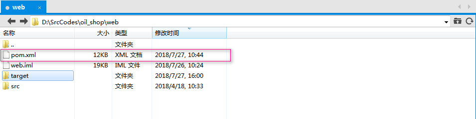
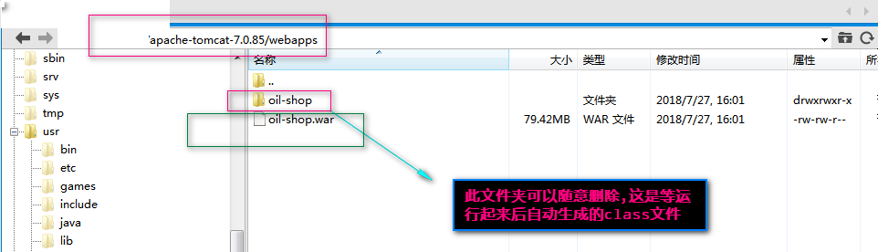

### 后端框架学习笔记3

***

[TOC]


##### 78 : mysql中decimal,numeric,double,float的区别
A : 区别如下
###### 显著区别
decimal,numeric属于**标准数据**类型, 指定精度和刻度；decimal的存储大小不确定, numeric的存储大小默认8个字节. 
double,float属于**非标准**数据类型, 在DB中保存的是近似值, **Decimal则以字符串的形式保存数值**. 


###### 比较
浮点数有个坏处, 当你给定的数据是整数的时候, 那么它就以整数给你处理. 这样我们在存取货币值的时候自然遇到问题, 我的default值为：0.00而实际存储是0, 同样我存取货币为12.00, 实际存储是12. 丢失了精度,变成了一个近似值.
Float数值类型用于表示单精度浮点数值, 而Double数值类型用于表示双精度浮点数值, Float和Double都是浮点型, 而Decimal是定点型；MySQL 浮点型和定点型可以用类型名称后加（M, D）来表示, M表示该值的总共长度, D表示小数点后面的长度, M和D又称为精度和标度, 
如float(7,4)的 可显示为-999.9999, MySQL保存值时进行四舍五入, 如果插入999.00009, 则结果为999.0001. 
Float和Double在不指 定精度时, 默认会按照实际的精度来显示, 而Decimal在不指定精度时, 默认整数为10, 小数为0. 同时, 对数据求SUM()时会出现不同的结果, Float和Double求SUM都会出现很多小数点, 而Decimal求SUM得到的是精准数值. decimal 和 numeric 是同义, 都是用于精确存储数值 . 

###### 使用小结
Mysql存储小数的时候, 大多数和金额有关系. 可以直接转换成分,以其作为整数形式来统计,最好别用浮点数,如果要用就要注意精度问题.
Float和Double存在精度的问题, 所以首选还是要用 Decimal和Numeric, 就我个人而Numeric用的比较多


##### 79: mysql中int, bigint, smallint和tinyint的区别与长度的含义
A : **之间的差别在于可以表示的范围(存储空间), 不同表示范围肯定占用不同长度的存储空间**
**bigint** : 从 -2^63 (-9223372036854775808) 到 2^63-1 (9223372036854775807) 的整型数据（所有数字）. **存储大小为 8 个字节**.
**int** : 从 -2^31 (-2,147,483,648) 到 2^31 – 1 (2,147,483,647) 的整型数据（所有数字）. **存储大小为 4 个字节**. int 的 SQL-92 同义字为 integer. 
**smallint** : 从 -2^15 (-32,768) 到 2^15 – 1 (32,767) 的整型数据. **存储大小为 2 个字节**. 
**tinyint** : 从 0 到 255 的整型数据. **存储大小为 1 字节**. 
int(M) 在 integer 数据类型中, M 表示最大显示宽度. 在 int(M) 中，M 的值跟 int(M) 所占多少存储空间并无任何关系. 和数字位数也无关系 int(3), int(4), int(8) 在磁盘上都是占用 4 btyes 的存储空间. 在mysql建表中的length, 只是用于显示的位数.


##### 80 : mybatis中的CURD操作方式和命名方式
A : 主要集中在两点上面, 一个在insert, **insert的时候要构造一个对象, Update的时候不要构造对象**,使用常规的参数即可. 关于函数的命名方式, insert, updateById, selectById, selectByName, deleteById, deleteByMobile这种, **将操作和字段使用By连接起来**, 也就是采用**操作-By-字段**的方式命名, 然后首字母大写即可.
:one: : **insert**语句, insert语句最好使用对象的方式来插入, 而不是使用一个一个单独的参数去完成一条记录的插入
```java
//DAO层的Mapper接口之中insert的写法
@Insert("INSERT INTO recommend_mobile(user_id, customer_name, mobile, mobile_type, status,                + amount,  reward_time, created, updated)"
		+ " VALUES (#{userId}, #{customerName}, #{mobile} #{mobileType},#{status},#{amount}, "
         + " #{rewardTime}, #{created}, #{updated})")
@Options(useGeneratedKeys = true, keyProperty = "id", keyColumn = "id")
long insert(RecommendMobile recommendMobile);//对象
```
```java
//Service层之中insert的写法
public long insert(long userId, String customerName, String mobile) {
	RecommendMobile mobileRecord = recommendMobileMapper.getByMobile(mobile);
	if (mobileRecord != null) {
		return HAVE_EXIST;
	}
	long time = TimeUtils.now();
	RecommendMobile recommendMobile = new RecommendMobile();/使用相关的参数,构造一个对象
	recommendMobile.setUserId(userId);
	recommendMobile.setCustomerName(customerName);
	recommendMobile.setMobile(mobile);
	recommendMobile.setMobileType(RecommendMobileTypeEnum.MOBILE_NO_STATUS.getCode());
	recommendMobile.setStatus(RecommendMobileRewardTypeEnum.NOT_REWARD.getCode());
	recommendMobile.setAmount(REWARD_AMOUNT);
	recommendMobile.setRewardTime(DEFAULT_REWARD_TIME);
	recommendMobile.setCreated(time);
	recommendMobile.setUpdated(time);
	recommendMobileMapper.insert(recommendMobile);
	long result = recommendMobile.getId();
	return result;
}
```
:two: : **delete**语句, delete语句是用来删除, 删除所依据的字段需要唯一, 命名采用deleteById, deleteByMobile即可, 在**Mapper层和Service层以及Controller层的调用方式是一致的**.
:three: : **update**语句, update语句用来更新一条记录, 命名方式采用updateById, updateByMobile即可, update使用的时候, 不必构造对象, 因为我们更新的时候, 大多数时候不会全字段更新,*如果构造对象的话, 就会导致有很多的字段是null值*, 所以我们**直接使用传入的基本参数即可, 而不必构造对象更新**.
```java
//DAO层的Mapper接口之中update的写法
@Update("UPDATE recommend_mobile_reward_rule SET amount = #{amount}, updated = #{updated} WHERE id = #{id}")
int updateById(@Param("amount") int amount, @Param("updated") long updated, @Param("id") int id);
```
```java
//Service层之中update的写法
public int updateById(int amount, int id) {
	RecommendMobileRewardRule tempRule = getByIdOrTypeId(id, null);// 不使用mobileType
	if (tempRule == null) return NOT_EXIST;// 没有对应的奖励规则
	long time = TimeUtils.now();// 只能修改某种套餐的amount,不可修改套餐的种类
	int result = recommendMobileRewardRuleMapper.updateById(amount, time, id);/* rule的字段有的是null, 应该是字段设置呢还是对象设置? */
	return result;
}
```
:four: : **select**语句, select语句是我们使用最多的语句, 有大量的查询, 我们得到的数据, 通常需**要使用对象,或者对象的列表来承接**,如`Hello`, `List<Hello>`, 在Mapper层之中需要注意一下, 在service层和controller层之中的调用, 和在Mapper之中的返回值保持一致即可. 命名方面一般使用selectById, selectByMobile等即可.
```java
//DAO层的Mapper接口,查询一条,使用对象来承接
@Select("<script>"
       + " SELECT id, mobile_type, amount, created, updated  FROM recommend_mobile_reward_rule "
       + " <where>"
       + " <if test=\" id !=null \"> and id = #{id} </if>"
       + " <if test=\" mobileType !=null \"> and mobile_type = #{mobileType} </if>"
       + " </where>"
       + "</script>")
RecommendMobileRewardRule getByIdOrTypeId(@Param("id") Integer id, @Param("mobileType") Integer        mobileType);
```
```java
//DAO层的Mapper接口,查询多条,使用对象列表来承接
@Select("<script>"
        + " SELECT id, user_id, customer_name, mobile, mobile_type, status, amount, reward_time, created, updated "
        + " FROM recommend_mobile "
        + " <where>"
        + " <if test=\" userId !=null \"> and user_id = #{userId} </if>"
        + " <if test=\" status !=null \"> and status = #{status} </if>"
        + " <if test=\" id !=null \"> and id <![CDATA[ < ]]> #{id} </if>"
        + " ORDER BY id DESC LIMIT #{pageSize} "
        + " </where>"
        + "</script>")
List<RecommendMobile> getByUserIdAndStatus(@Param("userId") long userId, @Param("status") int           status,@Param("id") Long id, @Param("pageSize") int pageSize);
```


##### 81 : 项目的打包和发布
A : 说明, 之前有介绍到maven的一些操作, maven是一个构建工具, 比如同事写了一些代码ap,为我们开发提供支持, 此时我们就可以其源代码拉取下来,然后编译,发布安装到本地的maven仓库之中, 然后我们就可以使用其提供的功能了,此时需要用到的命令是
```shell
mvn clean install -Dmaven.test.skip=true
```
当我们完成了一个功能, 需要从本地环境发布到线上测试环境或者线上生产环境的时候, 我们需要将新的war包发布到tomcat的webapps之中, 此时我们需要用到的是**打包命令**, 如下

```shell
mvn clean package -Dmaven.test.skip=true
```


上图是打包前, 经过打包之后, 在target就会生成我们需要的war包, targe也可能因为之前打包过而存在(无关紧要)

然后我们再通过FTP软件, 将我们的包上传到tomcat的webapps下面就好了.其中的oil-shop文件夹可以和旧的war包一起删除, 这是等运行起来后自动生成的class文件,当我们上传了新的war包之后, 就会有新的oil-shop文件夹生成


相关参考见`77 : 项目的编译, Maven编译jar包用来引用`


##### 82 : 项目的分支问题
A : 如果采用了git-flow的开发模式, master是稳定生产模式, develop是所有的开发基础, feture是特性分支, 我们所有的新的功能都在feture分支上, **当我们需要发布项目到测试环境的时候, 我们就需要将代码经过本地的环境测试没有问题了之后, 合并到develop分支, 然后打包develop分支的代码, 将其发布到tomcat;** 如果发布到正式环境, 那么久需要在确认develop分支的代码没有问题之后, 将其合并到master分支, 然后将master分支的代码打包发布到tomcat之中.


##### 83 : mybatis动态语句if的test问题
A : 如下
```java
//如下的第一个test, xxx,yyy应该是userId还是user_id?
@Select("<script>"
        + " SELECT id, user_id, customer_name, mobile, mobile_type, status, amount, reward_time, created, updated "
        + " FROM recommend_mobile "
        + " <where>"
        + " <if test=\" xxx !=null \"> and yyy = #{userId} </if>"
        + " <if test=\" status !=null \"> and status = #{status} </if>"
        + " <if test=\" id !=null \"> and id <![CDATA[ < ]]> #{id} </if>"
        + " ORDER BY id DESC LIMIT #{pageSize} "
        + " </where>"
        + "</script>")
List<RecommendMobile> getByUserIdAndStatus(@Param("userId") long userId, @Param("status") int           status,@Param("id") Long id, @Param("pageSize") int pageSize);
```

动态sql语句是为了可以灵活处理sql字段而有的一种解决方式. 我们可以从上面的注释看到问题, 其实下面已经给出了答案, 应该是userId, **因为我们所采取的的test测试, 都是针对domain类的, 所以也就是class之中的文件, 因此应该在test的条件中填写userId, 而在真正的sql语句之中, 应该是sql数据库之中的字段**. 因此, yyy处应该是user_id, 完整的语句如下

```java
" <if test=\" userId !=null \"> and user_id = #{userId} </if>"
```

上述的第3个测试语句之中的`and id <![CDATA[ < ]]> #{id}`的`<![CDATA[ < ]]> `是一个转义字符, 其中转义的是`<`小于号, 如果没有此`<![CDATA[  ]]>`, mybatis的mapper接口执行的时候就会导致参数无法正常对应绑定, 所以需要注意一下.


##### 84 : mybatis动态语句if参数调用的问题
A : 动态sql就是为了处理多种组合条件下的sql的一种方式, 比如,一个查询, 可能需要按照id, 可能需要按照typeId, 也可能有同时按照id和typeId查询的情况, 这时候如果三种情况都写, 就要三个语句, 那样很麻烦, 所以我们可以使用动态语句, test之中是测试条件, 由于测试的是参数的有无, 所以用是否为null, 如`id!=null`来判断, **由于基本类型, 如int, double等在初始化的时候jvm会给其一个默认的初始值, 所以永远不会为`null`, 所以如果有~~null需求~~的字段和测试的时候, 需要使用包装类型的定义, 如Long, Integer等**

```java
//DAO层的Mapper接口,动态查询,那么如何在servicec层和controller层调用呢?
@Select("<script>"
       + " SELECT id, mobile_type, amount, created, updated  FROM recommend_mobile_reward_rule "
       + " <where>"
       + " <if test=\" id !=null \"> and id = #{id} </if>"
       + " <if test=\" mobileType !=null \"> and mobile_type = #{mobileType} </if>"
       + " </where>"
       + "</script>")
RecommendMobileRewardRule getByIdOrTypeId(@Param("id") Integer id, @Param("mobileType") Integer mobileType);
```

```java
//service层调用动态语句
public RecommendMobileRewardRule getByIdOrTypeId(Integer id, Integer mobileType) {
	    RecommendMobileRewardRule rule = recommendMobileRewardRuleMapper.
            getByIdOrTypeId(id, mobileType);
		return rule;
}
```

由此可以看出, service层的调用其实没有什么特殊的作为, 就是按照其方法调用, 那么controller层呢?

```java
//controller层调用动态语句
@RequestMapping(value = "/getByIdOrTypeId", method = RequestMethod.GET)
@ResponseBody
public YjfJsonResult getByIdOrTypeId(Integer id, Integer mobileType) {
	// 参数检查
	if (id == null && mobileType == null) {
		return YjfJsonResult.builder().code(ResultCode.PARAMS_ERROR.val()).
            message(ResultCode.PARAMS_ERROR.msg()).build();
		}
	RecommendMobileRewardRule rewardRule = ruleService.getByIdOrTypeId(id, mobileType);
	if (rewardRule == null) {
		log.info("电话卡类型的奖励规则已经存在! id:{}, mobileType:{}", id, mobileType);
        return YjfJsonResult.builder().code(ResultCode.MOBILE_REWARD_RULE_EXIST.val())
.message(ResultCode.MOBILE_REWARD_RULE_EXIST.msg()).result(ruleService.NOT_EXIST).build();
		}
        return YjfJsonResult.builder().code(ResultCode.SUCCESS.val()).
            message(ResultCode.SUCCESS.msg()).result(rewardRule).build();
	}
```

由controller可以看出也是一样的, 其决定于如何传入的参数, 如果传入id为null那么久按照mobileType查询, 反之同理, **这是正常调用走mapper-->service-->controller的路径, 所有的调用参数都按照正常的方式调用, 采用什么参数, 由前端传入的参数自动决定**, 但是, 但是, 但是,有一种情况, 就是**可能这个使用动态语句的service方法只是为其他的方法提供支持的, 那么我们就需要在service层让别人调用, 由此可得, 当只是进行某些特殊的操作时候, 我们可以将不需要的字段设置为null 或者是test测试条件失效的条件即可**, 其实同url前端传入的方式是同理的, 只不过一个是手动, 一个是自动的, 例子如下

```java
//service层的特定调用
//插入使用mobileType, 不需要id
public int insert(int mobileType, int amount) {
	RecommendMobileRewardRule tempRule = getByIdOrTypeId(null, mobileType);//insert使用mobileType, 不需要id, 所以设置id=null
	if (tempRule != null) {
		return HAVE_EXIST;// mobileType已经存在
	}
	RecommendMobileRewardRule rule = new RecommendMobileRewardRule();
	long time = TimeUtils.now();
	rule.setMobileType(mobileType);
	rule.setAmount(amount);
	rule.setCreated(time);
	rule.setUpdated(time);
	recommendMobileRewardRuleMapper.insert(rule);
	int result = rule.getId();
	return result;
}

// 删除使用使用id, 不需要mobileType
public int deleteById(int id) {
	RecommendMobileRewardRule tempRule = getByIdOrTypeId(id, null);//delete使用id, 不需要mobileType,所以设置mobileType=null
	if (tempRule == null) return NOT_EXIST;
	int result = recommendMobileRewardRuleMapper.deleteById(id);
	return result;
}

//查询一条奖励规则使用id或者mobileType
public RecommendMobileRewardRule getByIdOrTypeId(Integer id, Integer mobileType) {
	RecommendMobileRewardRule rule = recommendMobileRewardRuleMapper.getByIdOrTypeId(id, mobileType);
	return rule;
}
```

其实说白了, **动态sql的调用,就是把需要的参数设置为正常的, 把不需要的参数设置为null**.


##### 84 : mybatis的mapper语句的@param注解使用
A : 当只有一个参数的时候可以省略@Param注解, 也可以写上,都是可以的,但是而如果有多个的参数的时候, 不能省略, 必须全部都写上,否则就会报错
```java
//无
Insert("INSERT INTO recommend_mobile_reward_rule (mobile_type, amount, created, updated )"
			+ " VALUES(#{mobileType}, #{amount}, #{created}, #{updated})")
@Options(useGeneratedKeys = true, keyProperty = "id", keyColumn = "id")
int insert(RecommendMobileRewardRule recommendMobileRewardRule);

//有
@Delete("DELETE FROM recommend_mobile_reward_rule WHERE id = #{id}")
int deleteById(@Param("id") int id);

//有
@Update("UPDATE recommend_mobile_reward_rule SET amount = #{amount}, updated = #{updated} WHERE id = #{id}")
int updateById(@Param("amount") int amount, @Param("updated") long updated, @Param("id") int id);
```


##### 85 : 再谈mybatis的分页
A : 分页很重要, 我们都知道, 分页一般都是在select的操作之中, 分页有真分页和假分页两种, 真分页使用sql语句, 假分页采用前端控制, 真分页也有一次性取出来和多次取出来的区别
SQL的分页，我们可以使用**limit**关键字或者**limit**&**offset**两个关键字组合来完成分页的实现，但是使用这两个关键字的时候是有区别的。示例如下 : 

:one: . 仅使用**limit**关键字，*limit N* : **只返回符合条件的前N条**

```sql
###### sql的数据计算是从0开始的，第1条的下标为0) #####
SELECT * FROM article_topic LIMIT 10; # 符合条件的前10条
SELECT * FROM article_topic WHERE id<100 LIMIT 10; # 符合条件的前10条,这句和上面一句的含义相同
```

:two: . 使用**limit**关键字，*limit  M , N* : **跳过M条，返回N条，从第M条开始读取**

```sql
SELECT * FROM article_topic LIMIT 2,1; # 跳过2条取出1条数据，LIMIT后面是从第2条开始读，读取1条信息，即读取第2条数据，也就是第三条
SELECT * FROM article_topic LIMIT 8,5; # 跳过8条，取出5条，从第8条开始读取
SELECT * FROM article_topic WHERE id<100 LIMIT 8,5;
```

:three: . 使用**limit**&**offset**关键字，*limit M offset N* : **跳过N条，返回M条，从第N条开始计算**

```sql
SELECT * FROM article_topic LIMIT 2 OFFSET 1; # 返回2条数据，从第1条开始计算，LIMIT后面跟的是2条数据，OFFSET后面是从第1条开始读取，即读取第2,3条
SELECT * FROM article_topic LIMIT 10 OFFSET 5; # 返回10条数据，从第5条开始计算
```
其中第:two:种和第:three:种之间的关系是相反的，最好统一使用第三种: *limit M offset N*, 返回M条（跳过N条），从第N条开始计算。[ sql 中 limit 与 limit，offset连用的区别 ](https://blog.csdn.net/AinUser/article/details/72803175),   [SQL 语句的LIMIT的用法](https://www.cnblogs.com/wangxingliu/p/3512188.html)

这是sql之中的情况, 实际情况中, **我们分页都需要order排序, 根据id或者created**, 一般情况下, 我们总是需要让最近的情况显示在我们的查询结果之中, 没有太多人对于一年之前的订单感兴趣太大的兴趣, 所以通常使用`order by created desc`, *由于id通常也是增大的*, 所以也可以使用`order by id desc`, 但是这样通常都是取得的全部的查询数据, 然后再从其中查找, 对于机器的压力比较大, 如下:

```java
@Select("SElECT id, user_id, customer_name, mobile, mobile_type, status, amount, reward_time, created, updated "
			+ " FROM recommend_mobile "
			+ " WHERE user_id= #{userId} and status= #{status} ORDER BY id DESC LIMIT #{pageSize} OFFSET #{pageStart}")
List<RecommendMobile> getByUserIdAndStatus(@Param("userId") long userId, @Param("status") int status,@Param("pageSize") int pageSize, @Param("pageStart") int pageStart);
```

所以我们需要按需索取, 通过id大小来控制, 如取id=10到20的10条, 那么就设置id<20, pageSize=10即可, 如下:

```java
@Select("SELECT id, user_id, customer_name, mobile, mobile_type, status, amount, reward_time, created, updated "
              + " FROM recommend_mobile "
              + " WHERE user_id= #{userId} and status= #{status} and id < #{id} ORDER BY id DESC LIMIT #{pageSize} ")
List<RecommendMobile> getByUserIdAndStatus(@Param("userId") long userId, @Param("status") int status, @Param("id") long id, @Param("pageSize") int pageSize);
```

但是如上, **要求我们每次都要从前端获取id的大小值, 第一次前端无法获取id的大小, 所以必须允许其为空,** 因此, 我们需要设置动态sql语句来完成, 由于id可以为null, 所以其类型由基本类型设置为包装类型, `long-->Long`, 如下:

```java
@Select("<script>"
            + " SELECT id, user_id, customer_name, mobile, mobile_type, status, amount, reward_time, created, updated "
			+ " FROM recommend_mobile "
			+ " <where>"
            + " <if test=\" userId !=null \"> and user_id = #{userId} </if>"
            + " <if test=\" status !=null \"> and status = #{status} </if>"
            + " <if test=\" id !=null \"> and id <![CDATA[ < ]]> #{id} </if>"
            + " ORDER BY id DESC LIMIT #{pageSize} "
            + " </where>"
            + "</script>")
List<RecommendMobile> getByUserIdAndStatus(@Param("userId") long userId, @Param("status") int status, @Param("id") Long id, @Param("pageSize") int pageSize);//第一次id为空,也可以查询
```

这是mapper文件中的操作,  在service层正常调用即可, 如下:

```java
public List<RecommendMobile> getByUserIdAndStatus(long userId, int status, Long id, int pageSize) {
		return recommendMobileMapper.getByUserIdAndStatus(userId, status, id, pageSize);
}//只需要每页的大小pageSize, 不需要所有的都出现, 也就不需要使用offset
```

第二个关键在于controller层, 我们第一次不需要id值, 后面每次需要获取前一次的id, 作为`id < #{id}`的判断条件, 而且可以返回是否是分页的最后一次了, id通过`list.get(list.size()-1).getId()`l就可以得到, 然后就可以使用list的大小和pageSize来判断, 如果`list.size()< pageSize`那么就是最后的分页, 至于相等的情况, 可能需要多一次的获取和判断, 这个问题不大. 如下:

```java
@RequestMapping(value = "/getByUserStatus", method = RequestMethod.GET)
@ResponseBody
public YjfJsonResult getByUserIdAndStatus(int status, Long id, int pageSize) {
	long userId = SessionContextHolder.getUserId();
	if (userId < 0 || pageSize <= 0 || (id != null && id <= 0)) {
			log.warn("参数不符合要求! userId:{}, status:{}, id:{} ,pageSize:{}", userId, status, id, pageSize);
			return YjfJsonResult.builder().code(ResultCode.PARAMS_ERROR.val()).
                message(ResultCode.PARAMS_ERROR.msg())
					.build();
	}
	List<RecommendMobile> mobileList = recommendMobileService.getByUserIdAndStatus(userId, status, id, pageSize);
		HashMap<String, Object> jsonMap = new HashMap<>();
		jsonMap.put("record", mobileList);
		jsonMap.put("lastId", mobileList.get(mobileList.size() - 1).getId());// 获取最后一个的Id
		boolean end = false;
		if (mobileList.size() < pageSize) {
		end = true;
		}
		jsonMap.put("end", end);// 是否还需要分页,使用当前页的数量和pageSize来分区
		JSONObject json = new JSONObject(jsonMap);
		return YjfJsonResult.builder().code(ResultCode.SUCCESS.val()).
            message(ResultCode.SUCCESS.msg()).result(json).build();
	}
```

上面是不使用分页辅助类的的情况, 如下是使用辅助类的情况

```java
@RequestMapping(value = "/getByUserStatus", method = RequestMethod.GET)
@ResponseBody
public YjfJsonResult getByUserIdAndStatus(int status, Long id, int pageSize) {
	long userId = SessionContextHolder.getUserId();
	if (userId < 0 || pageSize <= 0 || (id != null && id <= 0)) {
			log.warn("参数不符合要求! userId:{}, status:{}, id:{} ,pageSize:{}", userId, status, id, pageSize);
			return YjfJsonResult.builder().code(ResultCode.PARAMS_ERROR.val()).
                message(ResultCode.PARAMS_ERROR.msg())
					.build();
	}
	List<RecommendMobile> mobileList = recommendMobileService.getByUserIdAndStatus(userId, status, id, pageSize);
	Mbook<RecommendMobile> mobileMbook;
	if (lastId == 0) {
		mobileMbook = Mbook.result(null, "", true);
		return YjfJsonResult.builder().code(ResultCode.SUCCESS.val()).
            message(ResultCode.SUCCESS.msg()).result(mobileMbook).build();
		}
	mobileMbook = Mbook.result(mobileList, String.valueOf(mobileList.get(lastId - 1).getId()), pageSize);
		return YjfJsonResult.builder().code(ResultCode.SUCCESS.val()).
            message(ResultCode.SUCCESS.msg()).result(mobileMbook).build();
}
```

如下是`MBook`辅助类:

```java
//MBook.java
package com.yjf.domain;

import lombok.Data;
import lombok.ToString;
import org.apache.commons.collections4.CollectionUtils;

import java.util.Collections;
import java.util.List;

/**
 * Created by xushengchao 5/3.
 */
@Data
@ToString
public class Mbook<T> {
    /**
     * 记录列表
     */
    private List<T> records;
    /**
     * 分页截止ID（根据实际含义赋值，updated时间戳、价格等)
     */
    private String lastId;
    /**
     * 是否最后一页
     */
    private boolean isEnd = false;

    /**
     * 组装返回分页列表
     *
     * @param records
     * @param lastId
     * @param isEnd
     * @param <T>
     * @return
     */
    public static <T> Mbook<T> result(List<T> records, String lastId, boolean isEnd) {
        Mbook<T> mbook = new Mbook<>();
        mbook.setRecords(records);
        mbook.setLastId(lastId);
        mbook.setEnd(isEnd);
        return mbook;
    }

    /**
     * 根据返回列表参数和页码判断是否最后一个并组装参数
     *
     * @param records
     * @param lastId
     * @param pageSize
     * @param <T>
     * @return
     */
    public static <T> Mbook<T> result(List<T> records, String lastId, Integer pageSize) {
        Mbook<T> mbook = new Mbook<>();
        mbook.setRecords(records);
        mbook.setLastId(lastId);
        mbook.setEnd(CollectionUtils.isEmpty(records) || records.size() < pageSize);
        return mbook;
    }

    /**
     * 封装mbook基础信息到已有的mbook
     *
     * @param mbook
     * @param pageSize
     * @param <T>
     */
    public static <T> void handleResult(Mbook<T> mbook, List<T> records, String lastId, Integer pageSize) {
        if (mbook != null) {
            mbook.setRecords(records);
            mbook.setLastId(lastId);
            mbook.setEnd(CollectionUtils.isEmpty(records) || records.size() < pageSize);
        }
    }

    /**
     * 默认列表
     *
     * @param <T>
     * @return
     */
    public static <T> Mbook<T> getDefault() {
        Mbook<T> mbook = new Mbook<>();
        mbook.setEnd(true);
        mbook.setRecords(Collections.emptyList());
        return mbook;
    }
}
```


86 : @Transactional的处理方法
A : service层处理, 事务调用事务, 在上一层之中处理异常, 异常必须要处理, 异常必须要处理, 异常必须要处理!!!


ref:
51.[mysql中decimal,numeric,double,float的区别](https://blog.csdn.net/wufaliang003/article/details/78502402),   52.[mysql 数据类型 Float、Double、Decimal和Numeric 的区别](http://www.uuboku.com/455.html),   53.[mysql中int、bigint、smallint 和 tinyint的区别与长度的含义](https://blog.csdn.net/spring21st/article/details/7332200)