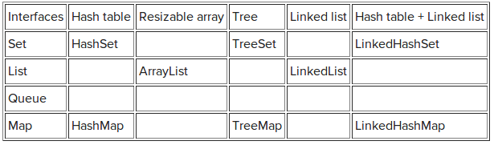
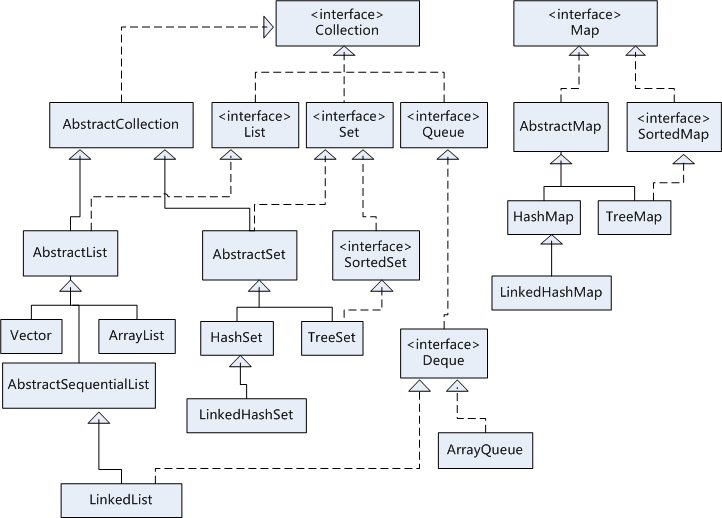
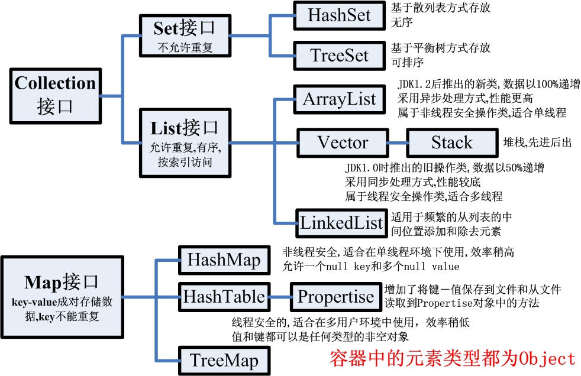
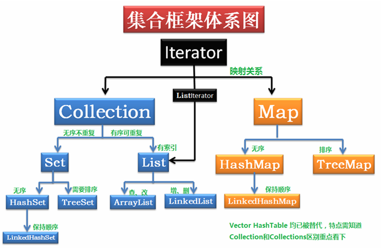
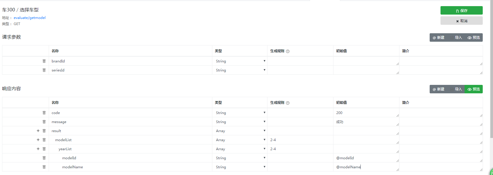
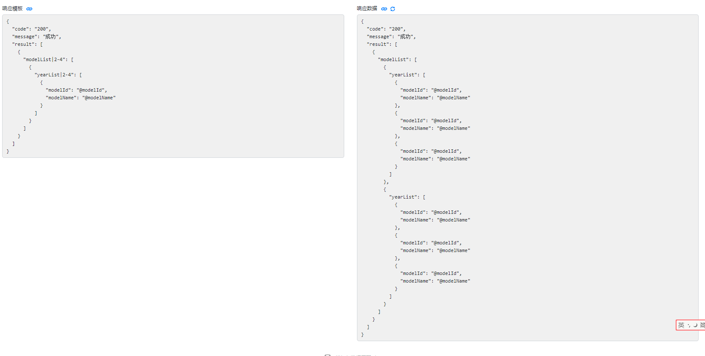
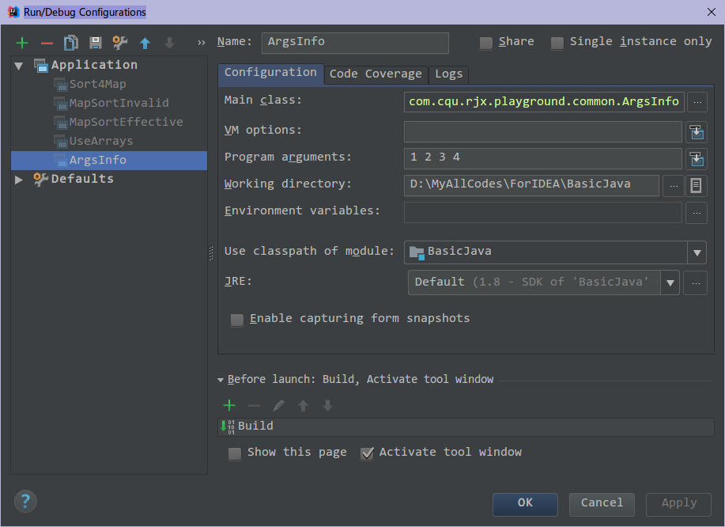
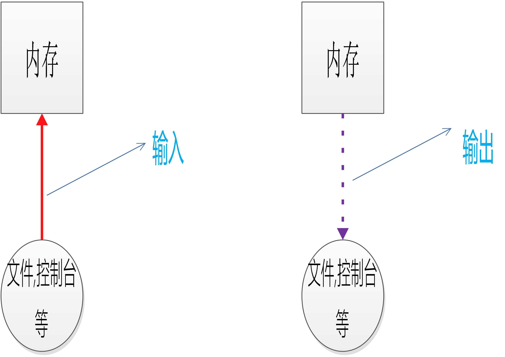
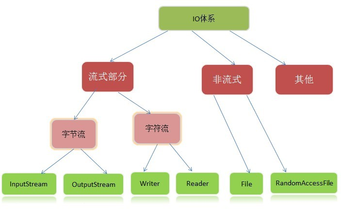
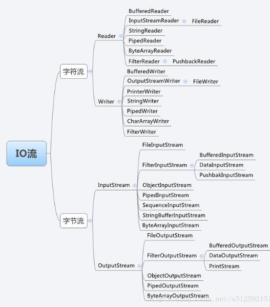

### 后端框架学习笔记4

***

[TOC]

##### 102 : Throwable, Error, Exception, RuntimeException, throw, throws的区别
A : 区别如下

在Java中, 根据错误性质将运行错误分为两类: 错误和异常. 在Java程序的执行过程中, 如果出现了异常事件, 就会生成一个异常对象. 生成的异常对象将传递Java运行时系统, 这一异常的产生和提交过程称为抛弃(throw)异常.当Java运行时系统得到一个异常对象时, 它将会沿着方法的调用栈逐层回溯, 寻找处理这一异常的代码. 找到能够处理这类异常的方法后, 运行时系统把当前异常对象交给这个方法进行处理, 这一过程称为捕获(catch)异常.


**Throwable**
类是 Java 语言中所有错误或异常的超类, 它的两个子类是Error和Exception


**Error**
是Throwable 的子类, 用于指示**合理的应用程序不应该试图捕获的严重问题**. 大多数这样的错误都是异常条件. 虽然   ThreadDeath 错误是一个"正规"的条件, 但它也是 Error 的子类, 因为**大多数应用程序都不应该试图捕获它**. 在执行该方法期间, 无需在其 throws 子句中声明可能抛出但是未能捕获的 Error 的任何子类, 因为这些错误可能是再也不会发生的异常条件. Error类包括一些严重的程序不能处理的系统错误类, 如内存溢出, 虚拟机错误, 栈溢出等. 这类错误一般与硬件有关, 与程序本身无关, 通常由系统进行处理, 程序本身无法捕获和处理.

1.OutOfMemoryError内存溢出一般是出现在申请了较多的内存空间没有释放的情形

```java
//java.lang.OutOfMemoryError  -Xmx150m
try {
	byte[] b = new byte[1024*1024*600];
} catch (OutOfMemoryError e) {
	e.printStackTrace();
}
```

运行时，设置jvm最大的heap内存150m，此时申请600m的内存，因此会报error

```java
java.lang.OutOfMemoryError: Java heap space
```

2.StackOverflowError
堆栈溢出错误. 当一个应用递归调用的层次太深而导致堆栈溢出时抛出该错误. 

```java
public static void main(String[] args) {
	method();
}
public static void method() {
	while (true) {
		method();
	}
}
```

无限次的递归调用出现

```java
Exception in thread "main" java.lang.StackOverflowError
```


**Exception**
类及其子类是 Throwable 的一种形式, 它指出了**合理的应用程序想要捕获的条件**. 有些异常在编写程序时无法预料的, 如中断异常, 非法存取异常等. 为了保证程序的健壮性, **Java要求必须对这些可能出现的异常进行捕获, 并对其进行处理**. Exception的除RuntimeException类的对象, 都是可检查的异常(Checked exception), Checked exception需要明确声明.

> public class Exception extends Throwable
>
> The class Exception and its subclasses are a form of Throwable that indicates conditions that a reasonable application might want to catch.
>
> The class Exception and any subclasses that are not also subclasses of RuntimeException are checked exceptions. Checked exceptions need to be declared in a method or constructor's throws clause if they can be thrown by the execution of the method or constructor and propagate outside the method or constructor boundary.


**RuntimeException**
类是Exception类的子类. **RuntimeException是那些可能在 Java 虚拟机正常运行期间抛出的异常的超类**, 可能在执行方法期间抛出但未被捕获的RuntimeException 的任何子类都无需在 throws 子句中进行声明. 它是Exception的子类. 常见的运行时异常:

```java
try {
	String str = new String("AA");
	str = null;
	System.out.println(str.length());
} catch (NullPointerException e) {
	e.printStackTrace();
	System.out.println("出现空指针的异常了");
}

try {
	Object obj = new Date();
	String str = (String) obj;
} catch (ClassCastException e) {
	System.out.println("出现类型转换的异常了");
} catch (Exception e) {
	e.printStackTrace();
} finally {
	System.out.println("处理完异常后的逻辑");
}

try {
	int i = 10;
	System.out.println(i / 0);
} catch (ArithmeticException e) {
	System.out.println("算术异常"+e.getMessage());
}

try {
	int[] i = new int[10];
	System.out.println(i[-10]);
} catch (ArrayIndexOutOfBoundsException e) {
	System.out.println("数组下标越界的异常！");
}
```

 

**IOExeption**

类是Exception类的子类, 从一个不存在的文件中读取数据, 越过文件结尾继续读取, 连接一个不存在的URL

```java
FileInputStream fis = null;
try {
	fis = new FileInputStream(new File("hello1.txt"));
	int b;
	while ((b = fis.read()) != -1) {
		System.out.print((char) b);
	}
} catch (FileNotFoundException e1) {
	System.out.println("文件找不到了！");
} catch (IOException e1) {
	System.out.println(e1.getMessage());
} finally {
	try {
		fis.close();
	} catch (IOException e) {
		e.printStackTrace();
	}
}
```

 **throws用来声明一种可能要抛出的异常类型, throw用来抛出一个异常对象**.


##### 103 : Java中数组、List、Set互相转换
A : 主要是List和Set之中的toArray方法, 以及List和Set创建的时候, 由于可以使用collection参数, 所以相当于可以直接转换.

```java
import java.util.*;

public class ArrayListSet {
    //Array, List, Set之间的相互转换
    public static void main(String[] args) {
        //定义数组, 数据来源
        String[] names = new String[]{"关羽", "Justin", "大桥未久", "天海翼", "爱因斯坦", "白素贞"};
        /*数组转换成其他类型的数据*/
        Array2ListNoAddRemove(names);//数组-->List
        Array2ListHaveAddRemove(names);
        Array2Set(names);//数组-->Set

        /*List转换成Set和Array*/
        List2Set(names);//List-->Set
        List2Array(names);//List-->Array

        /*Set转换成List和Array*/
        HashSet<String> hashSet = new HashSet<>();
        hashSet.add("北京");
        hashSet.add("北京");
        hashSet.add("上海");
        hashSet.add("天津");
        hashSet.add("成都");
        hashSet.add("杭州");
        hashSet.add("广州");
        Set2Array(hashSet);//Set-->数组
        Set2List(hashSet);//Set-->List
    }

    public static void Array2Set(String[] nameArray) {
        System.out.println("\nArray------>Set");
        Set<String> starts = new HashSet<>(Arrays.asList(nameArray));
        starts.add("Mary"); // ok
        starts.remove("Tom"); // ok
        System.out.println("set长度: " + starts.size());

    }

    // array 转换 Collection(不可添加删除元素, 固定大小)
    public static void Array2ListHaveAddRemove(String[] nameArray) {
        System.out.println("\nArray------>List(可以add & remove)");
        List nameList = new ArrayList<String>();
        for (String temp : nameArray) {
            nameList.add(temp);
        }
        nameList.add("Mary"); // ok
        nameList.remove(0); // ok
        StringBuilder sb2 = new StringBuilder();
        Iterator<String> iterator = nameList.iterator();
        while (iterator.hasNext()) {
            sb2.append(iterator.next() + " ,");
        }
        String listStrTemp2 = sb2.toString();
        String listStr2 = listStrTemp2.substring(0, listStrTemp2.length() - 1);
        System.out.println("最后一个,去除: " + listStr2);
    }

    // array 转换 list(不可添加删除元素, 固定大小)
    public static void Array2ListNoAddRemove(String[] nameArray) {
        System.out.println("\nArray------>List(不能add & remove)");
        List<String> list = Arrays.asList(nameArray);
        System.out.println("list的size(): " + list.size());
        StringBuilder sb1 = new StringBuilder();
        ListIterator<String> it = list.listIterator();
        while (it.hasNext()) {
            sb1.append(it.next() + " ,");
        }
        String listStrTemp = sb1.toString();//去除掉最后一个","
        System.out.println("最后一个,未去除: " + listStrTemp);
        String listStr = listStrTemp.substring(0, listStrTemp.length() - 1);
        System.out.println("最后一个,去除: " + listStr);
        //list.add("123"); // Arrays.asList()方法, 只能产生固定长度的list, 转换后添加和删除都不可以
    }

    public static void List2Array(String[] nameArray) {
        System.out.println("\nList------>Array");
        List<String> list = Arrays.asList(nameArray);
        String[] strArray = (String[]) list.toArray();//toarray
        for (String obj : strArray) {
            System.out.print((obj + ", "));
        }
        System.out.println("\n转换后数组的size:" + strArray.length);
    }

    public static void List2Set(String[] nameArray) {
        System.out.println("\nList------>Set");
        List<String> list = Arrays.asList(nameArray);
        HashSet hashSet = new HashSet(list);
        for (Object obj : hashSet) {
            System.out.print((String) obj + ", ");
        }
        System.out.println("\nhashSet的size:" + hashSet.size());
    }

    public static void Set2Array(HashSet hashSet) {
        System.out.println("\nSet------>Array");
        Object[] strArr = hashSet.toArray();//List,Set自带 toArray方法
        System.out.println("strArr.size(): " + strArr.length);
    }

    public static void Set2List(HashSet hashSet) {
        System.out.println("\nSet------>Hash");
        List<String> list = new ArrayList<>(hashSet);//这个是来自于Collection的构造函数
        list.add("123");
        System.out.println("list.size(): " + list.size());
    }
}
```


##### 104 : String类的基本方法, StringBuffer以及StringBuilder类

A : String是常量, 创建之后就无法修改, StringBuffer以及StringBuilder创建的是变量, StringBuffer线程安全, 速度慢一点, StringBuilder线程不安全, 速度快一点.


String类的用法如下:

```java
public class UseLangString {
    public static void main(String[] args) {
        useValueOf();
        charAndByte();
        useIndexOf();
        lowAndUp();
        startAndEnd();
        getSubStr();
    }

    /*使用valueOf*/
    public static void useValueOf() {
        System.out.println("\n---使用valueOf---");
        long longValue = 10l;
        String longValueStr = String.valueOf(longValue);
        System.out.println("method valueOf: " + longValueStr);
        char[] chars = new char[]{'h', 'e', 'l', 'l', 'o'};
        String charStr = String.valueOf(chars); //对应于chars
        System.out.println("method valueOf: " + charStr);
    }

    /*使用char和Byte的功能*/
    public static void charAndByte() {
        System.out.println("\n---使用char和Byte的功能---");
        String str1 = "今天是美好的一天";
        String str2 = "Hello, wonderful day!";
        byte[] str1ByteArr = str1.getBytes();//获得byte[] 数组
        byte[] str2ByteArr = str2.getBytes();//byte是二进制的编码
        System.out.println(str1ByteArr.length);
        System.out.println(str2ByteArr.length);
        for (byte temp : str1ByteArr) {//遍历byte[] str1ByteArr
            System.out.print(temp + " ");
        }
        System.out.println(" ");
        for (byte temp : str2ByteArr) {//遍历byte[] str2ByteArr
            System.out.print(temp + " ");
        }
        System.out.println(" ");
        char[] str1CharArr = str1.toCharArray();// 相当于把汉字完全分开了
        char[] str2CharArr = str2.toCharArray();
        System.out.println(str1CharArr.length);
        System.out.println(str2CharArr.length);
        for (char temp : str1CharArr) {//遍历char[] str1CharArr
            System.out.print(temp + " ");
        }
        System.out.println(" ");
        for (char temp : str2CharArr) {//遍历char[] str2CharArr
            System.out.print(temp + " ");
        }
        System.out.println(" ");

    }

    /*使用indexOf*/
    public static void useIndexOf() {
        System.out.println("\n---使用indexOf---");
        String wenhou = "你们好,中国人民!";
        String hello = " hello, chinese people!";
        System.out.println(wenhou.indexOf(2));//'2'字符的位置在何处, 没有2字符在其中
        System.out.println(wenhou.indexOf('好'));//'好'字符的位置在何处
        System.out.println(hello.indexOf(2));
        System.out.println(hello.indexOf('人'));
        System.out.println(hello.charAt(2));
        System.out.println(wenhou.codePointAt(6));//返回在unicode编码的具体位置
        System.out.println(hello.codePointAt(2));
        System.out.println(hello.lastIndexOf(1));
        System.out.println(hello.lastIndexOf('e'));//'e'最后一次在hello之中出现的位置
        System.out.println(hello.lastIndexOf("people"));//"people"最后一次在hello之中出现的位置
    }

    /*使用大小写转换和比较*/
    public static void lowAndUp() {
        System.out.println("\n---使用大小写转换和比较---");
        String low = "abcddd";
        String up = "ABCddd";
        System.out.println(low.toUpperCase());
        System.out.println(up.toLowerCase());
        System.out.println(low.equalsIgnoreCase(up));//不记大小写, 然后比较是否相等
        System.out.println(low.compareToIgnoreCase(up));//不计大小写, 返回比较结果(-1,0,1)
        System.out.println(low.compareTo(up));// 比较大小, 返回值大于0, 则表示low大于up, low-up, 小写字母大于大写字母的值
    }

    /*使用start和end相关方法*/
    public static void startAndEnd() {
        System.out.println("\n---使用start和end相关方法---");
        String str1 = "    今天是美好的一天";
        String str2 = "Hello, wonderful day!";
        System.out.println(str1.startsWith("jin"));
        System.out.println(str1.startsWith("今"));
        System.out.println(str2.endsWith("!"));
        System.out.println(str1);
        System.out.println(str1.trim());//去除前后空格

    }

    /*取得部分的字符串*/
    public static void getSubStr() {
        System.out.println("\n---取得部分的字符串---");
        String clause1 = "白日依山尽, 黄河入海流";
        String clause2 = "Do not, for one repulse, give up the purpose that you resolved to effect."
                + "To be, or not to be, that is the question.";
        System.out.println(clause1);
        System.out.println(clause2);
        System.out.println(clause1.concat(clause2));//二者拼接起来
        System.out.println(clause1.substring(6));   //取得部分的字符串
        System.out.println(clause1.substring(6, 10));
        System.out.println(clause1.isEmpty());//是否为空
        System.out.println(clause2.contains("purpose"));//是否包含一个字符串
        System.out.println(clause2.replace("o", "=*="));//替换
        String[] clause1SplitArr = clause2.split(",");//分割
        String[] clause2SplitArr = clause2.split(",", 3);//使用","作为分割符, 但是只分割三次, 后面的不分割了放在一起
        System.out.println(clause1SplitArr.length);
        System.out.println(clause2SplitArr.length);
        for (String temp : clause1SplitArr) {
            System.out.print(temp + "   ");
        }
        System.out.println(" ");
        for (String temp : clause2SplitArr) {
            System.out.print(temp + "   ");
        }
        System.out.println(" ");
        //Do not    for one repulse    give up the purpose that you resolved to effect.To be    or not to be    that is the question.
        //Do not    for one repulse    give up the purpose that you resolved to effect.To be, or not to be, that is the question.
    }   
}
```

StringBuffer和StringBuilder类的用法

```java
public class UseStringBufferBuilder {
    public static void main(String[] args) {
        System.out.println("StringBuffer: A thread-safe, mutable sequence of characters. "
                + "StringBuffer:可变字符串, 速度中等, 线程安全");
        System.out.println("StringBuilder: A mutable sequence of characters. This class "
                + "provides an API compatible with StringBuffer, but with no guarantee of synchronization."
                + "StringBuilder:可变字符串, 高效快速, 线程不安全");
        System.out.println("StringBuilder和StringBuffer之间的区别就在于线程安全性上面, 其他的方面都相同,api定义和用法都相同");
        useStringBuffer();
        useStringBuilder();

    }

    public static void useStringBuffer() {
        System.out.println("\n\n\n---使用StrigBuffer的功能---");
        String poem = "我欲抽到断扬子, 问天谁敢与争锋!";
        StringBuffer sb1 = new StringBuffer();
        StringBuffer sb2 = new StringBuffer(6);//设置容量
        StringBuffer sb3 = new StringBuffer(poem);//通过String字符串来创建StringBuffer对象.


        System.out.println("\n使用各种构造函数, 创建一个StringBuffer---");
        sb1.append(12);//int
        sb1.append("hello world!");//str
        sb1.append(new Object().toString());//对象
        sb1.append(36.8d);//duble
        sb1.append(poem, 2, 8);//从String字符串之中取一部分
        System.out.println(sb1.toString());//StringBuffer转换成String, toString


        System.out.println("\n使用delete, insert等api");
        sb1.deleteCharAt(2);//按位置删除, 第2个char
        sb1.delete(3, 12);//删除第3-12个char, 范围是[3,12]
        System.out.println(sb1.toString());
        System.out.println(sb1.capacity());//容量
        sb1.insert(5, 12345678);/*offset的含义是什么?*/
        System.out.println(sb1.toString());
        System.out.println(sb1.capacity());//容量
        sb1.insert(0, "你说什么?");//insert String,offset=0, 表示从现在的第0个位置插入
        char[] ch1 = new char[]{'中', '❀', '民', '果'};
        sb1.insert(sb1.length(), ch1);//末尾插入, 插入一个char 数组
        System.out.println(sb1.toString());


        System.out.println("\n使用index, subString, reverse, replace和getChars等api");
        int num = sb1.lastIndexOf("8");//最后一个8出现的位置
        int index = sb1.indexOf("❀");
        String sb7_end = sb1.substring(7);//取其中一部分就变成了String类型
        String sb3_9 = sb1.substring(3, 9);
        System.out.println("num: " + num + ", index: " + index + ", sb7_end:" + sb7_end + ", sb3_9:" + sb3_9);

        char[] chars = new char[]{'h', 'e', 'l', 'l', 'o', '!', 'M', 'I', 'A'};//size为7, 不过貌似没什么异常发生
        sb2.append(chars);
        System.out.println(sb2.toString() + ", " + sb2.toString().length());
        System.out.println(sb2.reverse());//reverse
        sb2.replace(2, 4, "******(敏感词屏蔽掉)******");
        System.out.println(sb2.toString());
        char[] chars123 = new char[10];
        sb2.getChars(1, 7, chars123, 3);//去填充一个char[]数组
        for (char ch : chars123) {
            System.out.print(ch);
        }
        System.out.println(" ");
        System.out.println(sb3.toString());
    }

    public static void useStringBuilder() {
        System.out.println("\n\n\n---使用StrigBuilder的功能---");
        String poem = "我欲抽到断扬子, 问天谁敢与争锋!";
        StringBuilder stringBuilder1 = new StringBuilder();
        StringBuilder stringBuilder2 = new StringBuilder(6);//设置容量
        StringBuilder stringBuilder3 = new StringBuilder(poem);//通过String字符串来创建StringBuilder对象.


        System.out.println("\n使用各种构造函数, 创建一个StringBuffer---");
        stringBuilder1.append(12);//int
        stringBuilder1.append("hello world!");//str
        stringBuilder1.append(new Object().toString());//对象
        stringBuilder1.append(36.8d);//duble
        stringBuilder1.append(poem, 2, 8);//从String字符串之中取一部分
        System.out.println(stringBuilder1.toString());//StringBuffer转换成String, toString


        System.out.println("\n使用delete, insert等api");
        stringBuilder1.deleteCharAt(2);//按位置删除, 第2个char
        stringBuilder1.delete(3, 12);//删除第3-12个char, 范围是[3,12]
        System.out.println(stringBuilder1.toString());
        System.out.println(stringBuilder1.capacity());//容量
        stringBuilder1.insert(5, 12345678);/*offset的含义是什么?*/
        System.out.println(stringBuilder1.toString());
        System.out.println(stringBuilder1.capacity());//容量
        stringBuilder1.insert(0, "你说什么?");//insert String,offset=0, 表示从现在的第0个位置插入
        char[] ch1 = new char[]{'中', '❀', '民', '果'};
        stringBuilder1.insert(stringBuilder1.length(), ch1);//末尾插入, 插入一个char 数组
        System.out.println(stringBuilder1.toString());


        System.out.println("\n使用index, subString, reverse, replace和getChars等api");
        int num = stringBuilder1.lastIndexOf("8");//最后一个8出现的位置
        int index = stringBuilder1.indexOf("❀");
        String sb7_end = stringBuilder1.substring(7);//取其中一部分就变成了String类型
        String sb3_9 = stringBuilder1.substring(3, 9);
        System.out.println("num: " + num + ", index: " + index + ", sb7_end:" + sb7_end + ", sb3_9:" + sb3_9);

        char[] chars = new char[]{'h', 'e', 'l', 'l', 'o', '!', 'M', 'I', 'A'};//size为7, 不过貌似没什么异常发生
        stringBuilder2.append(chars);
        System.out.println(stringBuilder2.toString() + ", " + stringBuilder2.toString().length());
        System.out.println(stringBuilder2.reverse());//reverse
        stringBuilder2.replace(2, 4, "******(敏感词屏蔽掉)******");
        System.out.println(stringBuilder2.toString());
        char[] chars123 = new char[10];
        stringBuilder2.getChars(1, 7, chars123, 3);//去填充一个char[]数组
        for (char ch : chars123) {
            System.out.print(ch);
        }
        System.out.println(" ");
        System.out.println(stringBuilder3.toString());

    }
}
```


##### 105 : Arrays类的基本方法
A : 区别如下


##### 106 : Collections类的基本方法
A : 区别如下


##### 107 : Comparable接口和Comparator接口的用法比较
A : Comparable和Comparator接口都是为了对类进行比较, 众所周知, 诸如Integer, double等基本数据类型, java可以对他们进行比较, 而对于类的比较, 需要人工定义比较用到的字段比较逻辑. 可以把**Comparable理解为内部比较, 实现了内部比较**, 而**Comparator是外部比较器, 专门用来比较**.  基本的写法如下:

> *Comparable接口在`java.lang`包之中, 而Comparator接口在`java.util`包之中*.
> 创建了比较器Comparator来compare对象o1和o2, 而Comparable是让一个类的对象拥有自己和自己对象比较的compareTo()方法, Comparator是用来创建比较某种类型的比较器的专门的接口

SlaveKindOneComparable(使用Comparable)
```java
//Comparable接口的使用
import lombok.Data;

/**
 * @Author: prayjourney
 * @Despcription:
 * @Date: Created in 2018/8/13 0:35
 * @Modified by:
 */
@Data
public class SlaveKindOneComparable extends Slave implements Comparable {
    private int age;
    private String name;
    private float price;

    SlaveKindOneComparable(int age, String name, float price) {
        super();
        this.age = age;
        this.name = name;
        this.price = price;
    }

    //仅仅按照年龄来比较
    @Override
    public int compareTo(Object o) {
        if (this.age < ((SlaveKindOneComparable) o).getAge()) {
            return -1;
        } else if (this.age == ((SlaveKindOneComparable) o).getAge()) {
            return 0;
        } else {
            return 1;
        }
    }

    public static void main(String[] args) {
        SlaveKindOneComparable slave1 = new SlaveKindOneComparable(18, "jim", 67.9f);
        SlaveKindOneComparable slave2 = new SlaveKindOneComparable(13, "fg1", 67.2f);
        System.out.println(slave1.compareTo(slave2));//比较
    }
}

@Data
class Slave {
    private int age;
    private String name;
    private float price;
}
```

SlaveKindTwoComparator(使用Comparator)
```java
//Comparator接口的使用
import lombok.Data;

import java.util.Comparator;

/**
 * @Author: prayjourney
 * @Despcription:
 * @Date: Created in 2018/8/13 0:56
 * @Modified by:
 */
public class SlaveKindTwoComparator implements Comparator {

    //仅仅按照年龄来比较
    @Override
    public int compare(Object o1, Object o2) {
        if (((SlaveKindTwo) o1).getAge() > ((SlaveKindTwo) o2).getAge()) {
            return 1;
        } else if (((SlaveKindTwo) o1).getAge() == ((SlaveKindTwo) o2).getAge()) {
            return 0;
        } else {
            return -1;
        }
    }

    public static void main(String[] args) {
        SlaveKindTwo slave1 = new SlaveKindTwo(18, "jim", 67.9f);
        SlaveKindTwo slave2 = new SlaveKindTwo(21, "张三", 97.2f);
        SlaveKindTwo slave3 = new SlaveKindTwo(21, "罗斯托夫斯基", 17.2f);
        SlaveKindTwo slave4 = new SlaveKindTwo(32, "瓦洛佳", 22.2f);

        /*这是比较器*/
        SlaveKindTwoComparator sktc = new SlaveKindTwoComparator();
        //在外部比较
        System.out.println(sktc.compare(slave1, slave2));
        System.out.println(sktc.compare(slave2, slave3));
        System.out.println(sktc.compare(slave3, slave1));
        System.out.println(sktc.compare(slave1, slave4));

    }
}

@Data
class SlaveKindTwo extends Slave {
    private int age;
    private String name;
    private float price;

    SlaveKindTwo(int age, String name, float price) {
        super();
        this.age = age;
        this.name = name;
        this.price = price;
    }
}

@Data
class Slave {
    private int age;
    private String name;
    private float price;
}
```


##### 108 : 去掉String字符后的最后一个字符
A : 如下

```java
String listStrTemp2 = sb2.toString();
String listStr2 = listStrTemp2.substring(0, listStrTemp2.length() - 1);
System.out.println("最后一个,去除: " + listStr2);
```


##### 109 : Apache工具类的使用

A : 示例如下


##### 110 : String 和 CharSequence 关系与区别

A : String 继承于CharSequence, 也就是说**String也是CharSequence类型**. CharSequence是一个接口，它只包括length(), charAt(int index), subSequence(int start, int end)这几个API接口. 除了String实现了CharSequence之外, StringBuffer和StringBuilder也实现了 CharSequence接口. 需要说明的是, **CharSequence就是字符序列，String, StringBuilder和StringBuffer本质上都是通过字符数组实现的!**
**CharSequence 是 char 值的一个可读序列**. 此接口对许多不同种类的 char 序列提供统一的只读访问(个人理解应该算得上是char类型得一个集合, 是interface). **String 类代表字符串, 实现了CharSequence 接口**. Java 程序中的所有字符串字面值(如"abc")都作为此类的实例来实现. CharSequence是String实现的一个接口, 就是要求是一串字符. 所以每个参数类型是CharSequence的方法，**都可以实际代入String对象**. *为什么这些方法不干脆定义String作为参数类型* ? 因为还有其他的CharSequence类型的类, 比如StringBuffer和StringBuilder这两个很重要的类. String对象是不可变的, 这两个可变, 所以我们在构造字符串的过程中往往要用到StringBuffer和StringBuilder.  如果那些方法定义String作为参数类型, 那么就没法对它们用那些方法, 先得转化成String才能用. 但StringBuffer和StringBuilder转换为String再转换过来很耗费时间，用它们而不是直接用String的“加法”来构造新String本来就是为了省时间, 所以如果用String作为参数类型就无法达到期待的效果.


```java
public final class String extends Object 
implements Serializable, Comparable<String>, CharSequence

The String class represents character strings. All string literals in Java programs, such as "abc", are implemented as instances of this class.
Strings are constant; their values cannot be changed after they are created. String buffers support mutable strings. Because String objects are immutable they can be shared. For example:
```


##### 111 : HashMap的遍历

A : 总的来说, 有5种遍历, 其中1种是仅遍历了values, 4种完全遍历了整个的map, 分类和原理介绍如下

###### 划分

Map的遍历: 
**遍历方式**: 分为**foreach**和**iterator**两种, *foreach效率好一点*. 这是方式上面的区别, 还有在使用的遍历因子的不同;
**遍历因子**: 按照遍历因子来划分,  则有**keySet()**和**entrySet()**两种, map的内部功能有Map.Entry接口实现, keySet()是直接取到keys, entrySet是首先取到每一个entry, 然后使用entry的getKey() 和 getValue()来完整的实现遍历, 速度要更好.

###### CreateTraversal.java(使用例子)

```java
import lombok.extern.slf4j.Slf4j;

import java.util.HashMap;
import java.util.Iterator;
import java.util.Map;
import java.util.Set;

/**
 * @Author: renjiaxin
 * @Despcription:
 * @Date: Created in 2018/8/17 9:52
 * @Modified by:
 */
@Slf4j
public class CreateTraversal {
    public static Map<String, Object> createMap() {
        Map<String, Object> map = new HashMap<>();
        map.put("天海翼", "36C");
        map.put("小泽玛利亚", "42F");
        map.put("", "");//可以的, 这样定义也可以
        map.put(null, null);/*key可以为null, 但是只能有一个, 只有一个起作用*/
        map.put(null, null);
        map.put("波多野结衣", "36C");
        map.put("苍井空", "28B");
        map.put(" ", " ");//可以的, 这样定义也可以
        map.put("小仓优子", "26A");
        map.put("深田恭子", null);
        map.put("雨宫琴音", "36C");
        map.put("北条麻妃", null);//value为null, 资料暂空, value为null可以有多个
        map.put("青山葵", "43F");

        return map;
    }

    public static void traversalMap(Map<String, Object> map, int type) {
        if (type < 0 || type > 4) {
            log.warn("错误的遍历类型, type:{}", type);
        }
        switch (type) {
            case 0:
                partForEachTraversal(map);
                break;
            case 1:
                forEachKeySetTraversal(map);
                break;
            case 2:
                forEachEntrySetTraversal(map);
                break;
            case 3:
                iteratorKeySetTraversal(map);
                break;
            case 4:
                System.out.println("推荐map.entrySet()+iterator");
                iteratorEntrySetTraversal(map);
                break;
            default:
                iteratorEntrySetTraversal(map);

        }
    }

    /*只是遍历了values, 没有遍历keys*/
    private static void partForEachTraversal(Map<String, Object> map) {
        System.out.println("\n使用values来循环, 只能遍历values, 无法遍历keys");
        long start = System.currentTimeMillis();
        for (Object value : map.values()) {
            System.out.print(value + " ");
        }
        long end = System.currentTimeMillis();
        long time = start - end;
        System.out.println("\nmap的大小n: " + map.values().size());
        System.out.println("运行时间为: " + time + "ms");
        System.out.println("");

    }

    /*map.keySet()+foreach*/
    private static void forEachKeySetTraversal(Map<String, Object> map) {
        System.out.println("map.keySet()+foreach, 完成遍历, 速度慢!");
        long start = System.currentTimeMillis();
        for (String key : map.keySet()) {
            System.out.print("key: " + key + ", values: " + map.get(key) + "; ");
        }
        long end = System.currentTimeMillis();
        long time = start - end;
        System.out.println("\nmap的大小n: " + map.values().size());
        System.out.println("运行时间为: " + time + "ms");
        System.out.println("");
    }

    /*map.entrySet()+foreach*/
    private static void forEachEntrySetTraversal(Map<String, Object> map) {
        System.out.println("map.entrySet()+foreach, 完成遍历, 速度快!");
        System.out.println("Map.Entry是Map类内部的一个接口,提供了Map类的主体方法和功能");
        long start = System.currentTimeMillis();
        Set<Map.Entry<String, Object>> entrySet = map.entrySet();//把这个set取出来
        for (Map.Entry<String, Object> entry : entrySet) {/*---*/
            System.out.print("key= " + entry.getKey() + " and value= " + entry.getValue() + "; ");
        }
        long end = System.currentTimeMillis();
        long time = start - end;
        System.out.println("\nmap的大小n: " + map.values().size());
        System.out.println("运行时间为: " + time + "ms");
        System.out.println("");
    }


    /*map.keySet()+iterator*/
    private static void iteratorKeySetTraversal(Map<String, Object> map) {
        System.out.println("map.keySet()+iterator, 完成遍历");
        long start = System.currentTimeMillis();
        Iterator<String> it = map.keySet().iterator();/**/
        while (it.hasNext()) {
            System.out.print("key :" + it.next() + " , value: " + map.get(it.next()));
        }
        long end = System.currentTimeMillis();
        long time = start - end;
        System.out.println("\nmap的大小n: " + map.values().size());
        System.out.println("运行时间为: " + time + "ms");
        System.out.println("");
    }

    /*map.entrySet()+iterator*/
    private static void iteratorEntrySetTraversal(Map<String, Object> map) {
        System.out.println("map.entrySet()+iterator, 完成遍历, 推荐的做法!");
        long start = System.currentTimeMillis();
        //Iterator it = map.entrySet().iterator();/*---*/
        Iterator<Map.Entry<String, Object>> it = map.entrySet().iterator();//上下相同, 这个清晰一些
        while (it.hasNext()) {
            System.out.print("key :" + it.next() + " , value: " + map.get(it.next()));
        }
        long end = System.currentTimeMillis();
        long time = start - end;
        System.out.println("\nmap的大小n: " + map.values().size());
        System.out.println("运行时间为: " + time + "ms");
        System.out.println("");
    }

    public static void main(String[] args) {
        System.out.println("由于map使用key-value形式的数据结构,所以没有使用数字形式的位置,不可使用for(int i=0;i<n;i++形式)");
        Map<String, Object> mp = createMap();
        traversalMap(mp, 0);
        traversalMap(mp, 1);
        traversalMap(mp, 2);
        traversalMap(mp, 3);
        traversalMap(mp, 4);
    }
}
```


##### 112 : HashMap实现原理

A : **HashMap的主干是一个Entry数组. Entry是HashMap的基本组成单元, 每一个Entry包含一个key-value键值对**. 具体介绍如下:

Entry数组

> 关于Entry数组的理解
> int数组之中的值,也全都是int. 所以Map.Entry数组之中的值, 也全都是Map.Entry类型的值, 桶用来索引(找到hashcode)这个作用是用数组来完成的,而这个进入到比如Map.Entry[1]位置的Map.Entry,他不是一个单纯的数字或者值, 而是一个可以继续索引其他值的"值+索引",是一个复合的值,可以表示值和索引,而这个值,是key+value,这在其定义之中体现了出来.

```java
//HashMap的主干数组，可以看到就是一个Entry数组，初始值为空数组{}，主干数组的长度一定是2的次幂，至于为什么这么做，后面会有详细分析。
transient Entry<K,V>[] table = (Entry<K,V>[]) EMPTY_TABLE;
```

 Entry是HashMap中的一个静态内部类. 代码如下

```java
static class Entry<K,V> implements Map.Entry<K,V> {
    final K key;
    V value;
    Entry<K,V> next;//存储指向下一个Entry的引用，单链表结构
    int hash;//对key的hashcode值进行hash运算后得到的值，存储在Entry，避免重复计算

    /**
    * Creates new entry.
    */
    Entry(int h, K k, V v, Entry<K,V> n) {
    value = v;
    next = n;
    key = k;
    hash = h;
} 
```

 所以, HashMap的整体结构如下

　　

简单来说:**HashMap由数组+链表组成的, 数组是HashMap的主体, 链表则是主要为了解决哈希冲突而存在的, 如果定位到的数组位置不含链表(当前entry的next指向null), 那么对于查找, 添加等操作很快, 仅需一次寻址即可; 如果定位到的数组包含链表, 对于添加操作, 其时间复杂度为O(n), 首先遍历链表, 存在即覆盖, 否则新增; 对于查找操作来讲, 仍需遍历链表, 然后通过key对象的equals方法逐一比对查找. 所以, 性能考虑, HashMap中的链表出现越少, 性能才会越好**. 


##### 113 : HashMap和HashSet之间的关系
A : HashMap 和 HashSet 是 Java Collection Framework 的两个重要成员, 其中 HashMap 是 Map 接口的常用实现类, HashSet 是 Set 接口的常用实现类. 由哈希表(实际上是一个HashMap实例)支持, 它不保证set 的迭代顺序, 特别是它不保证该顺序恒久不变, 此类允许使用null元素. 虽然 HashMap 和 HashSet 实现的接口规范不同, 但它们底层的 Hash 存储机制完全一样, **HashSet 本身就采用 HashMap 来实现的**, HashSet的实现其实非常简单, 它只是封装了一个HashMap对象来存储所有的集合元素. **所有放入HashSet中的集合元素实际上由HashMap的key来保存, 而HashMap的value则存储了一个PRESENT, 它是一个静态的Object对象**. HashSet的绝大部分方法都是通过调用HashMap的方法来实现的, 因此HashSet和HashMap两个集合在实现本质上是相同的. **对于HashSet中保存的对象, 请注意正确重写其equals和hashCode方法**, 以保证放入的对象的唯一性. 


HashSet的源码如下:

```java
public class HashSet<E> extends AbstractSet<E> implements Set<E>, Cloneable, java.io.Serializable {  
    static final long serialVersionUID = -5024744406713321676L;  
  
    // 底层使用HashMap来保存HashSet中所有元素。  
    private transient HashMap<E,Object> map;  
      
    // 定义一个虚拟的Object对象作为HashMap的value，将此对象定义为static final。  
    private static final Object PRESENT = new Object();  
  
    /** 
     * 默认的无参构造器，构造一个空的HashSet。 
     * 实际底层会初始化一个空的HashMap，并使用默认初始容量为16和加载因子0.75。 
     */  
    public HashSet() {  
    map = new HashMap<E,Object>();  
    }  
  
    /** 
     * 构造一个包含指定collection中的元素的新set。 
     * 实际底层使用默认的加载因子0.75和足以包含指定 
     * collection中所有元素的初始容量来创建一个HashMap。 
     * @param c 其中的元素将存放在此set中的collection。 
     */  
    public HashSet(Collection<? extends E> c) {  
    map = new HashMap<E,Object>(Math.max((int) (c.size()/.75f) + 1, 16));  
    addAll(c);  
    }  
  
    /** 
     * 以指定的initialCapacity和loadFactor构造一个空的HashSet。 
     * 实际底层以相应的参数构造一个空的HashMap。 
     * @param initialCapacity 初始容量。 
     * @param loadFactor 加载因子。 
     */  
    public HashSet(int initialCapacity, float loadFactor) {  
    map = new HashMap<E,Object>(initialCapacity, loadFactor);  
    }  
  
    /** 
     * 以指定的initialCapacity构造一个空的HashSet。 
     * 实际底层以相应的参数及加载因子loadFactor为0.75构造一个空的HashMap。 
     * @param initialCapacity 初始容量。 
     */  
    public HashSet(int initialCapacity) {  
    map = new HashMap<E,Object>(initialCapacity);  
    }  
  
    /** 
     * 以指定的initialCapacity和loadFactor构造一个新的空链接哈希集合。 
     * 此构造函数为包访问权限，不对外公开，实际只是是对LinkedHashSet的支持。 
     * 实际底层会以指定的参数构造一个空LinkedHashMap实例来实现。 
     * @param initialCapacity 初始容量。 
     * @param loadFactor 加载因子。 
     * @param dummy 标记。 
     */  
    HashSet(int initialCapacity, float loadFactor, boolean dummy) {  
    map = new LinkedHashMap<E,Object>(initialCapacity, loadFactor);  
    }  
  
    /** 
     * 返回对此set中元素进行迭代的迭代器。返回元素的顺序并不是特定的。 
     * 底层实际调用底层HashMap的keySet来返回所有的key。 
     * 可见HashSet中的元素，只是存放在了底层HashMap的key上， 
     * value使用一个static final的Object对象标识。 
     * @return 对此set中元素进行迭代的Iterator。 
     */  
    public Iterator<E> iterator() {  
    return map.keySet().iterator();  
    }  
  
    /** 
     * 返回此set中的元素的数量（set的容量）。 
     * 
     * 底层实际调用HashMap的size()方法返回Entry的数量，就得到该Set中元素的个数。 
     * @return 此set中的元素的数量（set的容量）。 
     */  
    public int size() {  
    return map.size();  
    }  
  
    /** 
     * 如果此set不包含任何元素，则返回true。 
     * 底层实际调用HashMap的isEmpty()判断该HashSet是否为空。 
     * @return 如果此set不包含任何元素，则返回true。 
     */  
    public boolean isEmpty() {  
    return map.isEmpty();  
    }  
  
    /** 
     * 如果此set包含指定元素，则返回true。 
     * 更确切地讲，当且仅当此set包含一个满足(o==null ? e==null : o.equals(e)) 
     * 的e元素时，返回true。      * 
     * 底层实际调用HashMap的containsKey判断是否包含指定key。 
     * @param o 在此set中的存在已得到测试的元素。 
     * @return 如果此set包含指定元素，则返回true。 
     */  
    public boolean contains(Object o) {  
    return map.containsKey(o);  
    }  
  
    /** 
     * 如果此set中尚未包含指定元素，则添加指定元素。 
     * 更确切地讲，如果此 set 没有包含满足(e==null ? e2==null : e.equals(e2)) 
     * 的元素e2，则向此set 添加指定的元素e。 
     * 如果此set已包含该元素，则该调用不更改set并返回false。 
     * 底层实际将将该元素作为key放入HashMap。 
     * 由于HashMap的put()方法添加key-value对时，当新放入HashMap的Entry中key 
     * 与集合中原有Entry的key相同（hashCode()返回值相等，通过equals比较也返回true）， 
     * 新添加的Entry的value会将覆盖原来Entry的value，但key不会有任何改变， 
     * 因此如果向HashSet中添加一个已经存在的元素时，新添加的集合元素将不会被放入HashMap中， 
     * 原来的元素也不会有任何改变，这也就满足了Set中元素不重复的特性。 
     * @param e 将添加到此set中的元素。 
     * @return 如果此set尚未包含指定元素，则返回true。 
     */  
    public boolean add(E e) {  
    return map.put(e, PRESENT)==null;  
    }  
  
    /** 
     * 如果指定元素存在于此set中，则将其移除。 
     * 更确切地讲，如果此set包含一个满足(o==null ? e==null : o.equals(e))的元素e， 
     * 则将其移除。如果此set已包含该元素，则返回true 
     * （或者：如果此set因调用而发生更改，则返回true）。（一旦调用返回，则此set不再包含该元素）。 
     * 底层实际调用HashMap的remove方法删除指定Entry。 
     * @param o 如果存在于此set中则需要将其移除的对象。 
     * @return 如果set包含指定元素，则返回true。 
     */  
    public boolean remove(Object o) {  
    return map.remove(o)==PRESENT;  
    }  
  
    /** 
     * 从此set中移除所有元素。此调用返回后，该set将为空。
     * 底层实际调用HashMap的clear方法清空Entry中所有元素。 
     */  
    public void clear() {  
    map.clear();  
    }  
  
    /** 
     * 返回此HashSet实例的浅表副本：并没有复制这些元素本身。 
     * 底层实际调用HashMap的clone()方法，获取HashMap的浅表副本，并设置到HashSet中。 
     */  
    public Object clone() {  
        try {  
            HashSet<E> newSet = (HashSet<E>) super.clone();  
            newSet.map = (HashMap<E, Object>) map.clone();  
            return newSet;  
        } catch (CloneNotSupportedException e) {  
            throw new InternalError();  
        }  
    }  
}  
```


##### 114 : Java中集合类的关系图谱介绍
A : 一些详细的介绍如下, 一些图片在115之中
###### Collection 和 Collections

首先要明确的是, Collection 和 Collections是两个不同的概念. Collection是一个接口, 所有的集合类(除Map外)都要继承(实现)自该接口. 它提供了对集合对象进行基本操作的通用接口方法. **Collections是一个包装类**, 它包含有各种有关集合操作的静态多态方法.(**Collections是一个工具类, 不能实例化**)


###### Collection家族关系图


###### Map家族的关系图


###### 关系图谱



##### 115 : Java中集合类的关系图
A : 如下:










##### 116 : Usage of API documented as @since 1.6+
A : 具体报错内容如下:
This inspection finds all usages of methods that have @since tag in their documentation.  This may be useful when development is performed under newer SDK version as the target platform for production

报错图:


解决方案:


看代码意思是, 那个方法是自Java1.6开始的, 但是, 看我图上面的language level 才是5, 级别不够, 所以就报错了. 在这个编辑器里面有好 几个地方都有关于这个jdk的版本的设置. 这么改完之后乍一看好像没问题了, 但是一会问题就又出来啦, 还得如下, 在maven build 里面添加如下的插件, 设置一下Java的版本就好啦. 
```xml
<build>  
    <plugins>  
        <plugin>  
            <groupId>org.apache.maven.plugins</groupId>  
            <artifactId>maven-compiler-plugin</artifactId>  
            <version>3.6.0</version>  
            <configuration>  
                <source>1.8</source>  
                <target>1.8</target>  
            </configuration>  
        </plugin>  
    </plugins>  
</build>  
```


##### 117 : JSON的序列化和反序列化
A : **JSON之中只有两种格式, JSONObject和JSONArray**, 其他的没有, *jsonStr是序列化和反序列化之中的概念, 与JSON无直接本质上的关系, 其本质是一个字符串, 只不过是可以直接解析罢了*.
**序列化**的本质是 将各种普通对象, Map, JSONObject, JSONArray转化成为一个json的字符串, json字符串的本质是**字符串**, 而不是json, **JSON只有JSONObject和JSONArray两种**, 只不过这个字符串可以通过直接解析, 转化成为JSONObject或者JSONArray, 序列化的方式主要通过`JSON.toJSONString(*)`实现, *可表示JSONObject, JSONArray, 其他类型的对象, Map可以先转化成这两种对象, 然后再去转化即可.

```java
//jsonObject
//jsonArray
String strObject=JSON.toJSONString(jsonObject);
String strArray=JSON.toJSONString(jsonArray);
```
**反序列化**的本质是 将一个json的字符串, 转化成各种普通对象, Map, JSONObject, JSONArray, 这个字符串可以通过直接解析, 转化成为JSONObject或者JSONArray, 其他的对象可以先转化成这两种, 然后再去转化, 反序列化的方式主要通过JSON.parseXXX(jsonStr)实现, XXX可表示Object, Array.

```java
//jsonStr
JSONObject jsonObject= JSON.parseObject(jsonStr);
JSONArray jsonArray= JSON.parseArray(jsonStr);
```


##### 118 : JSON字符串的一些问题
A : **程序里的解析出来的JSon字符串，应该在JSon验证程序里面可以直接解析!** 如果一个多层次的json对象, 在构造的时候, 必须要通过, 使用jsonarray和jsonobject的方式来构建, 而最好不直接通过复杂的json str来构建, 可以使用简单的json str来构建, 但是如果使用复杂的json str, 很容易造成转义字符的多余, 比如造成只有value 部分有转义符, [ ] 符都被转义符转义, 而且在外包裹了"", 这样就更加无法直接解析, 这样的问题就比较麻烦, 如
`{"proCode":"27","ProName":"青海","city":"[{\"cityCode\":\"195\",\"cityname\":\"玉树\"},
{\"cityCode\":\"140\",\"cityname\":\"海南藏族\"},{\"cityCode\":\"222\",\"cityname\":\"海西\"}]"} `, 而且更关键的是, 只有部分有转义符, 部分没有转义符, 这种字符串, 就没办法通过json, 将字符串直接转换成为json 对象. **所以, 一般不要使用手动去写json的str, 简单的可以, 复杂的, 尤其是如果有嵌套的, 还是要直接通过json obj + json array的组合来完成, json 对象的组件, 而不是通过 复杂的json str**, 例子如下:

```java
import com.alibaba.fastjson.JSON;
import com.alibaba.fastjson.JSONArray;
import com.alibaba.fastjson.JSONObject;
import lombok.AllArgsConstructor;
import lombok.Data;

import java.util.ArrayList;
import java.util.List;

/*
 * 程序里的解析出来的JSon字符串，应该在JSon验证程序里面可以直接解析! 如果一个多层次的json对象, 在构造的时候, 必须要通过,
 * 使用jsonarray和jsonobject的方式来构建, 而最好不直接通过复杂的json str来构建, 可以使用简单的json str来构建,
 * 但是如果使用复杂的json str, 很容易造成转义字符的多余, 比如造成只有value 部分有转义符, [ ] 符都被转义符转义, 而且在外包裹了"",
 * 这样就更加无法直接解析, 这样的问题就比较麻烦, 如
 * {"proCode":"27","ProName":"青海","city":"[{\"cityCode\":\"195\",\"cityname\":\"玉树\"},
 * {\"cityCode\":\"140\",\"cityname\":\"海南藏族\"},{\"cityCode\":\"222\",\"cityname\":\"海西\"}]"},
 * 而且更关键的是, 只有部分有转义符, 部分没有转义符, 这种字符串, 就没办法通过json, 将字符串直接转换成为json 对象.
 * 所以, 一般不要使用手动去写json的str, 简单的可以, 复杂的, 尤其是如果有嵌套的, 还是要直接通过json obj + json array的组合来完成,
 * json 对象的组件, 而不是通过 复杂的json str
 */

/**
 * 构建复杂的有层级的json object, 通过json obj+json array, 还有一个错误的json obj +str的例子
 */
public class JsonComplexStrError {
    public static void main(String[] args) {
        List<String> wuhujiang = returnList();
        JSONObject jsonObject = new JSONObject();
        for (int i = 0; i < wuhujiang.size(); i++) {
            JSONArray jsonArray = new JSONArray();
            for (int j = 0; j < 6; j++) {
                JSONObject temp = new JSONObject();
                temp.put(String.valueOf(j), String.valueOf(i + j));
                jsonArray.add(temp);
            }
            jsonObject.put(wuhujiang.get(i), jsonArray);
        }
        System.out.println("使用json array +json obj构造的复杂的json字符串如下:");
        System.out.println(jsonObject);
        System.out.println("使用str+ json构造的复杂的json字符串如下:");
        complexStrJsonObj();

        //定义jsonArray的字符串
        String starsWest = "[{\"name\":\"justin biber\", \"age\":\"22\"}, {\"name\":\"mike\", \"age\":\"17\"}, "
                + " {\"国籍\":\"美国\"}, {\"name\":\"bulanni\",\"age\": 36, ,\"nation\":\"uk\"}]";
        System.out.println("原先的jsonArray字符串starsWest: " + starsWest);
        JSONArray str2JsonArray = JSON.parseArray(starsWest);
        System.out.println("转换后的jsonArray" + str2JsonArray);
    }

    public static List<String> returnList() {
        List<String> wuhujiang = new ArrayList<>();
        wuhujiang.add("张飞");
        wuhujiang.add("关羽");
        wuhujiang.add("赵云");
        wuhujiang.add("马超");
        wuhujiang.add("黄忠");
        wuhujiang.add("刘备");
        return wuhujiang;
    }

    public static void complexStrJsonObj() {
        List<String> listBrandLetter = new ArrayList<>();
        listBrandLetter.add("A");
        listBrandLetter.add("B");
        listBrandLetter.add("F");
        listBrandLetter.add("R");
        List<ListSeries> listSeries = new ArrayList<>();
        listSeries.add(new ListSeries("A", "001", "奥迪"));
        listSeries.add(new ListSeries("A", "002", "阿斯玛顿丁"));
        listSeries.add(new ListSeries("A", "003", "阿尔法·罗密欧"));
        listSeries.add(new ListSeries("B", "004", "比亚迪"));
        listSeries.add(new ListSeries("B", "005", "奔驰"));
        listSeries.add(new ListSeries("B", "006", "别克"));
        listSeries.add(new ListSeries("B", "007", "宝马"));
        listSeries.add(new ListSeries("F", "008", "丰田"));
        listSeries.add(new ListSeries("R", "009", "日产"));
        JSONObject brandJsonObj = new JSONObject();// === 可以和现在在for循环之中已经注释了的部分对换注释
        for (int j = 0; j < listBrandLetter.size(); j++) {
            String firstLetter = listBrandLetter.get(j);
            StringBuffer brandTempBuffer = new StringBuffer();//出问题的关键, 字符串拼接
            for (int m = 0; m < listSeries.size(); m++) {
                String barndId = listSeries.get(m).getBrandId();
                String seriesId = listSeries.get(m).getSeriesId();
                String seriesName = listSeries.get(m).getSeriesName();
                if (firstLetter.equals(barndId)) {
                    JSONObject temp = new JSONObject();
                    temp.put("seriesId", seriesId);
                    temp.put("seriesName", seriesName);
                    String tempBrand = JSON.toJSONString(temp);
                    brandTempBuffer.append(tempBrand + ",");//拼接字符, 导致部分有转义, 部分无转义符号, 得到的字符串无法直接解析
                }
            }

            String seriesInfoStr = (brandTempBuffer.subSequence(0, brandTempBuffer.length() - 1))
                    .toString();// ===
            //String seriesInfoStr1 = "[" + (brandTempBuffer.subSequence(0, brandTempBuffer.length() - 1)) + "]";
            //JSONObject brandJsonObj = new JSONObject();
            brandJsonObj.put(firstLetter, seriesInfoStr);
            //System.out.println(brandJsonObj + "\n");//这样每一行都分开打印
        }
        System.out.println(brandJsonObj);// ===
    }

    @AllArgsConstructor
    @Data
    static class ListSeries {
        private String brandId;
        private String seriesId;
        private String seriesName;
    }
}
```

结果1(未注释`=== 可以和现在在for循环之中已经注释了的部分对换注释`):

```java
使用json array +json obj构造的复杂的json字符串如下:
{"关羽":[{"0":"1"},{"1":"2"},{"2":"3"},{"3":"4"},{"4":"5"},{"5":"6"}],"张飞":[{"0":"0"},{"1":"1"},{"2":"2"},{"3":"3"},{"4":"4"},{"5":"5"}],"刘备":[{"0":"5"},{"1":"6"},{"2":"7"},{"3":"8"},{"4":"9"},{"5":"10"}],"马超":[{"0":"3"},{"1":"4"},{"2":"5"},{"3":"6"},{"4":"7"},{"5":"8"}],"赵云":[{"0":"2"},{"1":"3"},{"2":"4"},{"3":"5"},{"4":"6"},{"5":"7"}],"黄忠":[{"0":"4"},{"1":"5"},{"2":"6"},{"3":"7"},{"4":"8"},{"5":"9"}]}
使用str+ json构造的复杂的json字符串如下:
{"A":"{\"seriesName\":\"奥迪\",\"seriesId\":\"001\"},{\"seriesName\":\"阿斯玛顿丁\",\"seriesId\":\"002\"},{\"seriesName\":\"阿尔法·罗密欧\",\"seriesId\":\"003\"}","B":"{\"seriesName\":\"比亚迪\",\"seriesId\":\"004\"},{\"seriesName\":\"奔驰\",\"seriesId\":\"005\"},{\"seriesName\":\"别克\",\"seriesId\":\"006\"},{\"seriesName\":\"宝马\",\"seriesId\":\"007\"}","R":"{\"seriesName\":\"日产\",\"seriesId\":\"009\"}","F":"{\"seriesName\":\"丰田\",\"seriesId\":\"008\"}"}
原先的jsonArray字符串starsWest: [{"name":"justin biber", "age":"22"}, {"name":"mike", "age":"17"},  {"国籍":"美国"}, {"name":"bulanni","age": 36, ,"nation":"uk"}]
转换后的jsonArray[{"name":"justin biber","age":"22"},{"name":"mike","age":"17"},{"国籍":"美国"},{"nation":"uk","name":"bulanni","age":36}]
```

结果2(注释`=== 可以和现在在for循环之中已经注释了的部分对换注释`)

```java
使用json array +json obj构造的复杂的json字符串如下:
{"关羽":[{"0":"1"},{"1":"2"},{"2":"3"},{"3":"4"},{"4":"5"},{"5":"6"}],"张飞":[{"0":"0"},{"1":"1"},{"2":"2"},{"3":"3"},{"4":"4"},{"5":"5"}],"刘备":[{"0":"5"},{"1":"6"},{"2":"7"},{"3":"8"},{"4":"9"},{"5":"10"}],"马超":[{"0":"3"},{"1":"4"},{"2":"5"},{"3":"6"},{"4":"7"},{"5":"8"}],"赵云":[{"0":"2"},{"1":"3"},{"2":"4"},{"3":"5"},{"4":"6"},{"5":"7"}],"黄忠":[{"0":"4"},{"1":"5"},{"2":"6"},{"3":"7"},{"4":"8"},{"5":"9"}]}
使用str+ json构造的复杂的json字符串如下:
{"A":"[{\"seriesName\":\"奥迪\",\"seriesId\":\"001\"},{\"seriesName\":\"阿斯玛顿丁\",\"seriesId\":\"002\"},{\"seriesName\":\"阿尔法·罗密欧\",\"seriesId\":\"003\"}]"}

{"B":"[{\"seriesName\":\"比亚迪\",\"seriesId\":\"004\"},{\"seriesName\":\"奔驰\",\"seriesId\":\"005\"},{\"seriesName\":\"别克\",\"seriesId\":\"006\"},{\"seriesName\":\"宝马\",\"seriesId\":\"007\"}]"}

{"F":"[{\"seriesName\":\"丰田\",\"seriesId\":\"008\"}]"}

{"R":"[{\"seriesName\":\"日产\",\"seriesId\":\"009\"}]"}

原先的jsonArray字符串starsWest: [{"name":"justin biber", "age":"22"}, {"name":"mike", "age":"17"},  {"国籍":"美国"}, {"name":"bulanni","age": 36, ,"nation":"uk"}]
转换后的jsonArray[{"name":"justin biber","age":"22"},{"name":"mike","age":"17"},{"国籍":"美国"},{"nation":"uk","name":"bulanni","age":36}]
```


##### 119 : JSON格式的问题
A : 如下, json格式如下, obj里面包含obj或者array, array里面也可以包含array或者obj, 但是**关键是要把数据的格式设计好**, 一个 {}内就包含一个obj整体, obj都是{key : value}的格式, 而array里面包含obj或者array即可.


##### 120 : Rap2设计接口时JSONArray之中不包含数据显示层级
A : 这是因为**对其初始值进行了设置, 固定了, 就无法包含多个值了, 而且可以通过生成规则, 来产生多个值**, 如下:







##### 121 : main函数之中的String[] args的含义以及作用
A : String[] args是为了方便接收外部给程序之中传入的参数, 将参数传入给程序, 做存储用的, 可在如下部分设置, 可在程序之中处理

```java
public class ArgsInfo {
    public static void main(String[] args) {
        System.out.println("String[] args是为了方便接收外部给程序之中传入的参数");
        System.out.println(args[0]);
        System.out.println(args[1]);
        System.out.println(args[2]);
        System.out.println(args[3]);
    }
}
```
输出的内容如下:
```txt
String[] args是为了方便接收外部给程序之中传入的参数
1
2
3
4
```


##### 122 : Java IO
A: 介绍如下
###### IO流的方向
Java的IO分为传统的io和new io, 传统io是阻塞性的, 而new io是非阻塞性的. **io的方向以内存为判断标准, 往内存中走, 就是输入, 从内存中出来就是输出**. Java中使用IO(输入输出)来读取和写入, 读写设备上的数据, 硬盘文件, 内存, 键盘......根据数据的走向可分为输入流和输出流, **这个走向是以内存为基准的, 即往内存中读数据是输入流, 从内存中往外写是输出流**. *输入也就是input, input有read方法, 输出也就是output, output有write方法*.


###### IO流的分类
**字节流可以处理所有数据类型的数据, 在java中以Stream结尾, 字符流处理文本数据, 在java中以Reader和Writer结尾**.
Java分为字节流(Stream结尾)和字符流(Reader, Writer结尾)，再分为输入流(InputStream, Reader)和输出流(OutputStream, Write), 输入输出相对于内存而言. 在读字符的时候用字符流, 如文本文件, XML; 在读二进制文件时候用字节流, 如RAR, EXE等不是文本以外的文件(图片). *Buffered开头的流只是加了缓冲区, 为了读写提高效率*. **字符流不能直接输出, 需要转换成字节流才能输出**
)




主要的类如下：
1. 文件管理
   File(文件特征与管理) : 用于文件或者目录的描述信息, 例如生成新目录, 修改文件名, 删除文件, 判断文件所在路径等.

2. 字节流
   InputStream(二进制格式操作) : 抽象类, 基于字节的输入操作, 是所有输入流的父类. 定义了所有输入流都具有的共同特征.
   OutputStream(二进制格式操作) : 抽象类. 基于字节的输出操作. 是所有输出流的父类. 定义了所有输出流都具有的共同特征.

3. 字符流
   > Java中字符是采用Unicode标准，一个字符是16位, 即一个字符使用两个字节来表示. 为此, JAVA中引入了处理字符的流. 

   Reader(文件格式操作) : 抽象类，基于字符的输入操作.
   Writer(文件格式操作) : 抽象类，基于字符的输出操作.

4. RandomAccessFile(随机文件操作) : 它的功能丰富, **可以从文件的任意位置进行存取（输入输出）操作**
  


###### IO流的细分

**InputStream**为字节输入流, 它本身为一个抽象类, 必须依靠其子类实现各种功能, 此抽象类是表示字节输入流的所有类的超类.  继承自InputStream的流都是向程序中输入数据的,且数据单位为字节(8bit); 下面是InputStream所属的子类：


`FileInputStream：` 从文件系统中的某个文件中获得输入字节. 哪些文件可用取决于主机环境. `FileInputStream` 用于读取诸如图像数据之类的原始字节流.

**OutputStream**为字节输出流, 是整个IO包中字节输出流的最大父类, OutputStream类也是一个抽象类, 要使用此类必须通过子类实例化对象.其子类有
:

**Writer**写入字符流的抽象类, 子类必须实现的方法仅有 write(char[], int, int), flush() 和 close(). 但是, 多数子类将重写此处定义的一些方法, 以提供更高的效率和/或其他功能. 其子类如下:

`BufferedWriter:`将文本写入字符输出流, 缓冲各个字符, 从而提供单个字符, 数组和字符串的高效写入. 可以指定缓冲区的大小, 或者接受默认的大小. 在大多数情况下, 默认值就足够大了.

**Reader**用于读取字符流的抽象类, 子类必须实现的方法只有 read(char[], int, int) 和 close(). 但是, 多数子类将重写此处定义的一些方法, 以提供更高的效率和/或其他功能.  子类有：


###### IO的操作
1.文件操作(创建文件和文件夹, 查看文件)

```java
//创建一个文件路径
File file = new File("D:\\testData.txt");
if(file.exists()){
//得到文件路径
System.out.println(file.getAbsolutePath());
//得到文件大小
System.out.println("文件大小："+file.length());
}
//创建文件和创建文件夹
File file1 = new File("d:\\iotest.txt");
if(!file1.exists())
{
    try {
        file1.createNewFile();
    } catch (IOException e) {
        // TODO Auto-generated catch block
        e.printStackTrace();
    }
}else{
    System.out.println("文件已存在");
}
//创建文件夹
File file2 = new File("d:\\testIO");
if(file2.isDirectory())
{
    System.out.println("文件夹存在");
}else{
    file2.mkdir();
}
 
//列出一个文件夹下的所有文件
File f = new File("d:\\testIO");
if(f.isDirectory())
{
    File lists[] = f.listFiles();
    for(int i=0;i<lists.length;i++)
    {
        System.out.println(lists[i].getName());
    }
}
```

2.Fileinput和Fileoutput
```java
FileInputStream fis = null;
        try {
            fis = new FileInputStream("D:\\testData.txt");
            byte bytes[]=new byte[1024];
            int n=0;
            while((n=fis.read(bytes))!= -1){
                String str = new String(bytes,0,n);
                System.out.print(str);
            }
        } catch (Exception e) {
            e.printStackTrace();
        } finally{
            try {
                fis.close();
            } catch (IOException e) {
                e.printStackTrace();
            }
        }
FileOutputStream fos = null;
        try {
            fos = new FileOutputStream("D:\\testData.txt");
            String str = "报效国家，舍生忘死";
            byte bytes[] = str.getBytes();
            fos.write(bytes);
        } catch (Exception e) {
            e.printStackTrace();    
        } finally {
            try {
                fos.close();
            } catch (Exception e2) {
                e2.printStackTrace();
            }
        }
```

3.BufferedInputStream和BufferedouttputStream
```java
/*read=input, write=output*/
@Slf4j
public class UseBufferStream {
    public static void main(String[] args) {
        try {
            String path1 = "D:/poem.txt";
            String path2 = "D:/test.txt";
            String path3 = "F:/我的音乐/日文歌/そばにいるね.mp3";
            String path4 = "D:/そばにいるね.mp3";
            //inputBufferFromConsole();
            //inputBuffer(path1);
            //outputBufferFromConsole(path2);
            outputBuffer(path3, path4);
        } catch (Exception e) {
            e.printStackTrace();
        }
    }
    /**
     * 从键盘输入
     *
     * @throws IOException
     */
    public static void inputBufferFromConsole() throws IOException {
        BufferedInputStream bis = new BufferedInputStream(System.in);//从键盘输入
        System.out.println("请输入内容, 换行意味着结束输入:");
        byte[] b = new byte[256];//用一个数组来承接这个流之中的内容

        while (bis.read(b) != -1) {//read, write依旧返回的是数字, 表示当前操作的位置所在, 如果为-1, 则表示
            String s = new String(b);
            System.out.println("我来自内存:");
            System.out.println(s);
            if (s == "q") {//退出, 退出暂时没有作用
                break;
            }
        }
        bis.close();
    }

    /**
     * 从文件输入到内存, 然后显示在console之中
     *
     * @param path
     * @throws IOException
     */
    public static void inputBuffer(String path) throws IOException {
        File file = new File(path);
        if (!file.exists()) {
            log.info("file不存在! path:{}", path);
            try {
                throw new IOException("file不存在!");
            } catch (IOException e) {
                e.printStackTrace();
            }
        }
        BufferedInputStream bis = new BufferedInputStream(new FileInputStream(file));//用file构造一个buffer流
        byte[] s = new byte[1024];
        try {
            while (bis.read(s) != -1) {
                String str = new String(s);
                System.out.println(str);
            }
        } catch (IOException e) {
            e.printStackTrace();
        } finally {
            bis.close();
        }
    }

    /**
     * 从键盘输入, 然后写入到另一个文件
     *
     * @param path
     * @throws IOException
     */
    public static void outputBufferFromConsole(String path) throws IOException {
        BufferedInputStream bis = new BufferedInputStream(System.in);//从键盘输入
        BufferedOutputStream bos = new BufferedOutputStream(new FileOutputStream(path));
        System.out.println("请输入内容, 换行意味着结束输入:");
        try {
            byte[] b = new byte[1024];//用一个数组来承接这个流之中的内容
            while (bis.read(b) != -1) {//将bis的内容读到byte之中
                bos.write(b);//写入到文件之中, 还是不能停止, 这需要想想
                bos.flush();
            }
        } catch (Exception e) {
            log.info("输入输出有问题!", e);
        } finally {
            bis.close();
            bos.close();
        }
    }

    /**
     * 将文件1写入到文件2之中
     *
     * @param path1
     * @param path2
     */
    public static void outputBuffer(String path1, String path2) {
        try {
            File file1 = new File(path1);
            File file2 = new File(path2);//此文件是复制的目的文件, 不存在, 需要创建
            file2.createNewFile();
            BufferedInputStream bis = new BufferedInputStream(new FileInputStream(file1));
            BufferedOutputStream bos = new BufferedOutputStream(new FileOutputStream(file2));
            byte[] temp = new byte[1024];
            while (bis.read(temp) != -1) {
                bos.write(temp);
            }
        } catch (IOException e) {
            e.printStackTrace();
        }
    }
}

```

4.FileReder和FileWriter
```java
public class UseReaderWriter {
    public static void main(String[] args) throws IOException {
        String path1 = "D:/poem.txt";
        String path2 = "D:/poem1.txt";
        inputReader(path1);
        outputWriter(path1, path2);
    }

    /**
     * 输入文件到内存
     *
     * @param path
     */
    public static void inputReader(String path) throws IOException {
        File f = new File(path);
        FileReader fr = new FileReader(f);//中文乱码
        char[] ch = new char[1024];// stream用byte[], reader/writer用char[], 流(二进制)用字节承载, 文件用字符承载
        while (fr.read(ch) != -1) {
            System.out.println("从文件之中读取字符, 使用char[]承接...");
            String str = new String(ch);
            System.out.println(str);
        }
        fr.close();
    }

    /**
     * 读取一个文件, 然后写入到另一个文件
     */
    public static void outputWriter(String path1, String path2) throws IOException {
        FileReader fr = new FileReader(path1);
        FileWriter fw = new FileWriter(path2);
        char[] ch = new char[1024];// stream用byte[], reader/writer用char[], 流(二进制)用字节承载, 文件用字符承载
        while (fr.read(ch) != -1) {
            System.out.println("从文件之中读取字符, 使用char[]承接, 然后写入到另一个文件之中...");
            fw.write(ch);
            fw.write("123456789");//还是有字符格式乱码的问题
        }
        fr.close();
        fw.close();
    }
}
```

5.BufferedReder和BufferedWriter
```java
public class UseBufferReaderWriter {
    public static void main(String[] args) throws IOException {
        String path1 = "D:/poem.txt";
        String path2 = "D:/poem2.txt";
        //inputFromConsole();
        inputBuffer(path1);
        input2OutputBuffer(path1, path2);
    }

    /**
     * 从console输入
     *
     * @throws IOException
     */
    public static void inputFromConsole() throws IOException {
        BufferedReader br = new BufferedReader(new InputStreamReader(System.in));
        System.out.println("请输入内容...");
        char[] ch = new char[1024];
        while (br.read(ch) != -1) {
            String sss = new String(ch);
            if (sss.equals("quit")) {//控制输入输出条件, 不起作用
                return;
            }
            System.out.println(sss);
        }
        br.close();
    }

    /**
     * 从文件读取, 然后输出到console
     *
     * @param path
     * @throws IOException
     */
    public static void inputBuffer(String path) throws IOException {
        BufferedReader br = new BufferedReader(new FileReader(path));//从此处读取
        char[] ch = new char[1024];
        while (br.read(ch) != -1) {
            String s = new String(ch);
            System.out.println(s);
        }
        br.close();
    }

    /**
     * 从文件读取, 然后输出到另一个文件
     *
     * @param path1
     * @param path2
     * @throws IOException
     */
    public static void input2OutputBuffer(String path1, String path2) throws IOException {
        BufferedReader br = new BufferedReader(new FileReader(path1));//从此处读取
        BufferedWriter bw = new BufferedWriter(new FileWriter(path2));//写入此文件
        char[] ch = new char[1024];
        while (br.read(ch) != -1) {
            bw.write(ch);
            bw.write("你好...再见...");
        }
        br.close();
        bw.close();
    }
}
```


##### 123 : 项目启动时候遇到的一些问题和经验小结
A: **总的原则, 查看日志!!! 一切问题看日志解决!!!!!!**
:one:. Connected to the target VM, address: '127.0.0.1:60626', transport: 'socket'Disconnected from the target VM, address: '127.0.0.1:60626', transport: 'socket'
A1: 这种情况很多, 最近遇到的一种是因为主develop分支做了更新, 修改了一些代码, 找不到了之前的一些api或者是jar包. 所以就产生了问题, 这种的解决方式是, pull develop, 然后reimport pom文件, 导入需要的jar包, 即可. 还有一种情况就是, 当端口被占用. 见问题2.

:two:. **XXX端口被占用**的解决方式
A2: 首先运行`netstat -ano|findstr 1099(XXX端口路)`, 然后就可以找出来相应的**pid**, 得到某个pid之后, 即可关闭此pid(进程), 使用`taskkill -f pid 3344(pid号) `, 就可以关闭相对应的进程, 如果这都不行, 那就重启.

> 参见后端框架学习笔记2.md 42条目intellij idea 运行 tomcat，无法进入断点的问题解决方法.

:three:. if语句使用的时候，使用`!=`，可以**减少一层嵌套**
```java
++BAD!!!++
if(a==5){
    wxResult=100;
    try{
        //dosomthing...
    }catch(Exception e){
        log.e("exception is {}",e);
    }
}else{
    System.out.println("hello world！")；
}

++GOOD++
if(a!=5){
    System.out.println("hello world！")；
}
wxResult=100;
try{
    //dosomthing...
}catch(Exception e){
    log.e("exception is {}",e);
}
```

:four:. 尽量使用简介的，考虑全面的API，`org.springframework.util.CollectionUtils`, `org.apache.commons.commons-lang3`, `org.apache.commons.commons-collections4`，`java.lang.util`都是需要考虑的对象.

:five:. 稍微可以复用的内容，都要提取出来，形成一个方法，这样在有问题修改的时候，方便修改，可以只改一处，多处适用，解决问题的效率较高。

:six:. 开发的时候, 每个新的分支, 都是从develop分支拉取出来的, 所以我们的分支, 一般是和4个分支有关系, 比如分支A, 和它有关系的就是 origin/develop(从此处pull), develop(本地develop, 分支的合并, 然后push到origin/develop), origin/A(远程仓库上面的A), A(本地的A分支). 只有上述4个分支在我们开发一个功能时候的交互之中, 其他的分支, 不管我们的功能有多相似, 都是不能混淆的, 不然会引起开发的混乱, 仓库代码的污染, 也就是说: **两个没有直接关联的分支, 不能相互合并 ! **比如, A分支借鉴了B分支的代码, 可以先把B分支上我们需要的代码拷贝出来, 然后再粘贴到A分支上去, 但是不能直接把B分支合并到A分支上去. 

:seven:. 开发的时候, 明确说明需要提供的接口才给出来, 如果没有明确说明需要提供, 则不给出来, 尤其是在Controller之中, 没有说明需要提供的接口, 坚决不能提供, 另外保持代码的简洁, 可以写注释说明, 但是不要大段的使用废代码, 去帮助记忆一个知识点, 这样的习惯不好.

:eight:. **参数的范围检查, 尤其是基本类型**, 对象参数我们一般都会有明确的参数检查, 但是基本类型的参数, 反而会有遗漏, 比如只检查`int age`, 一般只检查`age>0`, 但是这样是不够的, 还需要检查它的上限, **基本类型的参数上限和下线检查都很重要**!


ref:
80.[java中Comparable和Comparator两种比较器的区别](https://www.cnblogs.com/andywithu/p/7239613.html),   81.[Comparable和Comparator的区别](https://www.cnblogs.com/szlbm/p/5504634.html),   82.[Comparator和Comparable之间的区别](https://blog.csdn.net/u014133299/article/details/78608454),   83.[Java中数组、List、Set互相转换](https://blog.csdn.net/my_precious/article/details/53010232),   84.[String空格删除和java删除字符串最后一个字符的几种方法](https://www.cnblogs.com/ceshi2016/p/7574005.html),   85.[详解Java异常Throwable、Error、Exception、RuntimeException的区别](https://blog.csdn.net/kwu_ganymede/article/details/51382461),   86.[String详解, String和CharSequence区别, StringBuilder和StringBuffer的区别 (String系列之1)](https://www.cnblogs.com/skywang12345/p/string01.html) ,   87.[String 和 CharSequence 关系与区别](https://www.cnblogs.com/ChrisMurphy/p/4760197.html),   88.[遍历HashMap的四种方法](https://www.cnblogs.com/Berryxiong/p/6144086.html),   89.[HashMap遍历和使用](https://blog.csdn.net/zhangfengBX/article/details/76783348),   90.[Java中如何遍历Map对象的4种方法](https://blog.csdn.net/tjcyjd/article/details/11111401),   91.[Java中遍历Map的各种方式](https://www.jianshu.com/p/3d1fb84b2b63),  92.[HashMap遍历的两种方式，推荐使用entrySet()](https://blog.csdn.net/xueyepiaoling/article/details/5217709),   93.[HashMap循环遍历方式及其性能对比](http://www.trinea.cn/android/hashmap-loop-performance/),   94.[JCFInternals](https://github.com/prayjourney/JCFInternals),   95.[Intellij IDEA 出现“Usage of API documented as @since 1.6+”的解决办法](https://blog.csdn.net/qq_27093465/article/details/69372028),   96.[Java中集合类的关系图谱](http://www.hollischuang.com/archives/1342),   97.[Java集合框架](https://www.cnblogs.com/jqctop1/p/4722648.html),   98.[java集合复习笔记-java集合继承关系图](https://blog.csdn.net/sdhgood/article/details/38849477),   99.[史上最全Java集合关系图](https://blog.csdn.net/u010887744/article/details/50575735),   100.[JDK-Study](https://github.com/zxiaofan/JDK-Study/tree/master/src/java1/util/map),   101.[HashMap、HashSet和HashTable详解](https://blog.csdn.net/bear_wr/article/details/52275874),   102.[HashSet 的实现原理](http://wiki.jikexueyuan.com/project/java-collection/hashset.html),   103.[深入Java集合学习系列：HashSet的实现原理](http://zhangshixi.iteye.com/blog/673143),   104.[HashSet实现原理及源码分析](https://blog.csdn.net/itmyhome1990/article/details/76212556),   105.[JAVA提高十四：HashSet深入分析](https://www.cnblogs.com/pony1223/p/7877443.html),   106.[图解HashMap和HashSet的内部工作机制](http://www.importnew.com/21841.html),   107[你不知道的Java笔记9--解读main（）方法中的String[ ] args](https://blog.csdn.net/lin434406218/article/details/52612064),   108.[Java IO基础总结](https://www.cnblogs.com/dreamyu/p/6551137.html),   109.[JAVA IO](https://www.cnblogs.com/kakaisgood/p/6553581.html),   110.[Java之IO类的体系结构](http://353588249-qq-com.iteye.com/blog/780343),   111.[Java学习IO篇](https://www.cnblogs.com/hxsyl/p/3302852.html),   112.[Java学习IO篇](https://www.cnblogs.com/hxsyl/p/3302852.html),   113.[Java IO File (一)](https://www.cnblogs.com/zhanfuxing/p/3648306.html),   114.[Java IO（二）](https://www.cnblogs.com/zhanfuxing/p/3649248.html),   115.[Java IO (三)](https://www.cnblogs.com/zhanfuxing/p/3662304.html),   116.[java中的IO操作总结（一）](https://www.cnblogs.com/nerxious/archive/2012/12/15/2818848.html),   117.[java中的IO操作总结（二）](https://www.cnblogs.com/nerxious/archive/2012/12/16/2820310.html),   118.[java中的IO操作总结（三）](https://www.cnblogs.com/nerxious/archive/2012/12/17/2821545.html),   119.[java中的IO操作总结（四）](https://www.cnblogs.com/nerxious/archive/2012/12/17/2822365.html),   120.[java中的IO整理](https://www.cnblogs.com/rollenholt/archive/2011/09/11/2173787.html),   121.[Java 持久化之 -- IO 全面整理（看了绝不后悔）](https://www.cnblogs.com/lsy131479/p/9266481.html),   122.[java IO](https://www.cnblogs.com/baixl/p/4170599.html),   123.[[Disconnected from the target VM, address: '127.0.0.1:62535', transport: 'socket' on intellij idea CE. I can't debug my program. Any suggestions?](https://stackoverflow.com/questions/37781970/disconnected-from-the-target-vm-address-127-0-0-162535-transport-socket)](https://stackoverflow.com/questions/37781970/disconnected-from-the-target-vm-address-127-0-0-162535-transport-socket),   124.[Connected to the target VM, address: '127.0.0.1:60626', transport: 'socket' Disconnected from the ta](https://blog.csdn.net/qq_23184291/article/details/77887831)