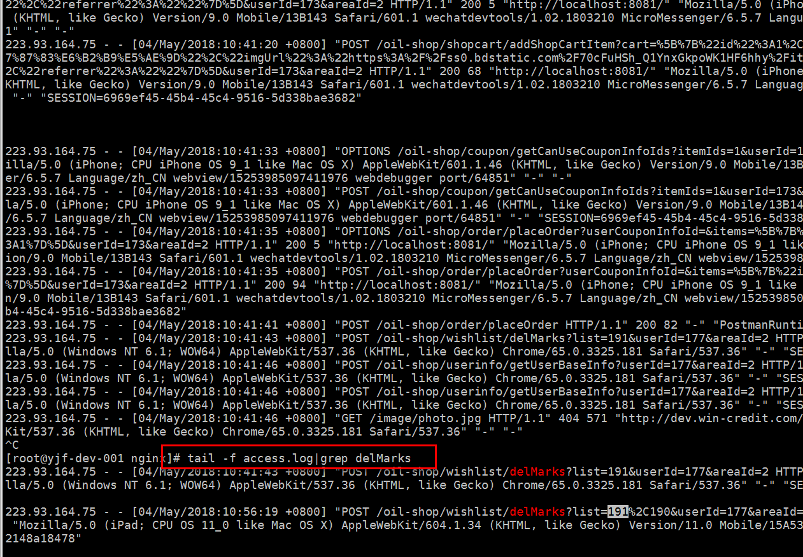
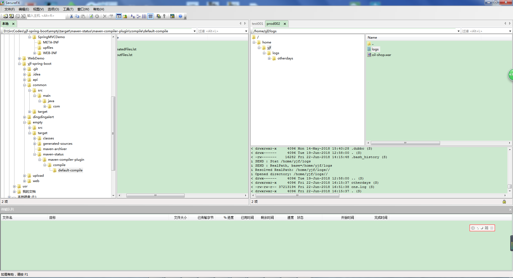

### 服务器日志的查看与项目的发布

---

#### 查看日志

日志有两种, 一种是访问的日志, 一种是业务日志, 访问日志是记录在nginx产生的日志之中, 而业务日志产生在tomcat的日志之中.

##### nginx日志

首先进入nginx日志目录, 然后使用`tail -f xxx.log|grep 关键字` 就可以循环监控访问的字段, 如下是实际的日志, 下图是日志所在的目录, 首先进入日志的目录, 然后使用`tail`访问日志

实时监控过滤某关键字,并且查看日志, 此处的关键字为`delMarks`


##### tomcat日志

tomcat日志是我们需要主要查看的日志, 而nginx大多数用来负载平衡, 用来查看访问的记录. 和nginx日志一样, 查看之前我们需要进入日志所在的目录, 然后通过`tail`命令来查看日志. 下图是进入Tomcat日志的目录

以下两图是查看生产环境的日志, 生产环境和测试环境其实就是访问地址, 配置环境, 数据库等不同, 其他的差别不大,查看日志的方式和上述的查看nginx日志的方式类似, 以下分别是**连接不同的环境**和**查看各自环境下的日志**


其中的命令和之前使用的差不多, 关键问题是找准**日志的位置**所在, 这样才能比较快的找到日志, 定位和分析问题.


##### 查看日志的命令

> linux查看日志的命令有多种: tail、cat、tac、head、echo等命令

**1.查看日志方式**

```powershell
命令格式: tail [必要参数] [选择参数] [文件]
```

**tail**(最常用的一种查看方式 )

```powershell
-f 循环读取
-q 不显示处理信息
-v 显示详细的处理信息
-c<数目> 显示的字节数
-n<行数> 显示行数
-q, --quiet, --silent 从不输出给出文件名的首部 
-s, --sleep-interval=S 与-f合用,表示在每次反复的间隔休眠S秒

tail  -n  10   test.log   查询日志尾部最后10行的日志;
tail  -n +10   test.log   查询10行之后的所有日志;
tail  -fn 10   test.log   循环实时查看最后1000行记录(最常用的)

//一般还会配合着grep用, 例如 :  tail -fn 1000 test.log | grep '关键字'
//如果一次性查询的数据量太大,可以进行翻页查看,
例如:tail -n 4700  aa.log |more -1000 可以进行多屏显示(ctrl + f 或者 空格键可以快捷键)
```

**head**

```powershell
head -n  10  test.log   //查询日志文件中的头10行日志;
head -n -10  test.log   //查询日志文件除了最后10行的其他所有日志;
```

head其他参数与tail 类似

**cat** 
cat 是由第一行到最后一行连续显示在屏幕上

```powershell
一次显示整个文件 : $ cat filename
从键盘创建一个文件 : $ cat > filename  
将几个文件合并为一个文件： $cat file1 file2 > file //只能创建新文件,不能编辑已有文件.
将一个日志文件的内容追加到另外一个 : $cat -n textfile1 > textfile2
清空一个日志文件 $cat : >textfile2
```

**注意: >意思是创建, >>是追加. 千万不要弄混了.** cat其他参数与tail 类似

**tac** 
tac 则是由最后一行到第一行反向在萤幕上显示出来

**sed**

这个命令可以查找日志文件特定的一段 , 也可以根据时间的一个范围查询

```powershell
//按照行号
sed -n '5,10p' filename //这样你就可以只查看文件的第5行到第10行。
//按照时间段
sed -n '/2014-12-17 16:17:20/,/2014-12-17 16:17:36/p'  test.log1234
```

**less**

```powershell
less log.log 
shift + G 命令到文件尾部  然后输入 ？加上你要搜索的关键字例如 ？1213
shift+n  关键字之间进行切换12345
```


**2.其他会应用到的命令**

```powershell
history // 所有的历史记录
history | grep XXX  // 历史记录中包含某些指令的记录
history | more // 分页查看记录
history -c // 清空所有的历史记录
!! 重复执行上一个命令
查询出来记录后选中:　!323
```

> linux日志文件说明
> /var/log/message 系统启动后的信息和错误日志，是Red Hat Linux中最常用的日志之一 
> /var/log/secure 与安全相关的日志信息 
> /var/log/maillog 与邮件相关的日志信息 
> /var/log/cron 与定时任务相关的日志信息 
> /var/log/spooler 与UUCP和news设备相关的日志信息 
> /var/log/boot.log 守护进程启动和停止相关的日志消息 
> /var/log/wtmp 该日志文件永久记录每个用户登录、注销及系统的启动、停机的事件


#### 项目的发布

对于java web的项目, 项目的发布就意味着将项目从开发环境之中打包, 然后放到web容器之中, 如tomcat, 打包现在一般都是使用maven作为包管理工具, 并且将其打包, 我们可以使用单独的语句, 在pom.xml文件所在的目录下面自行打包, 使用如下的命令语句即可生成war包, 然后将其放入web容器即可.

```shell
mvn clean package -Dmaven.test.skip=true
```

下图是发布项目的例子, 问题也是在于找到项目war包存放的地址, 将其覆盖即可. 一般项目放在tomcat的webapps文件夹之下, 我们其实找到tomcat的目录就行了. 发布的时候, 如果修改的较多,可以直接替换war包. 如果修改较少的话, 可以在**在对应的class文件目录下修改对应的class文件,修改增量即可**, 这样做是因为全量替换可能比较慢, 所以只替换增量可以节约时间.



查看日志的时候, 使用的是如xshell, secure crt类似的**终端模拟软件**, 而发布包, 需要使用的是如secure FX, FlashFXP类似的FTP软件, 将其上传到服务器tomcat的webapps目录下, 就可以了.至于具体如何发布可以参考如下的链接.


ref:

1.[linux 查看日志的几种基本操作](https://blog.csdn.net/xinzhifu1/article/details/59109792),   2.[linux查看日志文件内容命令tail、cat、tac、head、echo](https://www.cnblogs.com/zdz8207/p/linux-log-tail-cat-tac.html),   3.[Java笔记---部署 JavaWeb 项目到云服务器](https://blog.csdn.net/gulu_gulu_jp/article/details/50994003),   4.[javaweb部署服务器 详细版](https://blog.csdn.net/sinat_33388558/article/details/53991954),   5.[在云服务器上部署项目（上）](https://blog.csdn.net/gfd54gd5f46/article/details/54331207),   6.[在云服务器上部署项目（下）](https://blog.csdn.net/gfd54gd5f46/article/details/54358384),   7.[web项目部署服务器上线](https://blog.csdn.net/sinat_33388558/article/details/53536600),   8.[java项目部署到远程服务器上](https://blog.csdn.net/u013215018/article/details/70160737),   9.[实现自动构建编译javaweb项目并发布到N台服务器](https://www.cnblogs.com/linkstar/p/6530451.html)