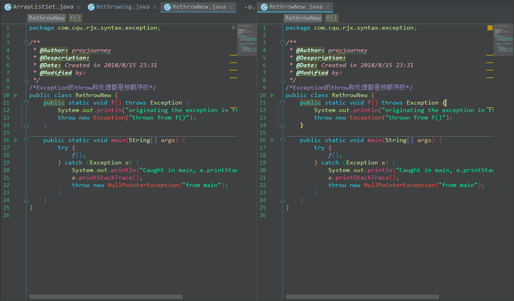
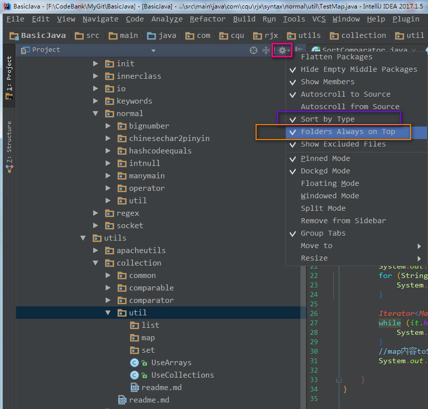

### IntelliJ IDEA 常用快捷键
---
**1.文本编辑**
&nbsp;&nbsp;&nbsp;&nbsp;删除:      Ctrl + Y
&nbsp;&nbsp;&nbsp;&nbsp;复制:      Ctrl + D
&nbsp;&nbsp;&nbsp;&nbsp;重命名:     Shift + F6
&nbsp;&nbsp;&nbsp;&nbsp;快速寻找:      Alt ＋ F3    
&nbsp;&nbsp;&nbsp;&nbsp;注释代码:     Ctrl ＋ / 和 Ctrl ＋ Shift ＋ /
&nbsp;&nbsp;&nbsp;&nbsp;查找变量来源:      F4 

**2.智能提示**
&nbsp;&nbsp;&nbsp;&nbsp;提示:      Ctrl + Space
&nbsp;&nbsp;&nbsp;&nbsp;智能提示:      Ctrl + Shift + Space
&nbsp;&nbsp;&nbsp;&nbsp;自动完成当前语句:      Ctrl + Shift + Enter
&nbsp;&nbsp;&nbsp;&nbsp;建议提示为参数:      Ctrl+ Alt + P

**3.搜索使用**
&nbsp;&nbsp;&nbsp;&nbsp;发现使用情况/行:      Alt + F7 / Ctrl + F7
&nbsp;&nbsp;&nbsp;&nbsp;高亮使用行:      Ctrl + Shift + F7
&nbsp;&nbsp;&nbsp;&nbsp;显示使用情况:      Ctrl + Alt + F7

**4.位置定位**
&nbsp;&nbsp;&nbsp;&nbsp;定位到下一个或上一个错误:      F2 / Shift + F2
&nbsp;&nbsp;&nbsp;&nbsp;定位文件头:      Ctrl +G   （定位到文件行数）
&nbsp;&nbsp;&nbsp;&nbsp;定位到代码块开始:      Ctrl + [
&nbsp;&nbsp;&nbsp;&nbsp;定位到代码块结束:      Ctrl + ]
&nbsp;&nbsp;&nbsp;&nbsp;回到最近的窗口:      F12
&nbsp;&nbsp;&nbsp;&nbsp;回到之前的文件:      Alt + Left
&nbsp;&nbsp;&nbsp;&nbsp;回到之后的文件:      Alt + Right
&nbsp;&nbsp;&nbsp;&nbsp;定位到最后编辑位置:      Ctrl + Shift + Backspace
&nbsp;&nbsp;&nbsp;&nbsp;从ToolWindow或其他Window切换到文件编辑:      Esc
&nbsp;&nbsp;&nbsp;&nbsp;关闭最近打开的窗口:      Shift+ Esc
&nbsp;&nbsp;&nbsp;&nbsp;关闭当前窗口:     Ctrl+F4
&nbsp;&nbsp;&nbsp;&nbsp;切换标签页:      Ctrl+Tab
&nbsp;&nbsp;&nbsp;&nbsp;切换窗口:      Alt+Num，常用的有1-项目结构，3-搜索结果，4/5-运行调试。

**5.类、方法、文件定位**
&nbsp;&nbsp;&nbsp;&nbsp;查找类:      Ctrl + N
&nbsp;&nbsp;&nbsp;&nbsp;查找文件:      Ctrl + Shift + N
&nbsp;&nbsp;&nbsp;&nbsp;符号定位:      Ctrl + Alt + Shift + N
&nbsp;&nbsp;&nbsp;&nbsp;查看文件结构:      Ctrl + F12
&nbsp;&nbsp;&nbsp;&nbsp;最近打开的文件:      Ctrl + E
&nbsp;&nbsp;&nbsp;&nbsp;打开最近编辑的文件:      Ctrl + Shift + E
&nbsp;&nbsp;&nbsp;&nbsp;定位下一个方法:      Alt + down
&nbsp;&nbsp;&nbsp;&nbsp;定位上一个方法:      Alt + up
&nbsp;&nbsp;&nbsp;&nbsp;查看方法参数信息:      Ctrl + P
&nbsp;&nbsp;&nbsp;&nbsp;查看方法、类的document:     Ctrl + Q

**6.类、方法的结构查看、定位**
&nbsp;&nbsp;&nbsp;&nbsp; 跳到类或方法的声明:      Ctrl+B
&nbsp;&nbsp;&nbsp;&nbsp;定位到类的父类、接口:      Ctrl+ U
&nbsp;&nbsp;&nbsp;&nbsp; 查看类的继承结构:      Ctrl+ H
&nbsp;&nbsp;&nbsp;&nbsp;查看方法的继承结构:      Ctrl+ Shift + H
&nbsp;&nbsp;&nbsp;&nbsp;查看类或方法被调用情况:      Ctrl+ Alt +H 
&nbsp;&nbsp;&nbsp;&nbsp;原地参看类、方法的声明:      Ctrl+Shift + I

**7.运行与调试**
&nbsp;&nbsp;运行：
&nbsp;&nbsp;&nbsp;&nbsp;Ctrl + F2:      停止
&nbsp;&nbsp;&nbsp;&nbsp;Shift + F10:      运行
&nbsp;&nbsp;&nbsp;&nbsp;Shift + F9:      Debug
&nbsp;&nbsp;&nbsp;&nbsp;Ctrl + F9:      Make工程(编译模块和依赖文件)
&nbsp;&nbsp;&nbsp;&nbsp;Ctrl + Shift + F9:      编译所选的文件或者模块
&nbsp;&nbsp;&nbsp;&nbsp;Ctrl + Shift + F10:      运行当前编辑器之中的文件
&nbsp;&nbsp;&nbsp;&nbsp;Alt + Shift + F10:      运行所选的文件
&nbsp;&nbsp;&nbsp;&nbsp;Alt + Shift + F9:      Debug所选的文件
&nbsp;&nbsp;调试:
&nbsp;&nbsp;&nbsp;&nbsp;F8:      步过(向下执行一行)
&nbsp;&nbsp;&nbsp;&nbsp;F7:      步入(如果该行有自定义方法，则运行进入自定义方法(不会进入官方类库的方法))
&nbsp;&nbsp;&nbsp;&nbsp;Shift + F7:      强制进入代码(任何代码)
&nbsp;&nbsp;&nbsp;&nbsp;Shift + F8:      步出(跳到下一个断点)
&nbsp;&nbsp;&nbsp;&nbsp;Alt + F9:      运行到光标处
&nbsp;&nbsp;&nbsp;&nbsp;Alt + F8:      Debug时选中查看值
&nbsp;&nbsp;&nbsp;&nbsp;F9:      恢复程序
&nbsp;&nbsp;&nbsp;&nbsp;Ctrl + F8:      钉住断点
&nbsp;&nbsp;&nbsp;&nbsp;Ctrl + Shift + F8:      查看断点

##### 1. 自动代码
Ctrl+Alt+O 优化导入的类和包

Alt+Insert 生成代码(如get,set方法,构造函数等)

Ctrl+Alt+T  生成try catch  或者 Alt+enter

CTRL+ALT+T  把选中的代码放在 TRY{} IF{} ELSE{} 里

Ctrl + O 重写方法

Ctrl + I 实现方法

Ctr+shift+U 大小写转化

ALT+回车    导入包,自动修正

ALT+/       代码提示

CTRL+J      自动代码

Ctrl+Shift+J，整合两行为一行

CTRL+空格   代码提示

CTRL+SHIFT+SPACE 自动补全代码

CTRL+ALT+L  格式化代码

CTRL+ALT+I  自动缩进

CTRL+ALT+O  优化导入的类和包

ALT+INSERT  生成代码(如GET,SET方法,构造函数等)

CTRL+E      最近更改的代码

CTRL+ALT+SPACE  类名或接口名提示

CTRL+P   方法参数提示

CTRL+Q，可以看到当前方法的声明

Shift+F6  重构-重命名 (包、类、方法、变量、甚至注释等)

Ctrl+Alt+V 提取变量

##### 2. 查询快捷键
Ctrl＋Shift＋Backspace可以跳转到上次编辑的地

CTRL+ALT+ left/right 前后导航编辑过的地方

ALT+7  靠左窗口显示当前文件的结构

Ctrl+F12 浮动显示当前文件的结构

ALT+F7 找到你的函数或者变量或者类的所有引用到的地方

CTRL+ALT+F7  找到你的函数或者变量或者类的所有引用到的地方

Ctrl+Shift+Alt+N 查找类中的方法或变量

双击SHIFT 在项目的所有目录查找文件

Ctrl+N   查找类

Ctrl+Shift+N 查找文件

CTRL+G   定位行

CTRL+F   在当前窗口查找文本

CTRL+SHIFT+F  在指定窗口查找文本

CTRL+R   在 当前窗口替换文本

CTRL+SHIFT+R  在指定窗口替换文本

ALT+SHIFT+C  查找修改的文件

CTRL+E   最近打开的文件

F3   向下查找关键字出现位置

SHIFT+F3  向上一个关键字出现位置

选中文本，按Alt+F3 ，高亮相同文本，F3逐个往下查找相同文本

F4   查找变量来源

CTRL+SHIFT+O  弹出显示查找内容

Ctrl+W 选中代码，连续按会有其他效果

F2 或Shift+F2 高亮错误或警告快速定位

Ctrl+Up/Down 光标跳转到第一行或最后一行下

Ctrl+B 快速打开光标处的类或方法

CTRL+ALT+B  找所有的子类

CTRL+SHIFT+B  找变量的类

Ctrl+Shift+上下键  上下移动代码

Ctrl+Alt+ left/right 返回至上次浏览的位置

Ctrl+X 删除行

Ctrl+D 复制行

Ctrl+/ 或 Ctrl+Shift+/  注释（// 或者/*...*/ ）

Ctrl+H 显示类结构图

Ctrl+Q 显示注释文档

Alt+F1 查找代码所在位置

Alt+1 快速打开或隐藏工程面板

Alt+ left/right 切换代码视图

ALT+ ↑/↓  在方法间快速移动定位

CTRL+ALT+ left/right 前后导航编辑过的地方

Ctrl＋Shift＋Backspace可以跳转到上次编辑的地

Alt+6    查找TODO

##### 3.其他快捷键
SHIFT+ENTER 另起一行

CTRL+Z   倒退(撤销)

CTRL+SHIFT+Z  向前(取消撤销)

CTRL+ALT+F12  资源管理器打开文件夹

ALT+F1   查找文件所在目录位置

SHIFT+ALT+INSERT 竖编辑模式

CTRL+F4  关闭当前窗口

Ctrl+Alt+V，可以引入变量。例如：new String(); 自动导入变量定义

Ctrl+~，快速切换方案（界面外观、代码风格、快捷键映射等菜单）

##### 4.调试快捷键
**其实常用的 就是F8 F7 F9 最值得一提的 就是Drop Frame  可以让运行过的代码从头再来**

Alt+F8          debug时选中查看值

Alt+Shift+F9，选择 Debug

Alt+Shift+F10，选择 Run

Ctrl+Shift+F9，编译

Ctrl+Shift+F8，查看断点

F7，步入

Shift+F7，智能步入

Alt+Shift+F7，强制步入

F8，步过

Shift+F8，步出

Alt+Shift+F8，强制步过

Alt+F9，s运行至光标处

Ctrl+Alt+F9，强制运行至光标处

F9，恢复程序

Alt+F10，定位到断点

##### 5.重构
**Ctrl+Alt+Shift+T，弹出重构菜单**
Shift+F6，重命名
F6，移动
F5，复制
Alt+Delete，安全删除
Ctrl+Alt+N，内联

##### 6. 调试整合(IDEA调试快捷键)

| 键                | 模式           | 作用                                 |
| ----------------- | -------------- | ------------------------------------ |
| **F7**            | Debug          | **进入断点方法之中**                 |
| **F8**            | Debug          | **不进入断点，越过断点直接给出结果** |
| **F9**            | Debug          | **恢复程序运行**                     |
| **Alt + F8**      | Debug          | **弹出可输入表达式的计算框**         |
| Ctrl + F8         | Debug / Common | 设置/清除断点                        |
| Shift + F7        | Debug          | 智能步入，会让你选择一个进入的方法   |
| Shift + F8        | Debug          | 跳出，恢复程序运行，=F9              |
| Ctrl + Shift + F8 | Debug          | 设置断点的进入条件                   |
| Alt + Shift + F7  | Debug          | 进入嵌套的方法之中                   |

##### IDEA的Debug使用
① 如下图 Gif 所示，查看所选对象的方法常用有三种方式：
  - 选中对象后，使用快捷键 `Alt + F8`。
  - 选中对象后，拖动对象到 `Watches`。
  - 选中对象后，鼠标悬停在对象上 2 秒左右

② 如下图 Gif 所示，在弹出表达式输入框中 IntelliJ IDEA 也是能帮我们智能提示。

③ 如下图 Gif 所示，当我们需要过掉后面的所有断点的时候，我们不需要去掉这些断点，只需要点击左下角那个小圆点，点击小圆点之后，所有断点变成灰色，然后我们再在按快捷键 F9 即可过掉当前和后面所有的断点。

④ 如下图 Gif 所示，我们可以给断点设置进入的条件，因为变量 temp3 不等于 200 所以该断点没有被进入直接跳过。

⑤ 如 下图Gif 演示，有时候当我们步入方法体之后，还想回退到方法体外，断点进入 addNum 方法后，点击 Drop Frame 按钮之后，断点重新回到方法体之外。

##### IDEA设置多个窗口
设置多窗口没有快捷键, 需要自己设置, 我设置的水平分割是SHIFT+H, 垂直分割是SHIFT+V, 设置如下

显示效果如下

##### IDEA设置项目列表之中文件和文件夹的排序
在Project窗口设置如下*Setting*--->*sort by type*--->*folders always on top*

级别：1.红，2.蓝，3.绿，4.黑

---
ref:
1.[IntelliJ Idea 常用快捷键 列表](http://www.cnblogs.com/tq03/p/5218754.html),   2.[Intellij IDEA常用快捷键介绍 Intellij IDEA快捷键大全汇总](http://www.jb51.net/softjc/261714.html),   3.[IDEA快捷键图](http://files.jb51.net/file_images/article/201412/2014121711113294_jb51.png),   4.[IntelliJ IDEA 快捷键说明大全（中英对照、带图示详解）](http://blog.csdn.net/deniro_li/article/details/72902621),   5.[IDEA 图标介绍。 缓存和索引介绍、清理方法和Debug使用](http://www.cnblogs.com/wangmingshun/p/6416397.html)