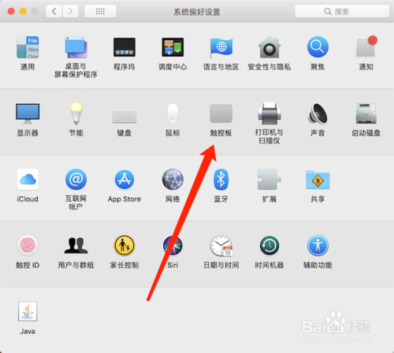

### mac手势操作

---
首先可以看这个网页的教学: [Mac小白教程 | 神奇的手势操作](https://www.bilibili.com/video/av27690940), 视频: [mac手势操作.wmv](mac手势操作.wmv) 
其实就是分了4中操作， 单手指，双手指，三手指，四手指.首先进入触控板设置

在这个图上面，主要设置的就是触控板和辅助功能，辅助功能开启四指和三指操作。
单手指：鼠标左键的功能，选中
双手指：鼠标右键，改名啥的
三手指：复制，移动文件夹
四手指：切换屏幕，上切换桌面，下切看程序打开的内容，外切隐藏程序，内切切入LaunchPad

---
ref：
1.[mac手势操作和设置](https://jingyan.baidu.com/album/20b68a88847549796cec62e9.html)