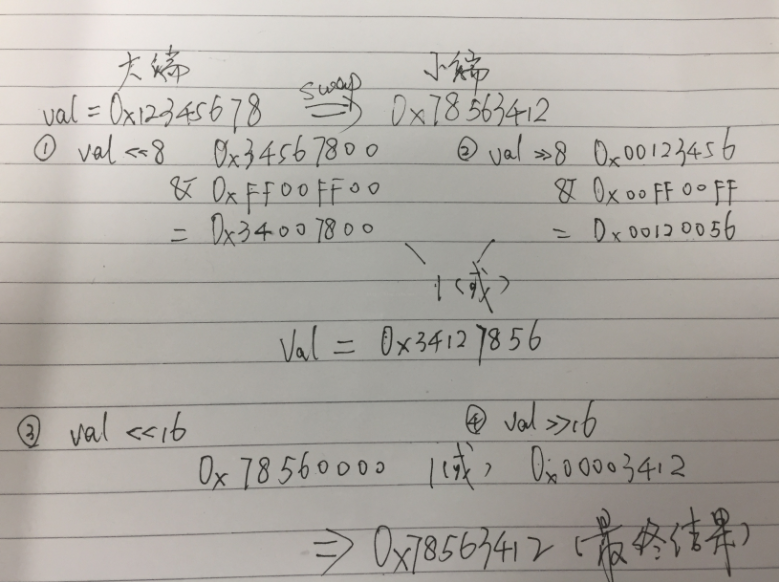

### 大端小端魔数等概念

***

##### 概念介绍

**魔数**：很多类型的文件，其起始的几个字节的内容是固定的（或是有意填充，或是本就如此）。根据这几个字节的内容就可以确定文件类型，因此这几个字节的内容被称为魔数 (magic number)。

在编程之中魔数通常是指：**所谓魔数和魔字符串就是在代码中直接使用某一个数字或者字符串，而不是常量**。

**小端**：较高的有效字节存放在较高的的存储器地址，较低的有效字节存放在较低的存储器地址。

**大端**：较高的有效字节存放在较低的存储器地址，较低的有效字节存放在较高的存储器地址。

大端存储与小端存储的区别和详情在*大端与小端存储模式详解*[^1]之中写的十分详细，总体来说：大端存储类似人的正常思维，小端存储机器处理更方便

mnist原始数据文件中32位的整型值是大端存储，C/C++变量是小端存储，所以读取数据的时候，需要对其进行大小端转换。

转换的函数为：

```cpp
1. uint32_t swap_endian(uint32_t val) {  
2.     val = ((val << 8) & 0xFF00FF00) | ((val >> 8) & 0xFF00FF);  
3.     return (val << 16) | (val >> 16);  
4. }  
```


##### 举一个例子

将一个32位的无符号整型变量（uint32）0x12345678从大端存储转成小端存储，那么转换的结果应该变为：**0x78563412**

上面的函数就实现了这个功能，将0x12345678带入，通过如下演算过程，实现了大端小端转换。




ref:

1.[大端与小端存储模式详解](https://blog.csdn.net/favory/article/details/4441361),   2.[大端、小端、魔数等概念](https://blog.csdn.net/chengzhongxuyou/article/details/52779094)

[^1]: http://blog.csdn.net/favory/article/details/4441361
