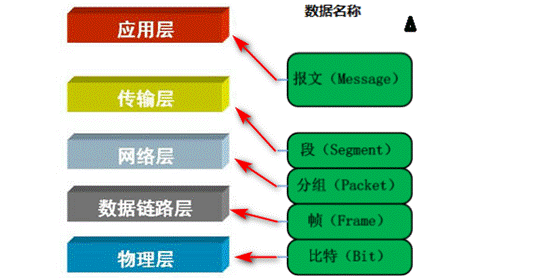
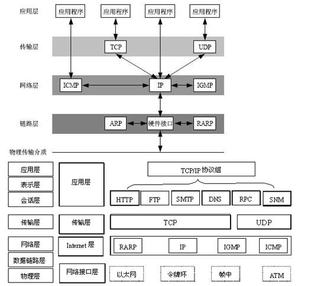
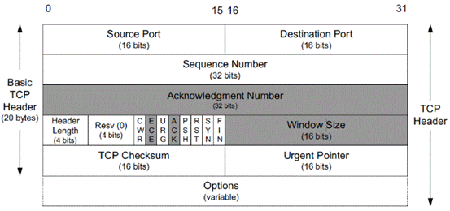
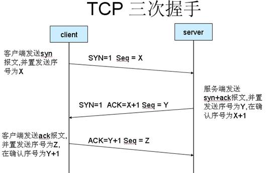
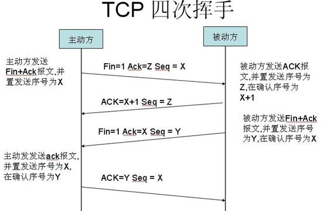

### 五层模型和数据格式

### 各层作用和协议

#### 应用层：
**作用**：通过应用进程间的交互去完成指定的网络应用。 
**协议**：应用进程间的通信和交互规则。 
**三大协议**：DNS（域名系统），HTTP协议（万维网），SMTP（电子邮件） 
**报文**：应用层交互的数据单元。 

#### 运输层：
**作用**：负责不同主机进程间通信，并且为这样的通信提供通用的（通用的：指不针对某一特定的网络应用进程，多种网络应用进程可以使用同一个运输层服务）数据传输服务 
- 复用：多个应用层进程同时使用下面的运输层服务 
- 分用：和复用相反，是运输层把收到的信息分别交给应用层相对应的进程 

**传输层的两种协议**：传输控制协议TCP（提供面向连接，可靠的数据传输服务）和用户数据协议UDP（提供无连接，尽最大努力的数据传输服务，不保证数据传输的可靠性）

#### 网络层：
**作用**：选择合适的网间路由和交换结点，确保数据及时传送。 
**过程**：在TCP/IP体系结构中，使用IP协议做数据传输时，将报文或用户数据报封装成分组（分组：笼统的数据单元，也称IP数据报）和包进行传送 
**注意**：这里的网络二字不再是我们平时所说的网络，而是说的计算机网络体系里面一个层次的名称。 
**互联网**：由大量的异构网络通过路由器相互连接起来的。使用网络层协议是无连接的网际协议和许多路由协议，因此互联网的网络层也叫做网际层或IP层

#### 链路层：
**作用**：在网络层选好的链路进行数据传输的过程中，为这些数据提供一段一段链路间的专门协议。 
**过程**：发送数据时，将网络层交下来的IP数据报封装成桢(每一帧包含有数据和控制信息(同步信息，地址信息，差错控制))；接收数据时，提取每一帧的数据部分上交给网络层，没用或重复的信息丢弃(由数据帧控制信息决定)。

#### 物理层：
**作用**：实现计算机节点之间比特流的透明传送，尽可能屏蔽掉具体传输介质和物理设备的差异。

### 协议与Socket

通过上图，我们可以回顾TCP/IP体系的5(4)层架构，与**各个层运行的主要的协议**，从上面看还不太清楚，可以看下面，**HTTP**对应**应用层**，**TCP**对应**传输层**，HTTP高于TCP，这就说明**TCP协议是为HTTP协议服务的**，实际上也是如此，TCP协议为HTTP提供可靠交付的协议，**需要说明的是HTTP协议是基于TCP服务的，**没有基于UDP的版本**。 进一步，还可以看出的是，IP协议对应于网络层，在TCP协议之下，因此**IP协议为TCP协议提供服务**，IP协议本身是一个**尽力交付的协议，但是配合ICMP(英特网报文控制协议)，就可以提供可靠交付的服务。

但是上图没有体现出Socket的概念，其实**Socket****是一个抽象出来的概念**，其目的在于方便我们对于TCP或者UPD传输协议的使用，**是面向于编程语言层级**的，位于**应用层**(HTTP)与**传输层**(TCP)"之间"，方便编程的使用。HTTP是**轿车**，提供了封装或者显示数据的具体形式；Socket是**车轮**，提供了通信的驱动力，TCP是**发动机**，提供了原始的通信能力。

| 名称   | 层次   | 作用                                                         | 备注                                                         |
| ------ | ------ | ------------------------------------------------------------ | ------------------------------------------------------------ |
| HTTP   | 应用层 | 超文本传输协议（HTTP，HyperText  Transfer Protocol)是运行于应用层的网络协议。所有的**WWW**文件都必须遵守这个标准。 | 我们在传输数据时，可以只使用（传输层）TCP/IP协议，但是那样的话，如  果没有应用层，便无法识别数据内容，如果想要使传输的数据有意义，则必须使用到应用层协议，应用层协议有很多，比如HTTP、FTP、TELNET等，也 可以自己定义应用层协议。WEB使用HTTP协议作应用层协议，以封装HTTP文本信息，然后使用TCP/IP做传输层协议将它发到网络上 |
| SOCKET | ---    | **Socket是应用层与TCP/IP协议族通信的中间软件抽象层**，它是一组接口。在设计模式中，Socket其实就是一个门面模式，++它把复杂的TCP/IP协议族隐藏在Socket接口后面++，对用户来说，*一组简单的接口就是全部，让Socket去组织数据，以符合指定的协议*。 | **虚拟概念**，Socket是对TCP/IP协议的封装，**Socket本身并不是协议，而是一个调用接口（API）**，++通过Socket，我们才能使用TCP/IP协议++。 实际上，**Socket跟TCP/IP协议没有必然的联系，Socket编程接口在设计的时候，就希望也能适应各种的网络协议**。 |
| TCP    | 传输层 | TCP(Transmission Control Protocol) 传输控制协议是一种面向连接的、可靠的、基于字节流的传输层通信协议 | TCP/UDP协议通过设计++封装形成了以供编程使用的*Socket套接字++ |
| UDP    | 传输层 | 提供无连接的尽力交付的服务                                   | **和HTTP协议无关**                                           |
| IP     | 网络层 | 为TCP和UDP协议提供服务                                       | 不可靠的，但是其服务的TCP是可靠服务，通过ICMP等协议来完成可靠性的保证 |

### TCP 报文
TCP封装在IP报文中的时候，如下图所示，TCP头紧接着IP头(IPV6有扩展头的时候，则TCP头在扩展头后面)，不携带选项(option)的TCP头长为20bytes，携带选项的TCP头最长可到60bytes。

#### TCP 报文头
我们首先要了解 TCP 报文组成，根据 TCP 报文组成格式，重点了解几个重要的字段有助于我们在后面分析 TCP/IP 报文。

上图中有几个字段需要重点介绍下：①序号：Seq 序号，占 32 位，用来标识从TCP源端向目的端发送的字节流，发起方发送数据时对此进行标记。②确认序号：Ack 序号，占 32 位，只有 ACK 标志位为 1 时，确认序号字段才有效，Ack=Seq+1。③标志位：共 6 个，即 URG、ACK、PSH、RST、SYN、FIN 等，具体含义如下：a.URG：紧急指针(urgent pointer)有效。b. ACK: 确认序号有效。c. PSH: 接收方应该尽快将这个报文交给应用层。d. RST: 重置连接。e. SYN: 发起一个新连接。f. FIN: 释放一个连接。注意：
- 不要将确认序号 Ack 与标志位中的 ACK 搞混了
- 确认方 Ack=发起方 Req+1，两端配对。

### TCP 的状态 
在TCP层，有个FLAGS字段，这个字段有以下几个标识：

l **SYN**， **FIN**， **ACK**，**PSH**，**RST**， **URG**

| **字段** | **含义**                                                     |
| -------- | ------------------------------------------------------------ |
| SYN      | 表示建立连接，Synchronous，是TCP/IP建立连接时使用的**握手信号** |
| FIN      | 表示关闭连接，Finish，是**结束信号**，表示将要关闭连接)      |
| ACK      | 表示响应，Acknowledgement，是**确认信号**，表示发来的数据已确认接收无误 |
| PSH      | 表示有 DATA数据传输                                          |
| RST      | 表示连接重置                                                 |

### 三次握手建立连接
TCP协议是如何保证可靠性的呢？就是**通过三次与目标设备的通信来确定数据包发送成功**。以浏览器和服务器的通信来打比方：
>浏览器：你好服务器，我是 浏览器A。 
服务器：你好 浏览器A，我是 服务器B。 
浏览器：服务器B 你好。

**过程解释**
- 第一次握手：建立连接时，客户端发送syn包（syn=j）到服务器，并进入SYN_SENT状态，等待服务器确认；SYN：同步序列编号（Synchronize Sequence Numbers）。
- 第二次握手：服务器收到syn包，必须确认客户的SYN（ack=j+1），同时自己也发送一个SYN包（syn=k），即SYN+ACK包，此时服务器进入SYN_RECV状态；
- 第三次握手：客户端收到服务器的SYN+ACK包，向服务器发送确认包ACK(ack=k+1），此包发送完毕，客户端和服务器进入ESTABLISHED（TCP连接成功）状态，完成三次握手。

图片中的Seq(Sequence number(顺序号码))随机产生，用来表明顺序

### 四次挥手断开连接
当数据包发送完毕需要**断开连接**的时候，就需要TCP的四次挥手来保证链接的合理断开。再次以浏览器和服务器的通信打比方：
>主动结束方：你好，我的数据发送完毕了，我要**进入准备断开的状态**了。（*此时它虽然不再发送数据了，但是可以接受数据*） 
另一方：我知道了，我还没有发送完毕的，你等着吧。 
另一方：我也发送完毕了，可以断开链接了。（此时它也进入准备断开的状态） 主动结束方：好的，那断开吧。

**过程解释**
1. 客户端A发送一个FIN，用来关闭客户A到服务器B的数据传送。
2. 服务器B收到这个FIN，它发回一个ACK，确认序号为收到的序号加1。和SYN一样，一个FIN将占用一个序号。
3. 服务器B关闭与客户端A的连接，发送一个FIN给客户端A。
4. 客户端A发回ACK报文确认，并将确认序号设置为收到序号加1。

### TCP为什么建立链接是三次，关闭链接是四次？
**连接时**：因为服务端的listen状态下的socket当收到SYN报文的建连请求后，它**可以把ACK和SYN（ACK起应答作用，而SYN起同步作用）放在一个报文里来发送**。
**关闭时**，**当收到对方的FIN报文通知时，它仅仅表示对方没有数据发送给你了**；但未必你所有的数据都全部发送给对方了，所以你可能未必会马上会关闭SOCKET，也即你可能还需要发送一些数据给对方之后，*再发送FIN报文给对方来表示你同意现在可以关闭连接了*，**所以它这里的ACK报文和FIN报文多数情况下都是分开发送的**。
*也就是说，关闭的时候，会先回复一个收到消息，然后回复一个断开连接，这本来在握手的步骤之中可以一步做完的，在关闭的时候分了两步去做，为什么这么做，是因为断开的时候，可能是还有数据在传输，而握手的时候，没有数据需要额外的传输*。