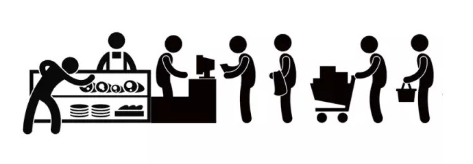
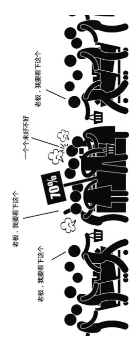
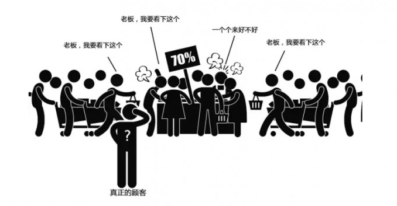
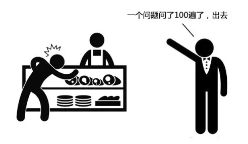
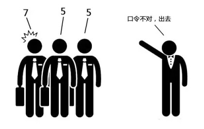
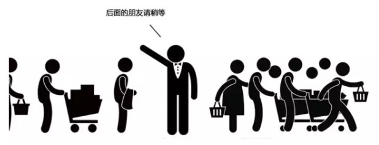

### DDoS攻击介绍

***

#### 基础概念

**分布式拒绝服务攻击**(Distributed Denial of Service)指借助于*客户/服务器*技术，将多个计算机联合起来作为攻击平台，对一个或多个目标发动攻击，从而成倍地提高拒绝服务攻击的威力。通常，攻击者使用一个偷窃帐号将DDoS主控程序安装在一个计算机上，在一个设定的时间主控程序将与大量代理程序通讯，代理程序已经被安装在网络上的许多计算机上。代理程序收到指令时就发动攻击。利用客户/服务器技术，主控程序能在几秒钟内激活成百上千次代理程序的运行。

#### 趣味介绍
让我们来举个栗子，假设A开了一家店，生意还不错

此时隔壁家生意萧条的B盯上了A

于是他雇佣来了一群闹事的小混混

紧接着，A就发现突然店里来了一大波客人。AA完全应接不暇，而且他们老找A问这问那，东看西看，就是不买东西，更可恶，赖着不走了！

而真正的顾客连进店的地方都没有了！**这就是所谓的DDoS攻击——一群“恶意访问”、“堵店门”、“占空间”、还“调戏店员”的非法流量**。*他们是黑客通过网络上事先留了木马后门的僵尸主机发动的，只不过他们装的和正常访问的数据几乎一样，使得NF或其他防护设备根本无法识别哪些是非法的数据流量*。

那么，这时候的解决办法就是，需要一个“明眼人”帮忙清理现场了。具体来说，就是利用某种抗DDoS攻击的工具来精准识别这些非法流量，比如绿盟科技的ADS。

#### 攻击方式
**DDoS攻击通过大量合法的请求占用大量网络资源，以达到瘫痪网络的目的**。 这种攻击方式可分为以下几种：1.通过使网络过载来干扰甚至阻断正常的网络通讯；2.通过向服务器提交大量请求，使服务器超负荷；3.阻断某一用户访问服务器；4.阻断某服务与特定系统或个人的通讯。
- **IP Spoofing**
IP欺骗攻击是一种黑客通过向服务端发送虚假的包以欺骗服务器的做法。具体说，就是将包中的源IP地址设置为不存在或不合法的值。服务器一旦接受到该包便会返回接受请求包，但实际上这个包永远返回不到来源处的计算机。这种做法使服务器必需开启自己的监听端口不断等待，也就浪费了系统各方面的资源。
- **LAND attack**
这种攻击方式与SYN floods类似，不过在LAND attack攻击包中的源地址和目标地址都是攻击对象的IP。这种攻击会导致被攻击的机器死循环，最终耗尽资源而死机。
- **ICMP floods**
ICMPfloods是通过向未良好设置的路由器发送广播信息占用系统资源的做法。
- **Application**
与前面叙说的攻击方式不同，Application level floods主要是针对应用软件层的，也就是高于OSI的。它同样是以大量消耗系统资源为目的，通过向IIS这样的网络服务程序提出无节制的资源申请来迫害正常的网络服务。

#### 攻击现象
- 被攻击主机上有大量等待的TCP连接；
- 网络中充斥着大量的无用的数据包；
- 源地址为假 制造高流量无用数据，造成网络拥塞，使受害主机无法正常和外界通讯；
- 利用受害主机提供的传输协议上的缺陷反复高速的发出特定的服务请求，使主机无法处理所有正常请求；
- 严重时会造成系统死机。

#### 基本分类
按照**TCP/IP协议**的++层次++可将DDOS攻击分为**基于ARP的攻击**、**基于ICMP的攻击**、**基于IP的攻击**、**基于UDP的攻击**、**基于TCP的攻击**和**基于应用层的攻击**，其实和在攻击方式部分的分类相同。
- **基于ARP**
ARP是无连接的协议，当收到攻击者发送来的ARP应答时。它将接收ARP应答包中所提供的信息。更新ARP缓存。因此，含有错误源地址信息的ARP请求和含有错误目标地址信息的ARP应答均会使上层应用忙于处理这种异常而无法响应外来请求，使得目标主机丧失网络通信能力。产生拒绝服务，如ARP重定向攻击。
- **基于ICMP**
攻击者向一个子网的广播地址发送多个ICMP Echo请求数据包。并将源地址伪装成想要攻击的目标主机的地址。这样，该子网上的所有主机均对此ICMP Echo请求包作出答复，向被攻击的目标主机发送数据包，使该主机受到攻击，导致网络阻塞。
- **基于IP**
TCP/IP中的IP数据包在网络传递时，数据包可以分成更小的片段。到达目的地后再进行合并重装。在实现分段重新组装的进程中存在漏洞，缺乏必要的检查。利用IP报文分片后重组的重叠现象攻击服务器，进而引起服务器内核崩溃。如Teardrop是基于IP的攻击。
- **基于应用层**
应用层包括SMTP，HTTP，DNS等各种应用协议。其中SMTP定义了如何在两个主机间传输邮件的过程，基于标准SMTP的邮件服务器，在客户端请求发送邮件时，是不对其身份进行验证的。另外，许多邮件服务器都允许邮件中继。攻击者利用邮件服务器持续不断地向攻击目标发送垃圾邮件，大量侵占服务器资源。

#### 如何精准识别非法流量

- 反欺骗：他会对数据包的地址及端口的正确性进行验证，同时进行反向探测。

- 协议栈行为模式分析：每个数据包类型需要符合RFC规定，这就好像每个数据包都要有完整规范的着装，只要不符合规范，ADS会自动识别并过滤。

- 特定应用防护：非法流量总是有一些特定特征的，这就好比即便你混进了顾客群中，但你的行为还是会暴露出你的动机，比如老重复问店员同一个问题，老做同样的动作，这样，你仍然还是会被发现的。
]

- 用户行为模式分析：真是的数据是随机访问的，这就好比顾客进店后的行为是随机的，或看看商品，或询询价，或来回比对，或和店员攀谈，而非法流量会大规模地，步调一致地去访问某一个点，这样一来，也是会被ADS识别。

- 动态指纹识别:合法的流量数据，都会有相应的加密算法，这就好比每个数据进入服务器前，都要通过私下分配的口令验证，如果你说不出口令或这口令不对，那么，ADS就直接把你OUT了。

- 带宽控制：而真实的访问数据过大时，ADS可以限制其最大输出的流量，以减少下游网络系统的压力，有了这个功能，苹果公司就可以不用这么手忙脚乱了。

#### 常用免费DDoS攻击测试工具
卢瓦(LOIC) (Low Orbit Ion Canon)，XOIC，HULK (HTTP Unbearable Load King)， DDOSIM-Layer等工具

ref:
1.[分布式拒绝服务攻击](https://baike.baidu.com/item/%E5%88%86%E5%B8%83%E5%BC%8F%E6%8B%92%E7%BB%9D%E6%9C%8D%E5%8A%A1%E6%94%BB%E5%87%BB/3802159?fr=aladdin&fromid=177090&fromtitle=DDOS%E6%94%BB%E5%87%BB), 2.[漫画告诉你什么是DDoS攻击?](https://www.leiphone.com/news/201509/9zGlIDvLhwguqOtg.html), 3.[免费DDoS攻击测试工具大合集](http://netsecurity.51cto.com/art/201406/442756.htm), 4.[什么是 DDoS 攻击？](https://www.zhihu.com/question/22259175)

