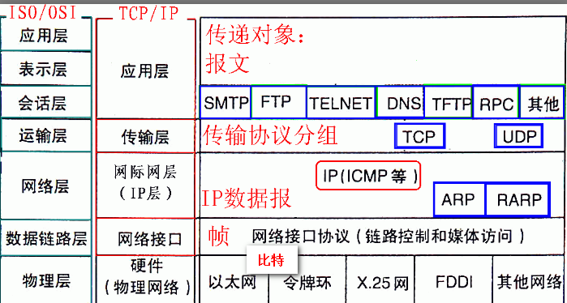
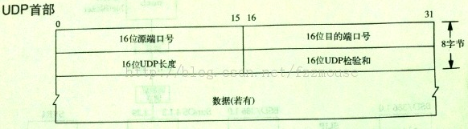

### )网络基础知识
- - -
##### 网络分层模型

国际标准化组织（ISO）在1978年提出了“开放系统互联参考模型”，即著名的OSI/RM模型（Open System Interconnection/Reference Model）是网络的**书面标准**，而TCP/IP模型是网络的**事实标准**。

> **OSI7层模型**：将计算机网络体系结构的通信协议自下而上依次为：*物理层（Physics Layer）*、*数据链路层（Data Link Layer）*、*网络层（Network Layer）*、*传输层（Transport Layer）*、*会话层（Session Layer）*、*表示层（Presentation Layer）*、*应用层（Application Layer）*。其中第四层完成数据传送服务，上面三层面向用户。

> **TCP/IP模型**：TCP/IPmo模型比OSI模型简单，其将计算机网络体系通讯协议分为5层，自下而上分别是，*物理层（Physics Layer）*、*数据链路层（Data Link Layer）、网络层（Network Layer）*、*传输层（Transport Layer）*、*应用层（Application Layer）*。其中，很多情况下，也可以将物理层和链路层合并，因此又有TCP/IP4层模型之称，要注意的是**TCP/IP不仅是网络模型，而且其是一系列的交互式协议的总称，是一个庞大的协议簇**。

OSI/RM与TCP/IP协议的**对应关系**可以通过如下图片来说明：
 
TCP/IP协议++各层的数据形式++可以通过如下图片来说明：
 
TCP/IP协议++各层的重要的协议++可以通过如下图片来说明：
 
TCP/IP协议++各层的数据封装情况++可以通过如下图片来说明：
 
TCP/IP协议++数据传输方向++可以通过如下图片来说明：
 

##### 下面是一些相关的总结

- OSI和TCP/IP各层的数据、作用以及运行的协议的总结：
|OSI层 | TCP/IP层|各层数据类型|运行的协议(TCP/IP)|作用(OSI)|作用(TCP/IP)|工作设备|
|----|-------|-------|--------|---------|-----------|
| 应用层   | ~~应用层~~[^1] | ~~报文(Message)~~  |   -   |为End-user的应用进程提供标准的网络服务和应用接口 |   -   |   -   |
| 表示层   | ~~应用层~~ | ~~报文(Message)~~  |   -   | 定义用户或应用程序之间交换数据的格式，提供数据表示之间的转换服务，保证传输的信息到达目的端后意义不变  |   -   |   -   |
| 会话层   | 应用层    | **报文(Message)**    |FTP,SMTP,POP3,**HTTP**,Telnet,SNMP,**DNS** | 在用户间建立会话关系 | 为End-user的应用进程提供标准的网络服务和应用接口，定义用户或应用程序之间交换数据的格式，提供数据表示之间的转换服务，保证传输的信息到达目的端后意义不变，三次握手建立会话关系 |   -   |
| 运输层   | 运输层    | **段(Segment)**    | **TCP,UDP**    | 负责将上层数据分段并提供端到端的、可靠的或不可靠的传输以及端到端的差错控制和流量控制问题 | 负责将上层数据分段并提供端到端的、可靠的或不可靠的传输以及端到端的差错控制和流量控制问题 |   网关   |
| 网络层   | 网络层    | **分组(Packet)**     | **IP,ICMP,ARP,RARP,IGMP**  | 负责对子网间的数据包进行路由选择，网络层还可以实现拥塞控制、网际互连等功能，主要是"路径选择、路由及逻辑寻址" | 负责对子网间的数据包进行路由选择，网络层还可以实现拥塞控制、网际互连等功能，主要是"路径选择、路由及逻辑寻址" | 路由器，(3层)交换机  |
| 数据链路层| 数据链路层 | **帧(Frame)**    |  PPP,CSMA/CD,X.25   | 两个相邻节点间可靠透明地传输帧，为网络层提供可靠的数据传输 | 两个相邻节点间可靠透明地传输帧，为网络层提供可靠的数据传输 |   网桥，(2层)交换机   |
| 物理层   | 物理层    | **比特(Bit)**     |   -   | 物理媒体（介质）上透明地传输比特流 | 物理媒体（介质）上透明地传输比特流 |   中继器，Hub   |

- TCP/IP各层的协议
|层名称| 协议中文名|协议英文名|作用|端口|
|-----|---------|--------|----|----|
|应用层|文件传输协议|FTP（File Transfer Protocol）|用于Internet上的控制文件的双向传输，同时，它也是一个应用程序|21|
|  -  |简单邮件传输协议|SMTP（Simple Mail Transmission Protocol）|它是一组用于由源地址到目的地址传送邮件的规则，由它来控制信件的中转方式。SMTP协议属于TCP/IP协议簇，帮助每台计算机在发送或中转信件时找到下一个目的地，其是一个**推送**协议|25|
|  -  |邮局协议|POP3（Post Office Protocol）|邮局协议的第3个版本,规定怎样将计算机连接到Internet的邮件服务器和下载电子邮件的协议。它是因特网电子邮件的第一个离线协议标准,POP3允许用户从服务器上把邮件存储到本地主机,同时删除保存在邮件服务器上的邮件|110|
|  -  |动态主机配置协议|DHCP（Dynamic Host Configuration Protocol）|一种通常被应用在大型的局域网络环境中，集中的管理、分配IP地址，使网络环境中的主机动态的获得IP地址、Gateway地址、DNS服务器地址等信息，并能够提升地址的使用率的协议|67&68|
|  -  |超文本传输协议|**HTTP（Hypertext Transfer Protocol）**|其是用于从WWW服务器传输超文本到本地浏览器的传送协议，是一个客户端和服务器端请求和应答的标准|80|
|  -  |远程登录协议|Telnet（Telecommunication Network Protocol）|是Internet远程登陆服务的标准协议和主要方式。它为用户提供了在本地计算机上完成远程主机工作的能力。|23|
|  -  |网络管理协议|SNMP（Simple Network Management Protocol）|由一组网络管理的标准组成，包含一个应用层协议（application layer protocol）、数据库模型（database schema）和一组资源对象。该协议能够支持网络管理系统，用以监测连接到网络上的设备是否有任何引起管理上关注的情况。|161&162|
|应用层|域名管理系统|**DNS（Domain Name System）**|将IP地址转换为对应的域名的协议|53|
|运输层|传输控制协议（面向连接）|**TCP（Transmission Control Protocol）**|是一种面向连接的、可靠的、基于字节流的传输层通信协议| - |
|运输层|用户数据报协议（无连接）|**UDP（User Datagram Protocol）**|一种无连接的传输层协议，提供面向事务的简单不可靠信息传送服务| - |
|网络层|无连接数据报传输服务|**IP（Internet Protocol）**|提供对数据大小的重新组装功能的不可靠的传输服务，将多个数据包交换网络连接起来，在源地址和目的地址之间传送数据包| - |
|  -  |因特网控制报文协议|**ICMP（Internet Control Message Protocol）**|是一种面向无连接的协议，主要用于在主机与路由器之间传递控制信息，包括报告错误、交换受限控制和状态信息等|==ping命令采用此协议==|
|  -  |地址解析协议|**ARP（Address Resolution Protocol）**|根据IP地址获取物理地址的一个TCP/IP协议（IP地址-->MAC地址）| - |
|  -  |逆地址解析协议|**RARP（Reverse Address Resolution Protocol）**|允许局域网的物理机器从网关服务器的 ARP 表或者缓存上请求其 IP 地址。（MAC地址--> IP地址）| - |
|网络层|多播组管理协议|IGMP（Internet Group Management Protocol）|动态的将各个主机注册到特定局域网中的一个组播组中| - |
|数据链路层|点对点协议|PPP（Point to Point Protocol）|提供全双工操作，并按照顺序传递数据包的一种在同等单元之间传输数据包这样的简单链路设计的链路层协议。| - |
|    -   |载波监听多路访问/冲突检测|CSMA/CD（Carrier Sense Multiple Access with Collision Detection）|一种争用型的介质访问控制协议，提供寻址和媒体存取的控制方式，使得不同设备或网络上的节点可以在多点的网络上通信而不相互冲突| - |
|数据链路层|X.25协议|X.25（X.25 Protocol）|使用电话或者ISDN设备作为网络硬件设备来架构广域网的ITU-T网络协议| - |

>**端口号针对于应用层的服务，运输层为应用层提供服务，它们对于端口号有概念，而网络层以下则无端口号的概念。**

- - -
##### IP地址

- **IP地址是一个32位的二进制数**，通常采用点分十进制表示。
- IP地址根据**网络号**和**主机号**来区分，分为*A，B，C，D，E*共5类地址。

- IP分类
| 类别 | 最大网络数 | IP地址范围 | 最大主机数 | 私有IP范围 | 说明 |
|--------|--------|--------|--------|--------|
|    A    |  2^7-2  | 0.0.0.0~127.255.255.255    |  2^24-2   |  10.0.0.0~10.255.255.255      | 以0开头,第一个字节作为网络号 |
|    B    |  2^14   | 128.0.0.0~191.255.255.255  |  2^16-2   |  172.16.0.0~172.31.255.255    | 以10开头,前两个字节作为网络号 |
|    C    |  2^21   | 192.0.0.0~223.255.255.255  |  2^8-2    |  192.168.0.0~192.168.255.255  | 以110开头,前三个字节作为网络号 |
|    D    |  -      | 224.0.0.0~239.255.255.255  |  -        |  -      | 以1110开头,D类地址作为组播地址（一对多的通信）|
|    E    |  -      | 240.0.0.0~255.255.255.255  |  -        |  -      | 以1111开头,E类地址为保留地址，供以后使用 |

- 特殊地址
  1. **网络地址**：P地址由网络号（包括子网号）和主机号组成，网络地址的主机号为全0，网络地址代表着整个网络。
  2. **广播地址**：广播地址通常称为直接广播地址，是为了区分受限广播地址。*广播地址与网络地址的主机号正好相反*，广播地址中，主机号为全1。当向某个网络的广播地址发送消息时，该网络内的所有主机都能收到该广播消息。
  3. **组播地址**：D类地址就是组播地址。
  4. **回环地址**：127.0.0.0/8被用作回环地址，++回环地址表示本机的地址++，常用于对本机的测试，用的最多的是127.0.0.1。
  5. **私有地址**：私有地址(private address)也叫==专用地址==，它们不会在全球使用，只具有本地意义。
  |类别| 举例|范围|
  |---|--------:|:--------:|
  |A类|私有地址：10.0.0.0/8|10.0.0.0~10.255.255.255|
  |B类|私有地址：172.16.0.0/12|172.16.0.0~172.31.255.255|
  |C类|私有地址：192.168.0.0/16|192.168.0.0~192.168.255.255|
  6. **0.0.0.0**
　　常用于寻找自己的IP地址，例如在我们的RARP，BOOTP和DHCP协议中，若某个未知IP地址的无盘机想要知道自己的IP地址，它就以255.255.255.255为目的地址，向本地范围（具体而言是被各个路由器屏蔽的范围内）的服务器发送IP请求分组。
  7. **255.255.255.255**
　　++该IP地址指的是受限的广播地址++。受限广播地址与一般广播地址（直接广播地址）的区别在于，受限广播地址只能用于本地网络，路由器不会转发以受限广播地址为目的地址的分组；一般广播地址既可在本地广播，也可跨网段广播。例如：主机192.168.1.1/30上的直接广播数据包后，另外一个网段192.168.1.5/30也能收到该数据报；若发送受限广播数据报，则不能收到。注：一般的广播地址（直接广播地址）能够通过某些路由器（当然不是所有的路由器），而受限的广播地址不能通过路由器。

- 子网掩码及网络划分
  1. 子网掩码(subnet mask)又叫网络掩码、地址掩码、子网络遮罩，它是一种用来指明**一个IP地址的哪些位标识的是主机所在的子网，以及哪些位标识的是主机的位掩码**。*子网掩码不能单独存在，它必须结合IP地址一起使用*。子网掩码只有一个作用，就是将某个IP地址划分成网络地址和主机地址两部分。
  2. 网络号与主机号
  网络号是网络的标识，主机号是主机的标识，**在同一个网络上，可以直接发送数据包**，通过比较这两个网络号，就可以知道接受方主机是否在本网络上。如果网络号相同，表明接受方在本网络上，那么可以通过相关的协议把数据包直接发送到目标主机；如果网络号不同，表明目标主机在远程网络上，那么数据包将会发送给本网络上的路由器，由路由器将数据包发送到其他网络，直至到达目的地。

  3. 获得网络地址与主机地址
  | - |IP(01[^2])|子网掩码(01)|  运算 |
  |---|------|-----------|------|
  | 网络地址 | IP(01) | 子网掩码(01) | 与(**&**) |
  | 主机地址 | IP(01) | **取反**(子网掩码(01)) | 与(**&**) |
  例子：
>1.将B类IP地址168.195.0.0划分成27个子网，计算子网掩码27=11011，至少需要N=5位来表示，将B类地址的默认子网掩码255.255.0.0的主机地址前5位置1，即得到其子网掩码：11111111 11111111 11111000 00000000（255.255.248.0）
这样产生2^5-2=30个子网！
2.需将B类IP地址167.194.0.0划分成若干个子网，每个子网内有主机500台：则有:(500)10=(111110100)2，此二进制的位数是9，则N=9，将该B类地址的子网掩码255. 255.0.0的主机地址全部置 1，得到255.255.255.255。然后再从后向前将后9位置0，可得：11111111 11111111 11111110 00000000即255.255.254.0。这组数值就是划分成主机为500台的B类IP地址167.194.0.0的子网掩码。
++在实际的计算中，我们需要对主机数量和网络的数量，可以按照[^3]中的方法来运算。++

  4. 子网掩码的分类
      - 缺省子网掩码：即未划分子网，对应的网络号的位都置 1 ，主机号都置 0 。
      |类别| 缺省子网掩码|
      |---|:--------:|
      |  A 类|网络缺省子网掩码： **255.0.0.0**|
      |  B 类|网络缺省子网掩码： **255.255.0.0**|
      |  C 类|网络缺省子网掩码： **255.255.255.0**|
      - 自定义子网掩码：将一个网络划分为几个子网，需要每一段使用不同的网络号或子网号，实际上我们可以认为是__将主机号分为两个部分：子网号、子网主机号__。 形式如下：

    未做子网划分的 IP 地址：网络号＋主机号
    做子网划分后的 IP 地址：网络号＋子网号＋子网主机号
    ==就是说 IP 地址在划分子网后，以前的**主机号位置的一部分给了子网号**，余下的是子网主机号==。

  5. 网编址技术的优点：
   - 解决巨大的网络地址管理耗费
   - **降低路由器中的选路表的急剧膨胀**
   - ==提高IP地址的利用效率==

  6. IP报文结构

>++普通IP报文头部长度为20个字节++。版本：标明IP协议的版本，目前为IPV4；报文长度：指IP包头部长度，占四位。总长度：整个IP数据包的长度。服务类型：TOC，Type of Service。8位（3位COS+4位TOS+1位 空闲），4位TOS表示最小时延，最大吞吐量，最高可靠性和最小费用。标示符：唯一地标示主机发送的每一份数据报。通常每发送一份报文它的价值为加1。生成时间TTL：设置了数据包可以经过的路由器数目。一旦经过一个路由器，TTL的值就会减1，当该字段为0时，数据包被抛弃。协议：上层协议。如TCP协议的协议号为6，UDP的协议号为17报头检验和：计算IP头部的检验和，检查报文头部的完整性。

- - -
##### TCP/IP协议
TCP/IP协议是Internet最基本的协议、Internet国际互联网络的基础，由网络层的IP协议和传输层的TCP协议组成。简言之**TCP负责发现传输的问题，一有问题就发出信号，要求重新传输，直到所有数据安全正确地传输到目的地**,IP是给因特网的每一台联网设备规定一个**地址**。传输层(TCP/UDP)接收由网络层(IP)发来的数据包，并把该数据包发送到应用层；相反，网络层(IP)也把从传输层(TCP/UDP)接收来的数据包传送到更底层。*++IP协议是不可靠的++*，其没有做任何事情来确认数据包是否按顺序发送的或者有没有被破坏，IP数据包中含有源地址目的地址。

TCP是面向连接的通信协议，通过**++三次握手++建立连接* ***，通讯完成时要拆除连接，通过**++四次挥手++拆除连接**，由于TCP是面向连接的所以只能用于端到端的通讯。TCP提供的是一种可靠的数据流服务，采用“带重传的肯定确认”技术来实现传输的可靠性。TCP还采用一种称为"滑动窗口"的方式进行流量控制，所谓窗口实际表示接收能力，用以限制发送方的发送速度。

TCP报文格式

>seq:"sequance"序列号；ack:"acknowledge"确认号；SYN:"synchronize"请求同步标志；；ACK:"acknowledge"确认标志"；FIN："Finally"结束标志。

 
**TCP协议的三次握手和四次挥手**
- TCP连接建立过程：首先Client端发送连接请求报文，Server段接受连接后回复ACK报文，并为这次连接分配资源。Client端接收到ACK报文后也向Server段发生ACK报文，并分配资源，这样TCP连接就建立了。

- TCP连接断开过程：假设Client端发起中断连接请求，也就是发送FIN报文。Server端接到FIN报文后，意思是说"我Client端没有数据要发给你了"，但是如果你还有数据没有发送完成，则不必急着关闭Socket，可以继续发送数据。所以你先发送ACK，"告诉Client端，你的请求我收到了，但是我还没准备好，请继续你等我的消息"。这个时候Client端就进入FIN_WAIT状态，继续等待Server端的FIN报文。当Server端确定数据已发送完成，则向Client端发送FIN报文，"告诉Client端，好了，我这边数据发完了，准备好关闭连接了"。Client端收到FIN报文后，"就知道可以关闭连接了，但是他还是不相信网络，怕Server端不知道要关闭，所以发送ACK后进入TIME_WAIT状态，如果Server端没有收到ACK则可以重传。“，Server端收到ACK后，"就知道可以断开连接了"。Client端等待了2MSL后依然没有收到回复，则证明Server端已正常关闭，那好，我Client端也可以关闭连接了。Ok，TCP连接就这样关闭了！

- **为什么建立连接是三次握手，而关闭连接是四次挥手**？
这是因为在建立连接的过程中，服务器端在LISTEN状态下，收到建立连接请求的SYN报文后，把ACK和SYN放在一个报文里发送给客户端。而关闭连接时，当收到对方的FIN报文时，仅仅表示对方不再发送数据了，但是还能接收数据，己方也未必全部数据都发送给对方了，所以己方可以立即close，也可以发送一些数据给对方后，在发送FIN报文给对方来表示同意现在关闭连接。因此，*己方ACK和FIN一般都会分开发送*。

- - -
##### UDP协议
用户数据报协议（User Datagram Protocol）是一种**无连接的传输层协议**，提供面向事务的简单不可靠信息传送服务。UDP的特点如下：
- **是无连接的**。即相比TCP协议，UDP协议在传送数据前*不需要建立连接，也没有释放连接*。
- 是**尽最大努力交付**的。即UDP协议无法保证数据能够准确的交付到目的主机，也无需对接收到的UDP报文进行确认。
- 是**面向报文**的。即UDP协议将应用层传输下来的数据封装在一个UDP包中，不进行拆分或合并。当运输层在收到对方的UDP包后，去掉首部后，将数据直接交给应用进程。
- **没有拥塞控制**。因此UDP协议的发送速率**不受网络的拥塞度影响**。
- *UDP支持一对一、一对多、多对一和多对多的交互通信*。
- *UDP的头部占用较小*，只占用8个字节。

>UDP数据包由首部和数据组成，每行4个字节（32位）,首部固定长度为8个字节（2行）,第一行是源端口16位，目的端口16位，表示发送方和接收方的端口号；第二行是UDP包长度16位，UDP校验和16位，UDP包长度包括UDP首部在内的以字节为单位的UDP数据报总长度；其后为校验和，最后是数据(首部结束之后的部分).

ref：
1.[计算机网络——OSI与TCPIP体系架构、功能及协议](http://www.cnblogs.com/6DAN_HUST/archive/2009/11/04/1595708.html),   2.[TCPIP各层数据含义的本质](http://blog.csdn.net/xingqingly/article/details/38015973),   3.[计算机网络基础知识整理（一）](http://blog.csdn.net/mengdai1991/article/details/46755243),   4.[计算机网络基础知识整理（二）](http://blog.csdn.net/mengdai1991/article/details/46755711),   5.[计算机网络基础知识整理（三）](http://blog.csdn.net/mengdai1991/article/details/46757353),   6.[[Network] 计算机网络基础知识总结](http://www.cnblogs.com/maybe2030/p/4781555.html),   7.[osi七层模型中都有哪些重要协议](https://zhidao.baidu.com/question/687951782892980524.html),   8.[子网掩码详解](http://blog.csdn.net/jason314/article/details/5447743),   9.[子网掩码怎么计算](http://jingyan.baidu.com/article/ca2d939dcf7491eb6c31ce8e.html),   10.[IP详解](http://blog.csdn.net/u012440687/article/details/52175366),   11.[TCP三次握手四次挥手详解](http://www.cnblogs.com/zmlctt/p/3690998.html),   12.[TCP和UDP数据包结构](http://www.360doc.com/content/11/1201/09/7503466_168805370.shtml),   13.[UDP协议](http://blog.csdn.net/luozenghui529480823/article/details/12946837)

[^1]:此处删除线表示对应关系.
[^2]:此处01表示二进制.
[^3]:[子网掩码怎么计算](http://jingyan.baidu.com/article/ca2d939dcf7491eb6c31ce8e.html).